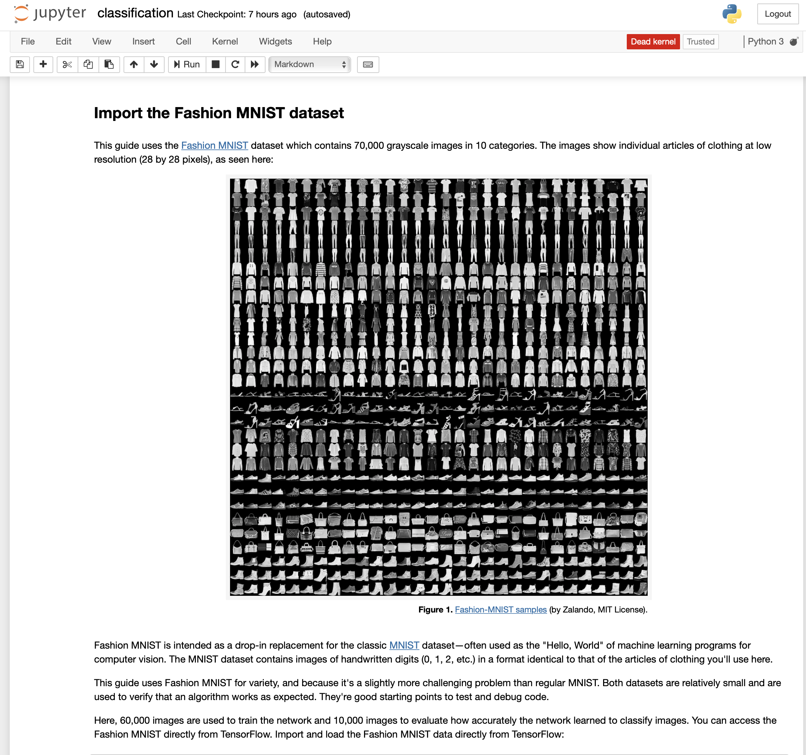

# Jupyter Notebook with TensorFlow


**Important**

_This tutorial is undergoing updates._

Our team is revising this example to work with the current version of TensorFlow, and will be updated soon.


[TensorFlow](https://www.tensorflow.org/) is a highly popular deep learning framework that is greatly accelerated when running on GPUs, which is frequently used in conjunction with Jupyter notebooks.

In this simple example, an instance of TensorFlow with Jupyter is deployed to CoreWeave Cloud and exposed to the public Internet using Kubernetes.



## Prerequisites

This tutorial presumes that you have...

* installed [`kubectl`](https://kubernetes.io/docs/reference/kubectl/) on your system
* obtained and configured [CoreWeave access credentials](../../docs/coreweave-kubernetes/getting-started.md#obtain-coreweave-access-credentials)


**Important**

Please note that this tutorial is for demonstration purposes only, and should not be used in production due to the lack of HTTPS encryption on the Jupyter service.


## Tutorial source code

To follow along with this tutorial, first clone the manifests from [GitHub](https://github.com/coreweave/kubernetes-cloud/tree/master/tensorflow-jupyter):



### Manifests

The `tensorflow-jupyter` directory contains three YAML files, each of which are [manifests](https://kubernetes.io/docs/reference/glossary/?all=true#term-manifest) used to deploy a different piece of this example.

<table><thead><tr><th width="323.3333333333333">Filename</th><th>Description</th></tr></thead><tbody><tr><td><a href="tensorflow-jupyter.md#the-deployment-manifest"><code>tensorflow-deployment.yaml</code></a></td><td>Defines the <strong>Deployment</strong>, which dictates how the TensorFlow with Jupyter Pods will be created</td></tr><tr><td><a href="tensorflow-jupyter.md#the-service-manifest"><code>tensorflow-service.yaml</code></a></td><td>Defines the <strong>Service</strong>, which handles networking and public publishing</td></tr><tr><td><a href="tensorflow-jupyter.md#the-persistent-volume-claim-manifest"><code>jupyter-pvc.yaml</code></a></td><td>Defines the <strong>PersistentVolumeClaim</strong> used for Jupyter notebook storage</td></tr></tbody></table>

## The Deployment manifest

In this example, [a Kubernetes Deployment manifest](https://kubernetes.io/docs/concepts/workloads/controllers/deployment/) is used to deploy a single instance of [TensorFlow](https://www.tensorflow.org) with [Jupyter notebooks](https://jupyter.org/).


**Note**

Pods defined in the same Deployment manifest may be [scheduled](https://kubernetes.io/docs/concepts/scheduling-eviction/kube-scheduler/#scheduling) either on the same node, or on multiple nodes — where Pods are scheduled ultimately depends on node resource availability. If co-location of Pods is required for some reason, e.g. shared ephemeral or block storage, this can be controlled with [affinity rules](https://kubernetes.io/docs/concepts/configuration/assign-pod-node/#affinity-and-anti-affinity).

This example Deployment manifest does not showcase all possible node affinity rules; those shown are included purely for demonstration purposes. The entire `affinity` stanza may be removed from this example Deployment without breaking the example.

[Learn more about scheduling Pods](https://kubernetes.io/docs/concepts/scheduling-eviction/kube-scheduler/#scheduling), or see a more advanced Deployment example in [Custom Containers](../../docs/coreweave-kubernetes/custom-containers.md).


### Replicas

This example [Deployment manifest](https://kubernetes.io/docs/concepts/workloads/controllers/deployment/) dictates to CoreWeave Cloud's [Kubernetes control plane](https://kubernetes.io/docs/concepts/overview/components/#control-plane-components) to ensure that there will only ever be one Pod running TensorFlow with Jupyter at all times. This single instance is defined via the `spec.replicas: 1` key-value pair in the manifest.

```yaml
apiVersion: apps/v1
kind: Deployment
metadata:
  name: tensorflow-jupyter
spec:
  strategy:
    type: Recreate
  # Replicas controls the number of instances of the Pod to maintain running at all times
  replicas: 1
```

### Resources

The control plane is also in charge of reserving GPU, CPU and memory resources on CoreWeave [compute nodes](../node-types.md), on which Pods run. Each instance of Jupyter, running inside [a Kubernetes Pod](https://kubernetes.io/docs/concepts/workloads/pods/pod-overview/), is allocated `2` GPUs, as defined by the `spec.resources.limits.nvidia.com/gpu: 2` pair seen below.

```yaml
resources:
  requests:
    cpu: 500m # The CPU unit is mili-cores. 500m is 0.5 cores
    memory: 256Mi
  limits:
    cpu: 2000m
    memory: 2048Mi
    # GPUs can only be allocated as a limit, which both reserves and limits the number of GPUs the Pod will have access to
    # Making individual Pods resource light is advantageous for bin-packing. In the case of Jupyter, we stick to two GPUs for
    # demonstration purposes
    nvidia.com/gpu: 2
```


**Additional Resources**

To learn more about requests and limits in Kubernetes, refer to [the official Kubernetes documentation](https://kubernetes.io/docs/concepts/configuration/manage-resources-containers/#requests-and-limits).


## The Service manifest

In Kubernetes, networking traffic is handled via [Services](https://kubernetes.io/docs/concepts/services-networking/service/), which are typically defined by their own manifests. In this example, a single Service is defined in the Service manifest `tensorflow-service.yaml`, which allows the Deployment to be published to the public Internet.

This Service manifest dictates that TCP port `8888` will be open to the public Internet as [a `LoadBalancer` type](https://kubernetes.io/docs/concepts/services-networking/service/#loadbalancer):


```yaml
apiVersion: v1
kind: Service
metadata:
  annotations:
    metallb.universe.tf/address-pool: public
    # Setting a sharing key might save public IP addresses
    # See https://metallb.universe.tf/usage/#ip-address-sharing for more detail
    metallb.universe.tf/allow-shared-ip: example-1
  name: tensorflow-jupyter
spec:
  type: LoadBalancer
  externalTrafficPolicy: Local
  ports:
    - name: notebook
      port: 8888
      protocol: TCP
      targetPort: notebook
  selector:
    app.kubernetes.io/name: tensorflow-jupyter
```


### Connecting the Pod to the Service

In order to connect the `containerPod` exposed in the Deployment manifest to the Service, the Deployment manifest dictates that the Web interface of Jupyter will be published from the container's TCP port `8888`, defined in the `spec.ports.containerPort` pair. This matches the port that the Service opens to the Internet under the `spec.ports.port` pair shown above.


**Additional Resources**

[Learn more about how to connect applications to Services in Kubernetes](https://kubernetes.io/docs/tutorials/services/connect-applications-service/).



```yaml
spec:
  containers:
    - name: tf
      image: tensorflow/tensorflow:2.12.0-gpu-jupyter

     ports:
      - name: notebook
        containerPort: 8888
        protocol: TCP
```



**Additional Resources**

To learn more about Kubernetes Services, refer to [the official Kubernetes documentation](https://kubernetes.io/docs/concepts/services-networking/service/).


## The Persistent Volume Claim manifest

Utilizing a [persistent volume](https://kubernetes.io/docs/concepts/storage/persistent-volumes/) ensures that files persist, even if the node currently running the Pod fails. In this example, a persistent volume is allocated in order to persist user-uploaded notebooks.

Allocation of persistent volume storage is done via a Kubernetes `PersistentVolumeClaim`, commonly called a PVC, which requests the storage size and backing [storage type](../../docs/storage/storage/#volume-types) (such as SSD or HDD) to be used. In this example, the PVC is defined in the `jupyter-pvc.yaml` file.

```yaml
apiVersion: v1
kind: PersistentVolumeClaim
metadata:
  name: jupyter-pv-claim
spec:
  # Available storage classes at time of writing are
  # block-nvme-lga1 - New York - NVMe Storage with 3 Replicas
  # block-hdd-lga1 - New York - HDD Storage with 3 Replicas
  storageClassName: block-nvme-lga1
  accessModes:
    - ReadWriteOnce
  resources:
    requests:
      storage: 10Gi
```

### Mounting storage

The storage type selected here is a [Block NVME](../../docs/storage/storage/#volume-types) type, with a capacity of `10Gi`. After it is created, the volume claim is then mounted to the `/tf/notebooks` directory, as specified by the `spec.volumeMounts` stanza in the Deployment manifest:


```yaml
volumeMounts:
  - name: storage
    mountPath: /tf/notebooks
```



**Additional Resources**

[Learn more about Storage and how to use it on CoreWeave Cloud](../../docs/storage/storage/).


## Run the example

Run the following steps to deploy the TensorFlow Deployment and Service.

### Apply the resources

Using `kubectl apply`, deploy the Deployment and the Service.

```bash
 $ kubectl apply -f tensorflow-deployment.yaml
 deployment.apps/tensorflow-jupyter configured
 
 $ kubectl apply -f tensorflow-service.yaml
 service/tensorflow-jupyter configured 
```

### View created Pods

Use `kubectl get pods` to list the newly created Pods. This should show that the Deployment is working to instantiate our requested instance.

```
 $ kubectl get pods
 
 NAME                                 READY   STATUS              RESTARTS   AGE
 tensorflow-jupyter-6794bcb465-4czqb  0/1     ContainerCreating   0          2s
```

After a moment, all Pods should transition from a `ContainerCreating` state to a `Running` state.

```
$ kubectl get pods

NAME                                  READY   STATUS    RESTARTS   AGE
tensorflow-jupyter-6794bcb465-4czqb   1/1     Running   0          6s
```

Obtaining the Deployment resource will also show that all desired Pods are up and running, as well as some additional information about them.

```
 $ kubectl get deployment
 
 NAME                 READY   UP-TO-DATE   AVAILABLE   AGE
 tensorflow-jupyter   1/1     1            1           73m
```

Using `kubectl describe` on a Pod will display in-depth information on that Pod, which is useful if there is a Pod that hasn't yet started.

```
 $ kubectl describe pod tensorflow-jupyter-6794bcb465-4czqb
 ....
 Events:
   Type    Reason                  Age   From                     Message
   ----    ------                  ----  ----                     -------
   Normal  Scheduled               54s   default-scheduler        Successfully assigned tenant-test/tensorflow-jupyter-6794bcb465-4czqb to g04c225
   Normal  SuccessfulAttachVolume  54s   attachdetach-controller  AttachVolume.Attach succeeded for volume "pvc-66fa0887-a4c4-4245-a4e2-02200f640fea"
   Normal  Pulling                 50s   kubelet, g04c225         Pulling image "tensorflow/tensorflow:1.15.0-py3-jupyter"
   Normal  Pulled                  24s   kubelet, g04c225         Successfully pulled image "tensorflow/tensorflow:1.15.0-py3-jupyter"
   Normal  Created                 19s   kubelet, g04c225         Created container miner
   Normal  Started                 18s   kubelet, g04c225         Started container miner
```

Pod labels may also be leveraged for more information. For example, for Pods given the `spec.metadata.name` attribute of `tensorflow-jupyter`, as is the case in the example Deployment, the following command may be used to acquire additional information on matching Pods:

```bash
$ kubectl describe pod -l app.kubernetes.io/name=tensorflow-jupyter
```


**Additional Resources**

For more information on Labels and Affinities in CoreWeave Cloud, see [Advanced Label Selectors](../label-selectors.md).


### Obtain the Jupyter login token

View the Pod's logs to obtain the Jupyter login token. The token will be displayed as part of the URL for the served instance. For example:

```
$ kubectl logs tensorflow-jupyter-6794bcb465-4czqb

WARNING: You are running this container as root, which can cause new files in
mounted volumes to be created as the root user on your host machine.

To avoid this, run the container by specifying your user's userid:

$ docker run -u $(id -u):$(id -g) args...

[I 14:09:12.985 NotebookApp] Writing notebook server cookie secret to /root/.local/share/jupyter/runtime/notebook_cookie_secret
[I 14:09:13.153 NotebookApp] Serving notebooks from local directory: /tf
[I 14:09:13.153 NotebookApp] The Jupyter Notebook is running at:
[I 14:09:13.153 NotebookApp] http://tensorflow-jupyter-6794bcb465-4czqb:8888/?token=a71eb39261e6ef01bdec8867c2c051b0b3aaf31545bfbb84
[I 14:09:13.153 NotebookApp]  or http://127.0.0.1:8888/?token=a71eb39261e6ef01bdec8867c2c051b0b3aaf31545bfbb84
```

In this example, the token is `a71eb39261e6ef01bdec8867c2c051b0b3aaf31545bfbb84`.

### Obtain the public IP

To view the public IP assigned to the Service, which will be used to log in to Jupyter, `get` all Services.

```bash
$ kubectl get service

NAME                 TYPE           CLUSTER-IP       EXTERNAL-IP     PORT(S)    AGE
tensorflow-jupyter   LoadBalancer   10.134.100.173   64.79.105.199   8888/TCP   30s
```

### Log in to Jupyter

Using your browser, navigate to `http://<EXTERNAL-IP>:8888` using the login token [obtained from the Pod's logs](tensorflow-jupyter.md#obtain-the-jupyter-login-token).

:tada: Congratulations! You've deployed an instance of TensorFlow running a Jupyter notebook on CoreWeave Kubernetes!


**Tip**

The package includes TensorFlow's example Notebooks, which will leverage the GPUs made available to the Pod.

