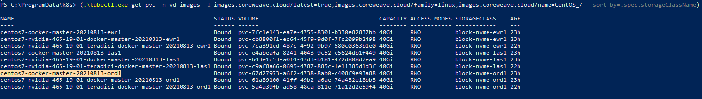

# Networking

The best way to manage connectivity between Kubernetes components and the Internet is to use [Kubernetes Network Policies](https://kubernetes.io/docs/concepts/services-networking/network-policies/). For the following example implementation, we will create a simple group of Network Policies that create user groups with different access levels to internal and external resources.

Network policies are specified in YAML manifests, and can be applied to the namespace using `kubectl apply -f <path/to/manifest>`.

## Example

The first example Network Policy will be called `artist`. This Network Policy will use a [Pod Selector](https://kubernetes.io/docs/concepts/overview/working-with-objects/labels/), which will match against any Pod that has the label `user.group: artist`. Our Policy then specifies that it will allow inbound traffic from the local namespace on ports `3389`, `4172`, `60443` and `443`. Our Policy additionally specifies that it will allow our `artist` machines to send traffic to any target in the same namespace on ports `139` and `445`.

```yaml
apiVersion: networking.k8s.io/v1
kind: NetworkPolicy
metadata:
  name: artist
spec:
  podSelector:
    matchLabels:
      user.group: artist
  policyTypes:
  - Ingress
  - Egress
  ingress:
  - from:
    - namespaceSelector:
        matchLabels:
          kubernetes.io/metadata.name: tenant-sta-vfx1-reference
    ports:
    - protocol: TCP
      port: 3389
    - protocol: TCP
      port: 4172
    - protocol: TCP
      port: 60443
    - protocol: TCP
      port: 443
  egress:
  - to:
    - namespaceSelector:
        matchLabels:
          kubernetes.io/metadata.name: tenant-sta-vfx1-reference
    ports:
    - protocol: TCP
      port: 139
    - protocol: TCP
      port: 445
```

This Policy prevents connections originating from outside of the cluster from reaching our machines, except on port `3389`, which is an RDP port that provides admins access to troubleshoot machines externally using a separate account or login.


**Tip**

The [Network Policy Editor](https://editor.networkpolicy.io/) is a visual, interactive tool that assists composing these policies by working with diagrams like the example below.


<figure><figcaption><p>Network Policy Editor diagram</p></figcaption></figure>

If the Network Policy should have stricter policies, it can allow traffic only from our Active Directory Samba and from our [Teradici Connection Manager](https://www.teradici.com/web-help/pcoip\_connection\_manager\_security\_gateway/19.08/). This prevents any external or internal resource from connecting to our machines without going through the connection manager and [Leostream](https://leostream.com/) connection broker.


**Additional Resources**

To learn more about the Teradici Connection Manager and Leostream, see [Management](management.md).


```yaml
apiVersion: networking.k8s.io/v1
kind: NetworkPolicy
metadata:
  name: artist
spec:
  podSelector:
    matchLabels:
      user.group: artist
  policyTypes:
  - Ingress
  - Egress
  ingress:
  - from:
    - podSelector:
        matchLabels:
          app.kubernetes.io/name: teradici-gateway-teridici-conn-gateway
    ports:
    - protocol: TCP
      port: 3389
    - protocol: TCP
      port: 4172
    - protocol: TCP
      port: 60443
    - protocol: TCP
      port: 443
  egress:
  - to:
    - podSelector:
        matchLabels:
          app.kubernetes.io/name: samba-ad-samba-ad
    ports:
    - protocol: TCP
      port: 139
    - protocol: TCP
      port: 445
```

Note that all network policies are additive, so any IP range or port not explicitly mentioned will not be accessible.

To apply this policy to our virtual servers we can upgrade our workstations from the applications UI. Switch to the YAML editor and add the following entry:

```yaml
labels:
  user.group: "artist"
```

After restarting the virtual server, notice that the launcher pod now contains this label and the network policy will be applied.

Next we can create another network policy for our administrators. This policy should likely be the opposite: enable internet access but disable access to other internal resources.

```yaml
apiVersion: networking.k8s.io/v1
kind: NetworkPolicy
metadata:
  name: administration
spec:
  podSelector:
    matchLabels:
      user.group: administration
  policyTypes:
  - Ingress
  - Egress
  ingress:
  - from:
    - ipBlock:
        cidr: 0.0.0.0/0
    ports:
    - protocol: TCP
      port: 3389
    - protocol: TCP
      port: 4172
    - protocol: TCP
      port: 60443
    - protocol: TCP
      port: 443
  egress:
  - to:
    - ipBlock:
        cidr: 0.0.0.0/0
        except:
          - 10.0.0.0/8
```

This policy for example will prohibit administrators from accessing the Samba storage but will allow them to connect to anything else.

Last but not least we should create a network policy that is open to all traffic within the namespace, that way for internal infrastructure can be reached from other resources. We also add a wide open egress policy so that our services can connect to resources in the namespace or on the internet.

```yaml
apiVersion: networking.k8s.io/v1
kind: NetworkPolicy
metadata:
  name: infra
spec:
  podSelector:
    matchLabels:
      user.group: infra
  policyTypes:
  - Ingress
  - Egress
  ingress:
  - from:
    - namespaceSelector:
          matchLabels:
            kubernetes.io/metadata.name: tenant-sta-vfx1-reference
  egress: 
  - {}
```

When adding a wide-open network policy, pay close attention to whether or not a public IP address is assigned to avoid unintended connections from external actors.

## Firewalls

Firewalling for Virtual Servers may be accomplished through the use of [Network Policies](https://docs.coreweave.com/networking/coreweave-cloud-native-networking-ccnn#network-policies-firewalls).


**Note**

[CoreWeave Cloud Native Networking (CCNN)](../networking/coreweave-cloud-native-networking-ccnn.md) is the networking solution for VFX studios, and configuring network policies is the standard method for network security within CCNN. At this time, CCNN does not offer a managed intrusion detection solution (IDS) or intrusion prevention system (IPS).

