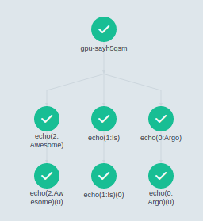

# Argo Workflows

This guide provides an introduction to Argo Workflows, outlines the steps needed to deploy the application on CoreWeave Cloud, and gives a quick walkthrough of the web UI.


**Quickstart**

If you already have experience with Argo Workflows and just need to deploy it on CoreWeave Cloud, you can [skip ahead to the deployment section](./#how-to-deploy-argo-workflows).


<div align="left">

<figure><figcaption><p>Argo Workflows</p></figcaption></figure>

</div>

After you've successfully deployed Argo Workflows, see our other guides with deeper dives into [security best practices](security-best-practices-for-argo-workflows.md), Argo's [Command Line Interface (CLI)](use-the-argo-workflows-cli.md), the [REST API](use-the-argo-workflows-rest-api.md), and how to submit workflows with [Helm](use-argo-workflows-with-helm.md). We also have valuable tips to [enhance performance](optimize-argo-workflows-performance-and-resilience.md) and ensure your workflows are resilient.&#x20;


**Examples**

If you want to see practical examples that use Argo Workflows on CoreWeave Cloud, [jump to the Examples section](./#argo-workflows-examples).


## What is Argo Workflows?

[Argo Workflows](https://argoproj.github.io/) is a powerful, open-source workflow management system you can deploy Argo Workflows from the CoreWeave [Applications Catalog](https://apps.coreweave.com/).&#x20;

It's used to define, execute, and manage complex, multi-step workflows in a code-based manner. It's developed and maintained as a [Cloud Native Computing Foundation (CNCF) Graduated project](https://www.cncf.io/projects/argo/), and uses the principles of cloud-native computing to ensure scalability, resiliency, and flexibility. Some of its key features are:

1. **Workflow definition using YAML**: Workflows are defined using a human-readable YAML format, which can be easily version-controlled and integrated into CI/CD pipelines. This allows users to create and modify workflows as code, enabling automation and collaboration across teams.
2. **Directed Acyclic Graph (DAG)**: Argo Workflows uses a directed acyclic graph to model workflow execution, allowing for complex dependencies and parallelism. This ensures that each step in the workflow is executed in a specific order, and parallel tasks can be run simultaneously to optimize processing time.
3. **Container-based tasks**: Argo Workflows runs tasks within containers, which provides isolation and allows for the use of different environments and runtime configurations. This makes it easy to build, package, and share tasks as container images, ensuring consistency and reproducibility.
4. **Scalability**: Built on top of Kubernetes, Argo Workflows can automatically scale resources according to workload demands. This ensures efficient resource utilization and allows for the execution of large-scale workflows without manual intervention.
5. **Fault-tolerance and high availability**: Argo Workflows provides mechanisms for handling failures, retries, and timeouts, ensuring that workflows can recover from errors and continue executing. Additionally, it leverages the resilience and high availability features of Kubernetes, such as self-healing and rolling updates.
6. **Visualization and monitoring**: Argo Workflows offers a web-based user interface that enables users to visualize, monitor, and interact with their workflows. Additionally, it provides integrations with monitoring and logging tools, such as Prometheus and Grafana, for advanced observability.
7. **Extensibility**: Argo Workflows supports custom task executors and integrations with other systems, such as artifact repositories, message queues, and cloud services. This allows users to create and customize workflows that meet their unique requirements.

Using Argo Workflows, you can automate repetitive tasks, enable collaboration across teams, and leverage the benefits of CoreWeave's cloud.

## How to deploy Argo Workflows

To deploy Argo Workflows, navigate to [CoreWeave Applications](https://apps.coreweave.com).

1. Click the **Catalog** tab.
2. Search for `argo-workflows` to find the application.
3. Click **Deploy** in the upper-right.
4. Enter a meaningful name for the deployment, such as `my-workflow`. Keep it short and use only lowercase alphanumeric characters, hyphens, or periods, because this becomes part of the ingress URL.
5. The remaining parameters are set to suggested defaults.&#x20;


**Use client authentication mode**

Although you can change these parameters, we strongly suggest using **client** authentication as a [security best practice](security-best-practices-for-argo-workflows.md).


<div align="left">

<figure><figcaption></figcaption></figure>

</div>

When ready, click the **Deploy** button at the bottom of the page.

If you enabled **Expose UI via public Ingress**, the web UI will be accessible from outside the Kubernetes cluster, so you can manage your workflows in a web browser.&#x20;

It may take up to five minutes for the deployment to receive a TLS certificate. If you receive an HTTPS security warning in the web UI, please wait for the certificate to be installed.

## How to retrieve the client token


**About ServiceAccounts and tokens**

When you deploy Argo Workflows, three ServiceAccounts are created based on the deployment name. For example, if the name is `my-workflow`, it creates these:

* `my-workflow-argo`
* `my-workflow-argo-client`
* `my-workflow-argo-server`

For this step you need a token from the `-argo-client` ServiceAccount. You can learn more about the others in our [security best practices article](security-best-practices-for-argo-workflows.md).&#x20;


To retrieve the Bearer token for your deployment, run the commands below for your OS.



```bash
# Replace my-workflow with your deployment name.
export ARGO_NAME=my-workflow
# Use kubectl to find the name of the secret for the ${ARGO_NAME}-argo-client ServiceAccount.
export SECRET=$(kubectl get sa ${ARGO_NAME}-argo-client -o=jsonpath='{.secrets[0].name}')
# Extract the token (a Kubernetes Secret), base64 decode it, and prepend "Bearer " to the string. This is the Bearer token.
export ARGO_TOKEN="Bearer $(kubectl get secret $SECRET -o=jsonpath='{.data.token}' | base64 --decode)"
# Display the Bearer token on the screen.
echo $ARGO_TOKEN
```



```powershell
# Replace "my-workflow" with your deployment name.
$ARGO_NAME="my-workflow"
# Use kubectl to find the name of the secret for the ${ARGO_NAME}-argo-client ServiceAccount.
$SECRET=$(kubectl get sa $ARGO_NAME-argo-client -o=jsonpath='{.secrets[0].name}')
# Extract the token (a Kubernetes Secret).
$DATA_TOKEN=$(kubectl get secret $SECRET -o=jsonpath='{.data.token}')
# base64 decode the token
$DECODE_64=[System.Text.Encoding]::UTF8.GetString([System.Convert]::FromBase64String($DATA_TOKEN))
# Prepend "Bearer " to the string. This is the Bearer token.
$ARGO_TOKEN="Bearer $DECODE_64"
# Display the Bearer token on the screen.
Write-Output $ARGO_TOKEN
```



Now that you have the Bearer token, you'll use it to log into the web UI.&#x20;

## How to use the web UI

You can submit and manage jobs through the web UI, an interactive way to manage your workflows, monitor their progress, and troubleshoot issues. This simplifies the submission and management process, allowing you to focus on building and running complex workflows efficiently.

To get started, navigate to your Argo Workflows deployment in the [Applications Catalog](https://apps.coreweave.com/), then click the **Access URL** to open the login page.&#x20;

<figure><figcaption><p>Access URL</p></figcaption></figure>

Paste the Bearer token you retrieved earlier into the **client authentication** box, then click **Login**.&#x20;

<div align="left">

<figure><figcaption><p>Screenshot of Argo login screen</p></figcaption></figure>

</div>

### How to submit a new workflow

To submit an example workflow:

1. Click **+SUBMIT NEW WORKFLOW**
2. Click **Edit using full workflow options**
3. Delete the existing example YAML.&#x20;
4. Expand the `workflow.yaml` below, copy/paste it into the **Workflow** text area, then click **+CREATE**.

<details>

<summary>workflow.yaml</summary>

```yaml
apiVersion: argoproj.io/v1alpha1
kind: Workflow
metadata:
  generateName: gpu-say
spec:
  entrypoint: main
  activeDeadlineSeconds: 300 # Cancel operation if not finished in 5 minutes
  ttlStrategy:
    secondsAfterCompletion: 86400 # Clean out old workflows after a day
  # Parameters can be passed/overridden via the argo CLI.
  # To override the printed message, run `argo submit` with the -p option:
  # $ argo submit examples/arguments-parameters.yaml -p messages='["CoreWeave", "Is", "Fun"]'
  arguments:
    parameters:
    - name: messages
      value: '["Argo", "Is", "Awesome"]'

  templates:
  - name: main
    steps:
      - - name: echo
          template: gpu-echo
          arguments:
            parameters:
            - name: message
              value: "{{item}}"
          withParam: "{{workflow.parameters.messages}}"

  - name: gpu-echo
    inputs:
      parameters:
      - name: message
    retryStrategy:
      limit: 1
    script:
      image: nvidia/cuda:11.4.1-runtime-ubuntu20.04
      command: [bash]
      source: |
        nvidia-smi
        echo "Input was: {{inputs.parameters.message}}"

      resources:
        requests:
          memory: 128Mi
          cpu: 500m # Half a core
        limits:
          nvidia.com/gpu: 1 # Allocate one GPU
    affinity:
      nodeAffinity:
        requiredDuringSchedulingIgnoredDuringExecution:
            # This will REQUIRE the Pod to be run on a system with a GPU with 8 or 16GB VRAM
              nodeSelectorTerms:
              - matchExpressions:
                - key: gpu.nvidia.com/vram
                  operator: In
                  values:
                    - "8"
                    - "16"
```


</details>

You'll see the Pods spinning up:

<div align="left">

<figure><figcaption><p>Workflow Pods starting</p></figcaption></figure>

</div>

A short time later, the workflow should complete.

<div align="left">

<figure><figcaption><p>Workflow complete</p></figcaption></figure>

</div>

You can perform many other tasks in the web UI. For example, navigate to the **Workflows** menu to manage multiple workflows.

<figure><figcaption><p>Argo Workflows HTTPS request, via the web UI</p></figcaption></figure>


Much more is possible. Please refer to the [Argo Workflows documentation](https://argoproj.github.io/argo-workflows/) for full details.

## Other workflow submission methods

Besides the web UI, you can deploy and manage workflows with the [Argo CLI](use-the-argo-workflows-cli.md), the Argo [REST API](use-the-argo-workflows-rest-api.md), and [Helm charts](use-argo-workflows-with-helm.md), giving you flexibility and control to choose the best approach for your requirements.

<table data-view="cards"><thead><tr><th></th><th></th><th></th><th data-hidden data-card-target data-type="content-ref"></th></tr></thead><tbody><tr><td><a href="use-the-argo-workflows-cli.md"><strong>Argo CLI</strong></a></td><td>With the Argo CLI, you can create, submit, manage, and monitor workflows. You can also create reusable templates in YAML files that define common parameters and workflow patterns and share them across teams.</td><td></td><td><a href="use-the-argo-workflows-cli.md">use-the-argo-workflows-cli.md</a></td></tr><tr><td><a href="use-the-argo-workflows-rest-api.md"><strong>Argo REST API</strong></a></td><td>The Argo Workflows REST API allows you to use the workflow engine programmatically with flexible, language-agnostic interface to build custom applications, or integrate it into existing CI/CD pipelines and automation workflows.</td><td></td><td><a href="use-the-argo-workflows-rest-api.md">use-the-argo-workflows-rest-api.md</a></td></tr><tr><td><a href="use-argo-workflows-with-helm.md"><strong>Helm charts</strong></a></td><td>You can use Helm charts to deploy Argo Workflows, manage its configuration, and update the deployment, which allows you to focus on building and running workflows rather than dealing with the complexities of manual deployment.</td><td></td><td><a href="use-argo-workflows-with-helm.md">use-argo-workflows-with-helm.md</a></td></tr></tbody></table>

All of these methods work in conjunction with the [Kubernetes API](https://argoproj.github.io/argo-workflows/walk-through/kubernetes-resources/) to create, update, and delete resources such as Pods, Jobs, and ConfigMaps. This tight integration with Kubernetes allows Argo Workflows to leverage all the features and capabilities of the CoreWeave platform, including resource management, scaling, and high availability.

## Practical examples

Because Argo Workflows is so powerful, we use it for many Machine Learning and VFX tutorials. Here are a few examples:


[finetune-gpt-neox-20b-with-argo-workflows.md](../../machine-learning-and-ai/training/fine-tuning/finetune-gpt-neox-20b-with-argo-workflows.md)



[fine-tune-stable-diffusion-models-with-coreweave-cloud.md](../../machine-learning-and-ai/training/fine-tuning/fine-tune-stable-diffusion-models-with-coreweave-cloud.md)



[finetuning-machine-learning-models.md](../../machine-learning-and-ai/training/fine-tuning/finetuning-machine-learning-models.md)



[cgi-rendering.md](../../machine-learning-and-ai/training/argo-workflows/cgi-rendering/cgi-rendering.md)


## More information

For more information about Argo Workflows, please see these resources:

* [Argo Workflows examples on GitHub](https://github.com/argoproj/argo-workflows/tree/master/examples)
* [Argo's Slack](https://argoproj.github.io/community/join-slack/)
* [Argo training on YouTube](https://www.youtube.com/playlist?list=PLGHfqDpnXFXLHfeapfvtt9URtUF1geuBo)
* [Argo Blog](https://blog.argoproj.io/)
