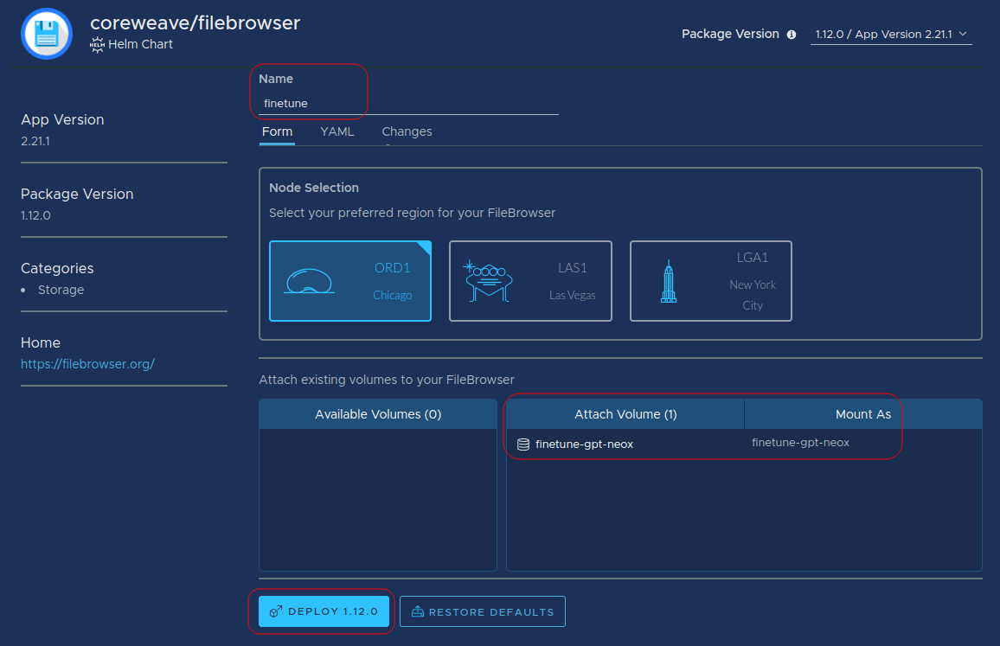
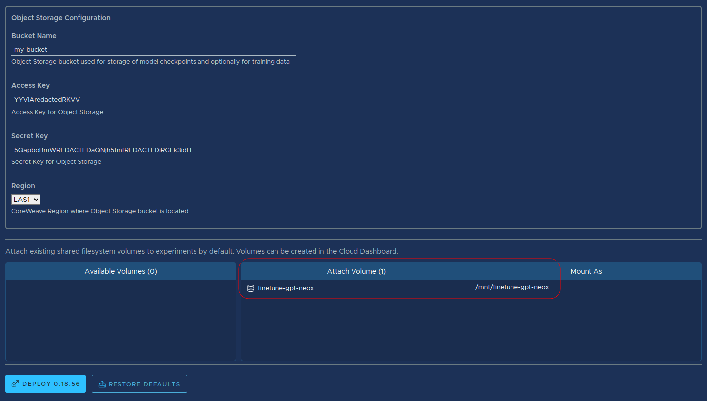

# Install Determined AI

[Determined AI](https://www.determined.ai/) is an open-source deep learning training platform that makes building models fast and easy. Determined AI can now be deployed directly onto CoreWeave Cloud by deploying the application from [the application Catalog](https://apps.coreweave.com).

To install Determined AI onto CoreWeave Cloud, perform the following steps.

## Prerequisites

It is recommended that prior to installation and setup of Determined AI itself, the following steps are completed.

1. [Configure your CoreWeave credentials](install-determined-ai.md#configure-your-coreweave-credentials)
2. [Create a shared filesystem volume](install-determined-ai.md#create-a-shared-filesystem-volume) for weights and training data
3. [Install FileBrowser](install-determined-ai.md#install-filebrowser) for filesystem navigation via a Web interface
4. [Create an Object Storage bucket](install-determined-ai.md#create-an-object-storage-bucket) for model checkpoint storage

Once the above have been completed, then the Determined AI application may be installed.

### Configure your CoreWeave credentials

This guide presumes that you have an active CoreWeave Cloud account, and have obtained and locally configured your [CoreWeave access credentials](../../coreweave-kubernetes/getting-started.md#obtain-coreweave-access-credentials).

### Create a shared filesystem volume

[Create a shared filesystem volume](../../storage/storage/using-storage-cloud-ui.md#create-a-new-storage-volume) by navigating to [Storage Volumes](https://cloud.coreweave.com/storage) in the Cloud UI. This model will be used to store weights and training data for fine-tuning.

CoreWeave's shared filesystem volumes can also be accessed by many Nodes simultaneously, allowing massive amounts of compute power to access the same dataset.

<figure><figcaption><p>Navigate to the Storage Volumes page, then click </p></figcaption></figure>

For this tutorial, the following values are used when creating the storage volume. If needed, it is easy to [increase the size](https://docs.coreweave.com/coreweave-kubernetes/storage#resizing) of a storage volume later.

| Field name       | Demo value          |
| ---------------- | ------------------- |
| **Volume Name**  | `finetune-gpt-neox` |
| **Region**       | `LAS1`              |
| **Disk Class**   | `HDD`               |
| **Storage Type** | Shared Filesystem   |
| **Size (Gi)**    | `1,000`             |
| **Labels**       | None                |

### **Install FileBrowser**

The FileBrowser application allows files to be transferred to and from shared filesystem volumes through a Web interface. While installing FileBrowser is optional, it is recommended to make navigating the filesystem easier. It is alternatively possible to use a Virtual Server or Kubernetes Pod to interact with the shared filesystem volume through SSH or another mechanism. Such configuration is beyond the scope of this tutorial.


**Additional Resources**

For complete instructions on installing and configuring FileBrowser, see [the FileBrowser installation guide](../../storage/filebrowser.md).


While configuring the FileBrowser application, ensure the new filesystem storage volume has been attached to the FileBrowser application as shown below, then click the **Deploy** button.

<figure><figcaption><p>When configuring FileBrowser, ensure the new filesystem storage volume has been attached to the FileBrowser application</p></figcaption></figure>

### Create an Object Storage bucket

Most Determined AI applications require Object Storage buckets to store model checkpoints, while a few - such as Jupyter Notebooks - can run without a bucket.

Unless you are sure your application will not require one, it is recommended to [create an Object Storage bucket](../../storage/object-storage.md). Make note of the **Access Key** and **Secret Key** values, provided in the generated configuration file.

## Install Determined AI

Once the previous steps have been completed, navigate to the Application Catalog, then search for `determined` to locate the Determined AI (`determined`) application. Click on its resulting card to configure its installation, then click **Deploy**.


The configuration screen will prompt for a name. Give the application a memorable name.

### Resource Pools

On CoreWeave Cloud, **Resource Pools** are groups of hardware selections plus memory requests and limits that make it simple to select resource groups for Determined AI deployments.

The Resource Pool configuration field corresponds to the `resource_pool` field in the Determined AI Kubernetes Deployment.

This allows for users to avoid needing to patch each experiment with a `spec` or to request resources on CoreWeave infrastructure. This setting may be overridden within the Deployment if needed.

This requires explicitly setting the following fields in your experiment configuration:

```yaml
resources:
  resource_pool: <GPU_RESOURCE_POOL>
```

Example:

```yaml
name: fashion_mnist_tf_keras_const
resources:
  resource_pool: A40
hyperparameters:
  global_batch_size: 32
  dense1: 128
records_per_epoch: 60000
searcher:
  name: single
  metric: val_accuracy
  smaller_is_better: false
  max_length:
    epochs: 5
entrypoint: model_def:FashionMNISTTrial
```

At this time, the following Resource Pools correspond to the GPU types and amounts each of which have **8 GPUS per node.**


**Note**

For more information on Node Types, see [Node Types](../../../coreweave-kubernetes/node-types.md).


| Resource Pool name | Hardware type | CPU amount | Memory |
| ------------------ | ------------- | ---------- | ------ |
| `A40`              | NVIDIA A40    | 64         | 512 Gi |
| `RTX_A5000`        | RTX A5000     | 32         | 200 Gi |
| `RTX_A6000`        | RTX A6000     | 32         | 200 Gi |
| `A100_NVLINK`      | A100 HGX      | 96         | 768 GI |
| `A100_NVLINK_80GB` | A100 HGX      | 96         | 768 Gi |
| `H100_NVLINK_80GB` | H100 HGX      | 96         | 768 Gi |

This tutorial uses the **Resource Pool** `A40`.

<figure><figcaption><p>The Resource Group chosen for this tutorial is A40</p></figcaption></figure>

### Configure Determined AI

<figure><figcaption><p>Add Object Storage and the Shared File System Volume</p></figcaption></figure>

In the **Object Storage Configuration** section, set your [Object Storage](../../storage/object-storage.md) bucket values, including the`ACCESS_KEY` and `SECRET_KEY` as [obtained above](install-determined-ai.md#create-an-object-storage-bucket).  Object storage is required if your experiment will be storing model checkpoints.

Some values, such as a link to the cluster, may be important for certain applications. Those details can be found in the post-deployment notes after the application is running. If you need to access these notes again, navigate to the **Applications** tab, then click the Determined application tile.

At the bottom of the configuration screen, ensure that the newly-created filesystem volume is attached as shown below.


**Important**

It is highly recommended to set the [Data Center Region](../../data-center-regions.md) of the application to be the same as that in which the shared filesystem volume was deployed.


Finally, click **Deploy** to launch the application.

## Access Determined AI

After the application is in a **Ready** state, navigate to the Ingress URL provided in the post-launch notes and use the login information provided.&#x20;


**Note**

The client is configured to communicate with the server via the environment variable `$DET_MASTER`.


<figure><figcaption><p>The Web UI access info in the post-launch notes</p></figcaption></figure>

At the Determined AI home screen, you can [launch a JupyterLab and subsequent Jupyter Notebooks](../../machine-learning-and-ai/training/determined-ai/launch-jupyter-notebook-on-coreweave-via-determined-ai.md), or perform model fine-tuning with [GPT DeepSpeed](../../machine-learning-and-ai/training/determined-ai/launch-gpt-deepspeed-models-using-determinedai.md), [GPT-NeoX](gpt-neox.md), or [Hugging Face](../../machine-learning-and-ai/training/determined-ai/finetuning-huggingface-llms-with-determined-ai-and-deepspeed.md).


**Important**

The default username for the Determined application is `admin`, and there is no default password set. Make sure to add a password after logging into the application for the first time.


<figure><figcaption><p>The Determined AI Web UI</p></figcaption></figure>

## Additional reading

For more information about Determined AI, see:

* The [official Determined AI documentation](https://docs.determined.ai/latest/)
* [Intro to Determined: A First Time User's Guide](https://www.determined.ai/blog/intro-to-determined)
* The [Determined AI Blog](https://www.determined.ai/blog)
