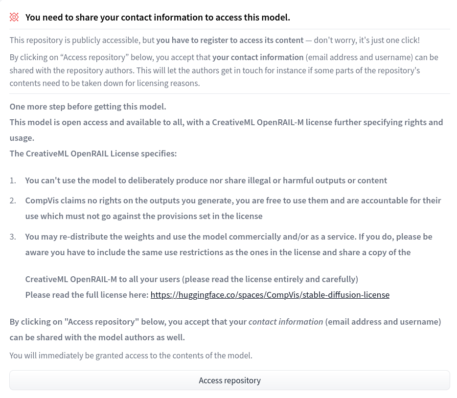

# PyTorch Hugging Face Diffusers - Stable Diffusion Text to Image

The [Stable Diffusion](https://huggingface.co/CompVis/stable-diffusion-v1-4) model takes a text prompt as input, and generates high quality images with photorealistic capabilities. It is an open source model built by our friends at [Stability.AI](https://stability.ai/). Stability also offers a UI for the model and an API service via [Dream Studio](https://beta.dreamstudio.ai/).

In this example we will go step by step to deploy Stable Diffusion as an auto-scaling Inference Service on CoreWeave Cloud, which will provide an HTTP API in order to generate images from a text prompt.

<figure><figcaption><p>An image generated from the prompt: "Red forest, digital art, trending"</p></figcaption></figure>

**View the example code on GitHub:**


To follow along, please clone the manifests from GitHub


## Prerequisites

The following tools must be installed and configured prior to running the example:

* [kubectl](https://docs.coreweave.com/coreweave-kubernetes/getting-started#install-kubernetes-command-line-tools)
* [docker](https://docs.docker.com/get-docker/)
* A CoreWeave Cloud account ([with Kubectl configured to use your CoreWeave kubeconfig](https://docs.coreweave.com/coreweave-kubernetes/getting-started#obtain-access-credentials))
* A [Docker Hub](https://hub.docker.com/) account
* A [HuggingFace](https://huggingface.co/) account with an [API Token](https://huggingface.co/settings/tokens)
* Register to use the model by clicking `Access Repository` [here](https://huggingface.co/CompVis/stable-diffusion-v1-4)

## Procedure

### Build and push the Docker images

We require two images:

1. **The Downloader image.** This will download the model to a [shared storage volume](../../storage/storage/), the individual inference Pods will load the model from this storage instead of downloading it over internet every time they scale up.
2. **The Model Image.** This is what will run CompVis/stable-diffusion-v1-4


**Important**

The default Docker tag is `latest`. Using this tag is **strongly** **discouraged**, as containers are cached on the nodes and in other parts of the CoreWeave stack. Always use a unique tag, and never push to the same tag twice. Once you have pushed to a tag, **do not** push to that tag again.


Below, we use simple versioning by using the tag `1` for the first iteration of the image.


**Note**

When running the following commands, be sure to replace the example `username` with your Docker Hub `username`.


From the `kubernetes-cloud/online-inference/stable-diffusion` directory, run the following commands:

```bash
$ docker login
$ export DOCKER_USER=coreweave
$ docker build -t $DOCKER_USER/model-downloader:1 -f Dockerfile.downloader . 
$ docker build -t $DOCKER_USER/stable-diffusion:1 -f Dockerfile . 
$ docker push $DOCKER_USER/model-downloader:1
$ docker push $DOCKER_USER/stable-diffusion:1
```


**Note**

This example assumes a public docker registry. To use a private registry, an [imagePullSecret ](https://kubernetes.io/docs/tasks/configure-pod-container/pull-image-private-registry/)needs to be defined.


### Deploy the Kubernetes resources

#### PVC


**Note**\
Before continuing, you may either point the `image:` in the following manifests to the image we just built in the previous steps, or you may use the publicly-available image found in the following manifests:

* [02-model-download-job.yaml](../../../online-inference/stable-diffusion/02-model-download-job.yaml)
* [03-inference-service.yaml](../../../online-inference/stable-diffusion/03-inference-service.yaml)


To create a PVC in which to store the model, run the following command from the `kubernetes-cloud/online-inference/stable-diffusion` directory:

```bash
$ kubectl apply -f 00-model-pvc.yaml
```

#### Model Repository Registration

Due to the generative power of this model, it is necessary to register your contact information via HuggingFace before the model can be used.

While logged in, [visit the HuggingFace Model Repository page](https://huggingface.co/CompVis/stable-diffusion-v1-4), review the terms, and click the `Access Repository` button at the bottom of the page.

<figure><figcaption><p>Stable Diffusion HuggingFace repository registration</p></figcaption></figure>

#### Secret

If you have not already done so, create a [HuggingFace](https://huggingface.co/) account and [API Token.](https://huggingface.co/settings/tokens)

Once you have a token, copy and Base64 encode it:

```bash
$  echo -n "TOKEN_HERE" | base64
VE9LRU5fSEVSRQ==
```

**Replace `TOKEN_HERE` with your Huggingface API Token**


**Important**

Note the extra space before the "echo" command, this will prevent the command (and as a result your HuggingFace API token) out of your shell history.


Take the Base64-encoded value of your token from the above command, and replace the value in the `token` field of the `01-huggingface-secret.yaml` file with it, then create the Secret:

```bash
$ kubectl create -f 01-huggingface-secret.yaml
```

#### Model job download

To deploy the job that downloads the model to the PVC, run the following command from the `kubernetes-cloud/online-inference/stable-diffusion/` directory:

```bash
$ kubectl apply -f 02-model-download-job.yaml
```

To check if the model has finished downloading, wait for the job to be in a `Completed` state:

```bash
$ kubectl get pods
NAME                              READY   STATUS      RESTARTS   AGE
stable-diffusion-download-vsznr   0/1     Completed   0          3h14m
```

Or, follow the job logs to monitor progress:

```bash
$ kubectl logs -l job-name=stable-diffusion-download --follow
```

#### InferenceService

Once the model is downloaded, the `InferenceService` can be deployed by invoking:

```bash
$ kubectl apply -f 03-inference-service.yaml
```

Loading up the model into GPU memory may take a couple of minutes. To monitor the progress of this, you can wait to see the KServe workers start in the pod logs by invoking:

```bash
$ kubectl logs -l serving.kubeflow.org/inferenceservice=stable-diffusion --container kfserving-container
```

Alternatively, you can wait for the `InferenceService` to show that `READY` is `True`, and that it has a URL:

```bash
$ kubectl get isvc stable-diffusion                                                                     
NAME               URL                                                                              READY   PREV   LATEST   PREVROLLEDOUTREVISION   LATESTREADYREVISION                        AGE
stable-diffusion   http://stable-diffusion.tenant-example-example.knative.chi.coreweave.com   True           100                              stable-diffusion-predictor-default-00001   64m
```

Using the provided URL, you can make an HTTP request via your preferred means.

Here is a simple cURL example:


```bash
curl http://stable-diffusion.tenant-example-example.knative.chi.coreweave.com/v1/models/stable-diffusion-v1-4:predict -d '{"prompt": "California sunset on the beach, red clouds, Nikon DSLR, professional photography", "parameters": {"seed": 424242, "width": 768}}' --output sunset.png \
&& open sunset.png
```


<figure><figcaption><p>An image generated from the prompt: "California sunset on the beach, red clouds, Nikon DSLR, professional photography"</p></figcaption></figure>

The following per-request parameters are supported:

```
- guidance_scale
- num_inference_steps
- seed
- width
- height
```

Parameters may be passed per-request as follows:


```shell-session
$ curl http://stable-diffusion.tenant-example-example.knative.chi.coreweave.com/v1/models/stable-diffusion-v1-4:predict -d \ '{"prompt": "California sunset on the beach, red clouds, Nikon DSLR, professional photography", "parameters": {"guidance_scale": 14.0, "num_inference_steps"
: 100, "seed": 424242, "width": 1024, "height": 768}}' --output sunset.png \
&& open sunset.png
```


### Hardware and Performance

This example is set to one A40 for production of higher resolution images. Inference times are around `4.78` seconds for a default resolution of `512x512` with 50 steps. Larger resolutions take longer - for example, a resolution of `1024x768` takes around `47` seconds.


**Note**

Multi-GPU Inference is not supported.


Depending on use case, GPUs with less VRAM will also work down to 8GB GPUs, such as the Quadro RTX 4000, however output resolution will be limited by memory to `512x512`.

The graph and table below compare recent GPU benchmark inference speeds for Stable Diffusion processing on different GPUs:

<figure><figcaption></figcaption></figure>

| GPU              | Seconds |
| ---------------- | ------- |
| Quadro RTX 4000  | 9.91    |
| Quadro RTX 5000  | 7.94    |
| A6000            | 4.45    |
| A40              | 4.78    |
| A100 40GB PCIE   | 3.35    |
| A100 40GB NVLINK | 3.29    |
| A100 80GB NVLINK | 3.19    |
| AWS A100 40GB    | 4.10    |


**Additional Resources**

Refer to the[ Node Types](https://docs.coreweave.com/coreweave-kubernetes/node-types) page for all available GPUs and their selectors.


### Autoscaling

Scaling is controlled in the `InferenceService` configuration. This example is set to always run one replica, regardless of number of requests.

Increasing the number of `maxReplicas` will allow the CoreWeave infrastructure to automatically scale up replicas when there are multiple outstanding requests to your endpoints. Replicas will automatically be scaled down as demand decreases.

#### Example

```yaml
spec:
  predictor:
    minReplicas: 1
    maxReplicas: 1
```

By setting `minReplicas` to `0`, Scale To Zero can be enabled, which will completely scale down the `InferenceService` when there have been no requests for a period of time.

When a service is scaled to zero, no cost is incurred.
