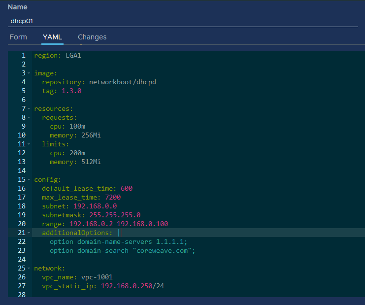

# DHCP on L2VPC

For IP address assignment in a VPC, a DHCP server needs to be deployed. CoreWeave provides a DHCP Server application (**dhcpd-server**) that supports IP allocation, static assignment and distribution of routes. This is the recommended method for distributing IP addresses inside a VPC, unless a dedicated virtual firewall is used.

In some deployments, users may also choose to distribute VPC IPs from a Windows Domain Controller.


**Important**

The VPC **must be created** before the DHCP server is deployed.


## Installation

To install the DHCP server, navigate to the applications Catalog from the CoreWeave Cloud UI homepage, then find and select the **dhcpd-server** application:

.png>)

### Configuration

Selecting the application will expose the configuration options for the DHCP server, shown and detailed below.

 (1).png>)

#### Configuration options

| **Subnet**                                  | <p>The VPC subnet where dynamic IP addresses will be assigned<br><br><span data-gb-custom-inline data-tag="emoji" data-code="26a0">⚠</span><strong>Note:</strong> This should be the net identifier of the subnet (e.g., for a <code>/24</code> network, the address would be <code>192.168.0.0</code>. For a <code>/25</code> network, either <code>192.168.0.0</code> or <code>192.168.0.128</code>)</p>                                          |
| ------------------------------------------- | --------------------------------------------------------------------------------------------------------------------------------------------------------------------------------------------------------------------------------------------------------------------------------------------------------------------------------------------------------------------------------------------------------------------------------------------------- |
| **Subnet Mask**                             | The netmask of the VPC subnet                                                                                                                                                                                                                                                                                                                                                                                                                       |
| **Range**                                   | <p>The range in the subnet to use dynamic IP assignment<br><br><span data-gb-custom-inline data-tag="emoji" data-code="26a0">⚠</span><strong>Note:</strong> This should be formatted as:<br><code>&#x3C;first usable address> &#x3C;space> &#x3C;last usable address></code></p>                                                                                                                                                                    |
| **Fixed IP assignment via DHCP**            | A comma-separated list of fixed IP addresses that will bind to the client ID of a Pod or Virtual Server                                                                                                                                                                                                                                                                                                                                             |
| **Routes**                                  | <p>Allows Virtual Servers and Kubernetes Pods to receive specific routes, such as in the case where there is a site to site VPN or virtual firewall deployed</p><p><br><span data-gb-custom-inline data-tag="emoji" data-code="26a0">⚠</span><strong>Note:</strong> This should be formatted as: <code>&#x3C;remotenetwork>/&#x3C;cidr>=&#x3C;gateway>.</code></p><p><br><strong>Example:</strong></p><p><code>10.0.0.0/16=192.168.0.254</code></p> |
| **Default gateway to be assigned via DHCP** | <p>This will set a default gateway address via DHCP<br><br><span data-gb-custom-inline data-tag="emoji" data-code="26a0">⚠</span><strong>Note:</strong> This should not be used if your Virtual Servers and Kubernetes Pods are connected to the regular CoreWeave Cloud Network (CCNN)</p>                                                                                                                                                         |

### Advanced **c**onfiguration

Advanced configuration for DHCP options are available via the YAML interface, which can be specified within  the `additionalOptions` block. To open the YAML editor, click the **YAML** tab.

<figure><figcaption><p>A DHCP YAML manifest</p></figcaption></figure>

Advanced configurations under the `additionalOptions` block need to be formatted as a mutli-line literal block, such as:

```yaml
additionalOptions: |
  option first-option x.x.x.x;
  option second-option y.y.y.y;
```


**Additional Resources**

Learn more about general DHCP configuration options on [the ISC website](https://kb.isc.org/docs/isc-dhcp-44-manual-pages-dhcp-options#standard-dhcpv4-options).


## VPC and network settings

At the bottom of the application's configuration screen are the **Network settings** for the DHCP server, in which you can adjust the settings for the server's VPC and network.

 (3) (1).png>)

#### Configuration options

| **VPC Name**          | <p>The name of your VPC.<br><span data-gb-custom-inline data-tag="emoji" data-code="26a0">⚠</span> The VPC must be created <strong>before the DHCP service.</strong></p> |
| --------------------- | ------------------------------------------------------------------------------------------------------------------------------------------------------------------------ |
| **Static IP for VPC** | The static IP address of the DHCP server (e.g., `192.168.0.250/24`)                                                                                                      |

## Fixed IP assignment

In order to configure a fixed IP for the Pod or Virtual Server, the client ID of the Pod or Virtual Server must first be set.

By default, some DHCP clients use the hostname, i.e. the Virtual Server name, as the client ID. This makes configuring the DHCP server easy, by allowing you to set a fixed IP for the Virtual Server by name. If this is not the case for your DHCP server, consult the documentation for your DHCP client on how to discover or configure the client ID.

### Pods

To set the client ID for a Pod, add the following annotation to the manifest:

```
vpc.coreweave.cloud/client-id: <client-id>
```

### Virtual Servers

The client IDs for Virtual Servers will be the name of the Virtual Server. Otherwise, the client ID can be configured in the [DHCP client configuration](dhcp-on-l2vpc.md) within the Virtual Server.
