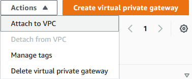
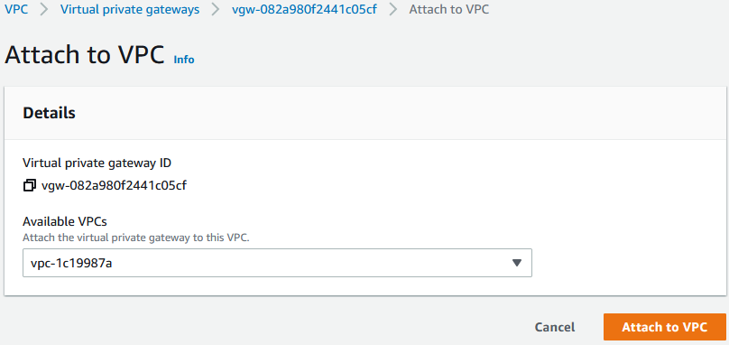
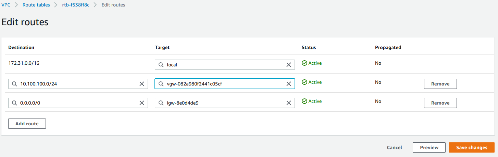
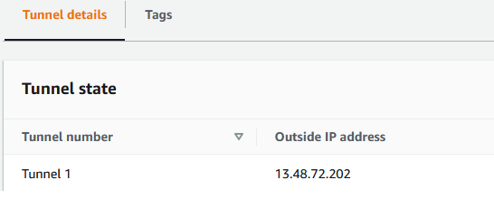

# AWS

## Introduction

In order to complete the AWS side of the Site-to-Site VPN connection, you must first complete the following steps from [your AWS dashboard](https://aws.amazon.com/)

1. [Create a virtual private gateway](aws.md#create-a-virtual-private-gateway).
2. [Initialize the VPN connection](aws.md#initial-vpn-setup).
3. [Configure the routing tables](aws.md#configure-routes).


**Additional Resources**

For more in-depth information on AWS Virtual Private Gateway configurations, refer to [the AWS documentation](https://docs.aws.amazon.com/directconnect/latest/UserGuide/virtualgateways.html).


The following describes precisely how to do each of these steps in such a way that the AWS side of the VPN connection will behave as expected.

## Creating a virtual private gateway

First, you'll need to create a **virtual private gateway** and **attach it** to the existing AWS VPC. \*\*\*\* This gateway that will act as a VPN concentrator on the AWS side.

From the VPC creation screen in your AWS account, navigate to **Virtual private network (VPN)** -> **Virtual private gateways.**

 (1) (1) (1).png>)

Select the orange **Create virtual private gateway** button in the upper right-hand corner to begin configuring the gateway. This will lead you to the configuration screen, as shown below.

.png>)

After the virtual private gateway has been created, attach the gateway to the VPC by selecting **Actions -> Attach to VPC.**

Select the VPC to which you'd like the gateway to be attached. Then, click **Attach to VPC.**

## Initial VPN setup

Next, using the inputs described below to configure the VPN, you'll need to initialize the **Site-to-Site VPN connection** on the AWS side.

Navigate to **Virtual private network (VPN) -> Site-to-Site VPN Connections**.

 (3).png>)

Select the orange **Create VPN connection** button in the upper right hand corner of the screen. This will launch the configuration screen for the VPN connection.

Options will be configured as shown in the screenshot and detailed in the table below.


**Important**

Please review the [IP address details section](aws.md#ip-address) before completing configuration.


 (1) (1).png>)

### Configuration

| Option name             | Instructions                                                                                                                    |
| ----------------------- | ------------------------------------------------------------------------------------------------------------------------------- |
| **Target gateway type** | Select "**Virtual Private Gateway**," then choose the virtual private gateway you created earlier in the dropdown that follows. |
| **Customer gateway**    | Select "New."                                                                                                                   |
| **IP address**          | :warning:**See** [**details**](aws.md#ip-address) **below this table.**                                                         |
| **Routing options**     | Select "Static."                                                                                                                |
| **Static IP fixes**     | Specify the CIDR IP of your CoreWeave VPC network, e.g. `10.100.100.0/24`.                                                      |

### IP address

This will be the IP address of your CoreWeave VPN, however configuring this is at the time of this guide's writing comes with a bit of a catch.

At this time, **there is no way to get the AWS tunnel endpoint IP before going through all steps,** so the following workaround must be employed\*\*.\*\*

1. A **random IP** must be added as the **IP address** for the first pass of these steps.
2. After the VPN has been created and the provided [tunnel details](aws.md#tunnel-details) have been noted, **then** create the [CoreWeave VPN](../vpn-setup.md).
3. After the CoreWeave VPN has been created and you have taken note of the IP assigned to your CoreWeave VPN, create a **new** **AWS Customer Gateway** with the new CoreWeave VPN IP Address by navigating to **Virtual Private Network -> Customer Gateways**.
4. After the new **Customer Gateway** is created, edit the previously created VPN by navigating to **Virtual Private Network -> Site-to-Site VPN Connections**.
5. Select your VPN, then edit it by seleting **Actions -> Modify VPN connection.**
6. Select your newly created Customer Gateway in the **Target customer gateway** dropdown.

## Tunnel 1

After completing the initial setup for the VPN, you'll need to configure further VPN settings for the tunnel under the **Tunnel 1 options** menu.

These options should be configured following the instructions detailed in the following table.

 (1) (1).png>)

### Configuration

| Option name                       | Instructions                                                                                                                                                                                                                                                                                                                            |
| --------------------------------- | --------------------------------------------------------------------------------------------------------------------------------------------------------------------------------------------------------------------------------------------------------------------------------------------------------------------------------------- |
| **Inside IPv4 CIDR for tunnel 1** | 
Choose a network to be used on the tunnel, or let AWS choose one for you. ℹ <strong>The first usable IP address in the <code>/30</code> network address space will be on the AWS side. The last usable IP address will be on the CoreWeave side</strong>
 |
| **Pre-shared key for Tunnel 1**   | 
A 32- to 64-character Alphanumeric random string. ⚠ <strong>CoreWeave will not allow a pre-shared key under 32 characters.</strong>
                                                                                                                      |
| **Advanced options for Tunnel 1** | 
Select the "<strong>Edit tunnel 1 options</strong>" radio button. ℹ <strong>This will prompt the second set of options to appear.</strong>
                                                                                                               |
| **Phase 1 encryption algorithms** | <ul><li>Remove <code>AES128</code> and <code>AES256</code>.</li><li>Leave <code>AES-128-GCM-16</code> and <code>AES-256-GCM-16</code>.</li></ul>                                                                                                                                                                                        |
| **Phase 2 encryption algorithms** | <ul><li>Remove <code>AES128</code> and <code>AES256</code>.</li><li>Leave <code>AES-128-GCM-16</code> and <code>AES-256-GCM-16</code>.</li></ul>                                                                                                                                                                                        |
| **Phase 1 integrity algorithms**  | Leave as is; will include `SHA2-256`, `SHA2-384`, and `SHA2-512`.                                                                                                                                                                                                                                                                       |
| **Phase 2 integrity algorithms**  | Leave as is, which will include `SHA2-256`, `SHA2-384`, and `SHA2-512`.                                                                                                                                                                                                                                                                 |
| **Phase 1 DH group numbers**      | Leave as is; should include `2`, `14`, `15`, `16`, `17`, `18`, `19`, `20`, `21`, `22`, `23`, and `24`.                                                                                                                                                                                                                                  |
| **Phase 2 DH group numbers**      | Leave as is; should include `2`, `5`, `14`, `15`, `16`, `17`, `18`, `19`, `20`, `21`, `22`, `23`, and `24`.                                                                                                                                                                                                                             |
| **Phase 1 lifetime (seconds)**    | Leave as is; the default is `28,800`.                                                                                                                                                                                                                                                                                                   |
| **Phase 2 lifetime (seconds)**    | Leave as is; the default is `3,600`.                                                                                                                                                                                                                                                                                                    |
| **Rekey margin time (seconds)**   | Leave as is; the default is `540`.                                                                                                                                                                                                                                                                                                      |
| **Rekey fuzz (percentage)**       | Leave as is; the default is `100`.                                                                                                                                                                                                                                                                                                      |
| **IKE version**                   | <ul><li>Remove <code>ikev1</code>.</li><li>Keep <code>ikev2</code>.</li></ul>                                                                                                                                                                                                                                                           |
| **Replay window size (packets)**  | Leave as is; the default is `1024`.                                                                                                                                                                                                                                                                                                     |
| **DPD timeout (seconds)**         | Leave as is; the default is `30`.                                                                                                                                                                                                                                                                                                       |
| **DPD timeout action**            | Select the "**Restart**" radio button.                                                                                                                                                                                                                                                                                                  |
| **Startup action**                | Select the "**Start**" radio button.                                                                                                                                                                                                                                                                                                    |

#### Advanced Tunnel 1 options

The following table describes what the configurations for the advanced Tunnel 1 options should be.

| Option name                       | Instructions                                                                                                                                     |
| --------------------------------- | ------------------------------------------------------------------------------------------------------------------------------------------------ |
| **Phase 1 encryption algorithms** | <ul><li>Remove <code>AES128</code> and <code>AES256</code>.</li><li>Leave <code>AES-128-GCM-16</code> and <code>AES-256-GCM-16</code>.</li></ul> |
| **Phase 2 encryption algorithms** | <ul><li>Remove <code>AES128</code> and <code>AES256</code>.</li><li>Leave <code>AES-128-GCM-16</code> and <code>AES-256-GCM-16</code>.</li></ul> |
| **Phase 1 integrity algorithms**  | Leave as is; will include `SHA2-256`, `SHA2-384`, and `SHA2-512`.                                                                                |
| **Phase 2 integrity algorithms**  | Leave as is, which will include `SHA2-256`, `SHA2-384`, and `SHA2-512`.                                                                          |
| **Phase 1 DH group numbers**      | Leave as is; should include `2`, `14`, `15`, `16`, `17`, `18`, `19`, `20`, `21`, `22`, `23`, and `24`.                                           |
| **Phase 2 DH group numbers**      | Leave as is; should include `2`, `5`, \*\*\*\* `14`, `15`, `16`, `17`, `18`, `19`, `20`, `21`, `22`, `23`, and `24`.                             |
| **Phase 1 lifetime (seconds)**    | Leave as is; the default is `28,800`.                                                                                                            |
| **Phase 2 lifetime (seconds)**    | Leave as is; the default is `3,600`.                                                                                                             |
| **Rekey margin time (seconds)**   | Leave as is; the default is `540`.                                                                                                               |
| **Rekey fuzz (percentage)**       | Leave as is; the default is `100`.                                                                                                               |
| **IKE version**                   | <ul><li>Remove <code>ikev1</code>.</li><li>Keep <code>ikev2</code>.</li></ul>                                                                    |
| **Replay window size (packets)**  | Leave as is; the default is `1024`.                                                                                                              |
| **DPD timeout (seconds)**         | Leave as is; the default is `30`.                                                                                                                |
| **DPD timeout action**            | Select the "**Restart**" radio button.                                                                                                           |
| **Startup action**                | Select the "**Start**" radio button.                                                                                                             |

The following screenshot exemplifies what these configurations look like.

 (1).png>)

## Configure Routes

Once the AWS VPC has been created and the VPN connection has been configured, a route must be added back to the CoreWeave VPC network.\\

To do this, configure the routing tables found under **Virtual private cloud -> Route tables**.

 (1) (1).png>)

Click the **route table ID** to open the configuration options for that table, and click the grey **Edit routes** button in the upper-right hand corner of the lower menu.

\
In the **Edit routes** menu, configure **Destination** as the CoreWeave VPC network name, and for **Target**, configure the AWS virtual private gateway that was created at the beginning of this process.

### Tunnel details

The newly created VPN is now viewable by navigating to **Virtual Private Network -> Site-to-Site VPN Connections**. Click the **VPN ID** to see details about the tunnel.

**Take note of the Tunnel 1 outside IP address. This will be needed in the CoreWeave VPN setup; review the** [**IP address details**](aws.md#ip-address) **for more information.**

