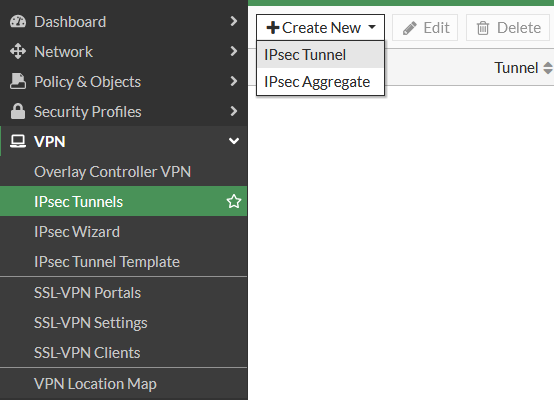
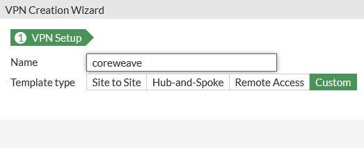
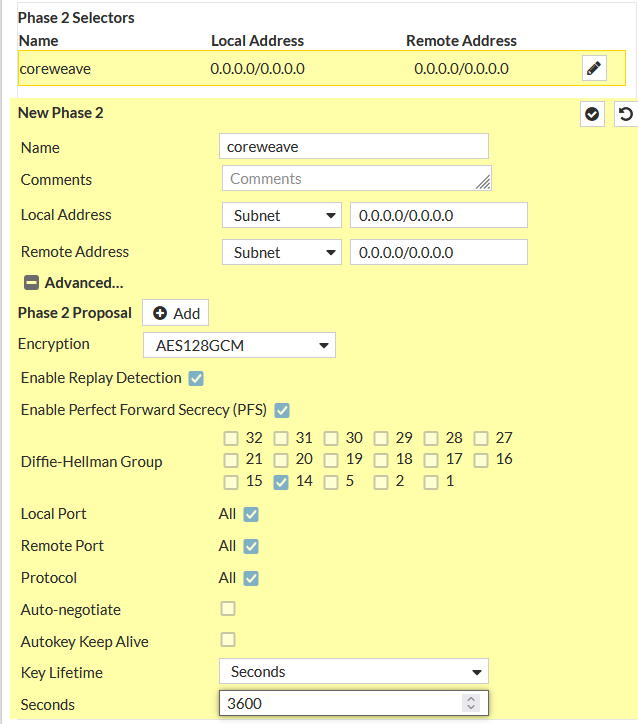
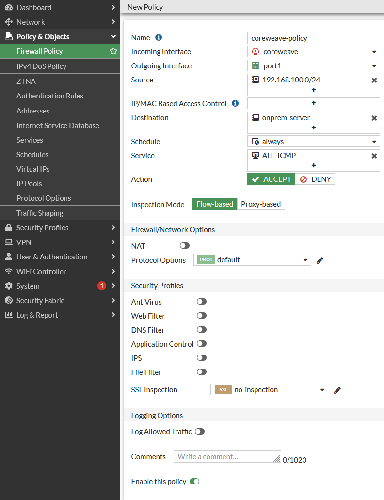
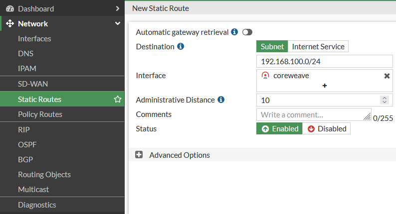
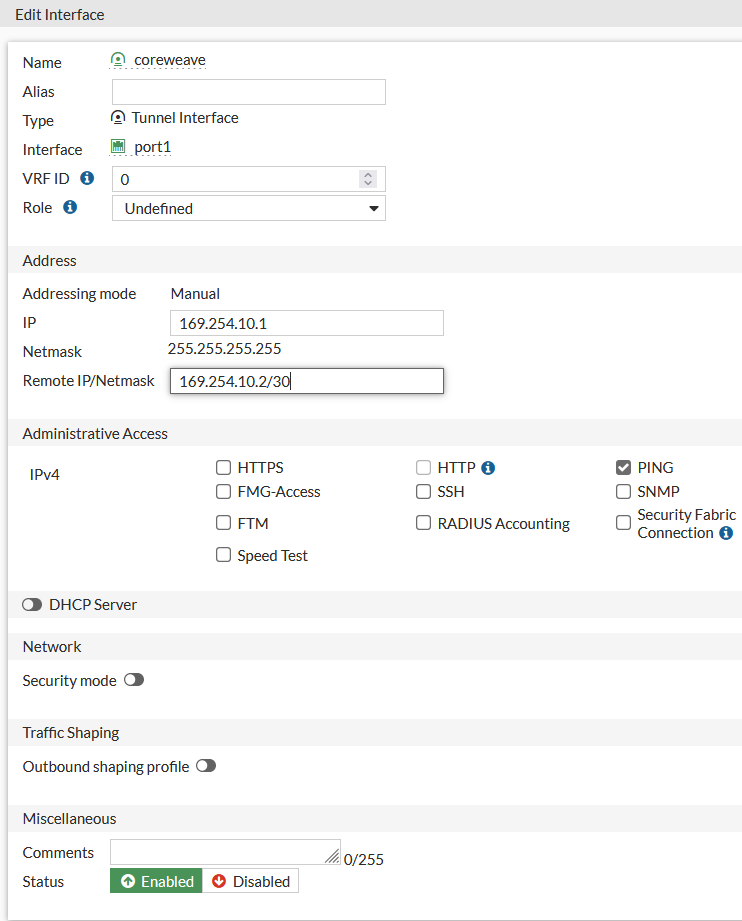

# Fortinet

In order to complete the Fortinet side of the Site-to-Site VPN connection, you must first complete the following steps from the Fortigate dashboard:

1. [Create a VPN Tunnel](https://app.gitbook.com/o/-M8EEYiNkaJsT8ISX0kX/s/-M83TghsCfsi8FCYs2DZ/\~/changes/tjJEyIP99W3v6R8Jn69w/coreweave-kubernetes/networking/site-to-site-connections/site-to-site-vpn/examples/fortinet#create-a-vpn-tunnel).
2. [Create a Security Policy](https://app.gitbook.com/o/-M8EEYiNkaJsT8ISX0kX/s/-M83TghsCfsi8FCYs2DZ/\~/changes/tjJEyIP99W3v6R8Jn69w/coreweave-kubernetes/networking/site-to-site-connections/site-to-site-vpn/examples/fortinet#creating-a-policy).
3. [Create a Static Route](https://app.gitbook.com/o/-M8EEYiNkaJsT8ISX0kX/s/-M83TghsCfsi8FCYs2DZ/\~/changes/tjJEyIP99W3v6R8Jn69w/coreweave-kubernetes/networking/site-to-site-connections/site-to-site-vpn/examples/fortinet#creating-a-static-route).
4. [Assign a IP address to the tunnel interface​](https://app.gitbook.com/o/-M8EEYiNkaJsT8ISX0kX/s/-M83TghsCfsi8FCYs2DZ/\~/changes/tjJEyIP99W3v6R8Jn69w/coreweave-kubernetes/networking/site-to-site-connections/site-to-site-vpn/examples/fortinet#assigning-a-ip-address-to-the-tunnel-interface).


**Additional Resources**

For more in-depth information on Fortigate VPN configuration, refer to the [Fortinet documentation](https://docs.fortinet.com/document/fortigate/7.2.1/administration-guide/762500/general-ipsec-vpn-configuration).


The following describes how to accomplish the above such that the Fortinet side of the VPN connection will behave as expected.

## Create a VPN tunnel

From the Fortinet dashboard, navigate to the **IPsec Tunnels** menu from the **VPN** submenu.

Select **Create New**, then **IPsec Tunnel** from the drop-down.

<figure><figcaption>
The IPsec tunnels configuration page from the VPN submenu
</figcaption></figure>

This will open the VPN Creation Wizard. Select **Custom**, then input a name for the tunnel (e.g., `coreweave`), then click **Next**.

<figure><figcaption>
The VPN configuration screen
</figcaption></figure>

This will open the main configuration screen for the IPSec tunnel.

### Phase 1 selectors

Refer to the table below, as well as the following screenshots, to configure the settings for the Phase 1 selectors of the tunnel.


**Note**

Please note that some settings will be left as their default settings, and are therefore not mentioned.


<table><thead><tr><th width="347">Option name</th><th>Instructions</th></tr></thead><tbody><tr><td>IP Address</td><td>The IP address of your VPN service in CoreWeave</td></tr><tr><td>Interface</td><td>Your WAN interface</td></tr><tr><td>Pre-shared Key</td><td>A 32- to 64-character alphanumeric random string ⚠<strong>CoreWeave will not allow a pre-shared key under 32 characters.</strong></td></tr><tr><td>IKE</td><td>Version 2</td></tr><tr><td>Phase 1 Proposal - Encryption</td><td><code>AES128GCM</code></td></tr><tr><td>Phase 1 Proposal - PRF</td><td><code>PRFSHA256</code></td></tr><tr><td>Diffie-Hellman Group</td><td><code>14 (modp2048)</code></td></tr><tr><td>Key Lifetime</td><td><code>28800</code></td></tr></tbody></table>

<figure><figcaption>
Phase 1 selectors menu
</figcaption></figure>

### Phase 2 selectors

Refer to the table below, as well as the following screenshots, to configure the settings for the Phase 2 selectors of the tunnel.


**Note**

Please note that some settings will be left as their default settings, and are therefore not mentioned.


| Option name                             | Instructions    |
| --------------------------------------- | --------------- |
| Phase 2 Proposal - Encryption           | `AES128GCM`     |
| Phase 2 Proposal - Diffie-Hellman Group | `14 (modp2048)` |
| Key Lifetime Seconds                    | `3600`          |

<figure><figcaption>
Phase 2 selectors menu
</figcaption></figure>

Once the Phase 1 and Phase 2 selectors have been configured as described above, click **OK** to create the tunnel. This will return you to the **IPSec Tunnels** dashboard.

## Create a Security Policy

Without a **Security Policy** attached, the VPN tunnel will not appear.

To configure a Security Policy for the new tunnel, navigate to the **Firewall Policy** page from the **Policy & Objects** submenu. From here, configure the Security Policy as is appropriate for your environment. Be sure that the new policy is **Enabled** using the slider at the bottom of the page.

<figure><figcaption>
The Security Policy configuration menu
</figcaption></figure>

## Create a static route

To configure a static route for your tunnel, navigate to the **Static Routes** page under the **Network** submenu.

| Option name | Instructions                       |
| ----------- | ---------------------------------- |
| Destination | The CoreWeave VPC subnet           |
| Interface   | The newly created tunnel interface |

<figure><figcaption>
Static Route configuration options
</figcaption></figure>

## Assign an IP address to the tunnel interface

To assign an IP address to the new tunnel interface, navigate to the **Interfaces** menu below the **Network** submenu.

The new tunnel interface will be listed under the **Physical Interface** you selected during the tunnel setup (this will usually be your WAN port).

Select the **Tunnel Interface**, then click **Edit**.

<figure><figcaption>
The network interfaces configuration menu
</figcaption></figure>

Clicking **Edit** will open the **Edit Interface** menu. To configure the interface, refer to the table as well as the screenshots below.

| Option                | Instructions                                                                                                                            |
| --------------------- | --------------------------------------------------------------------------------------------------------------------------------------- |
| IP                    | The IP for the Fortinet end of the tunnel                                                                                               |
| Remote IP/Netmask     | The IP for the CoreWeave end of the tunnel, including the netmask (usually `/30`)                                                       |
| Administrative Access | 
Select <code>PING</code> (This will allow you to <code>ping</code> the tunnel interface from the CoreWeave end of the tunnel)
 |

<figure><figcaption>
The interface configuration menu
</figcaption></figure>

Once your Tunnel Interface has been correctly configured, the tunnel should be ready to use!
