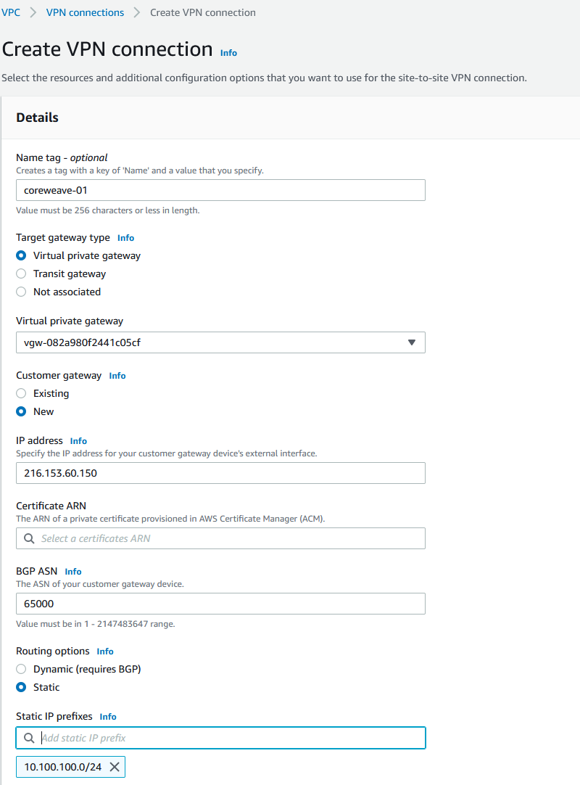
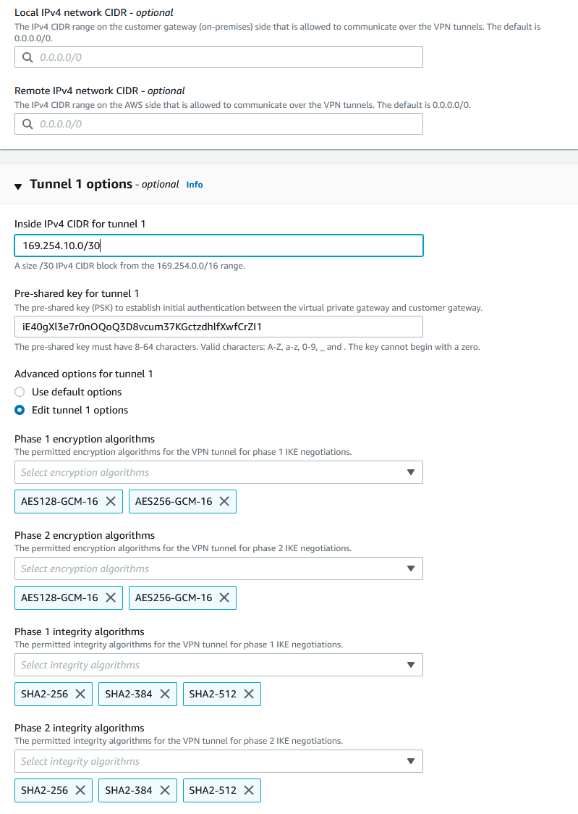
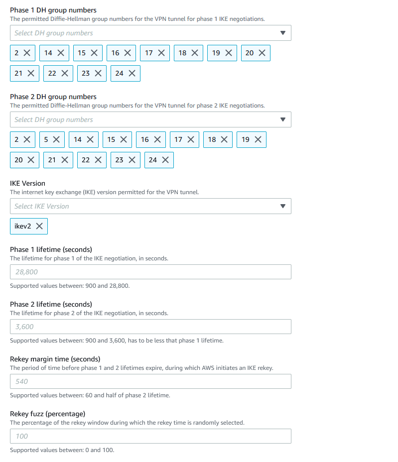
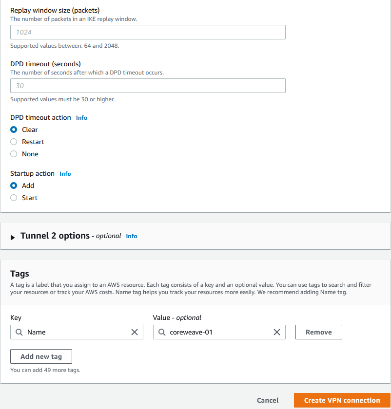
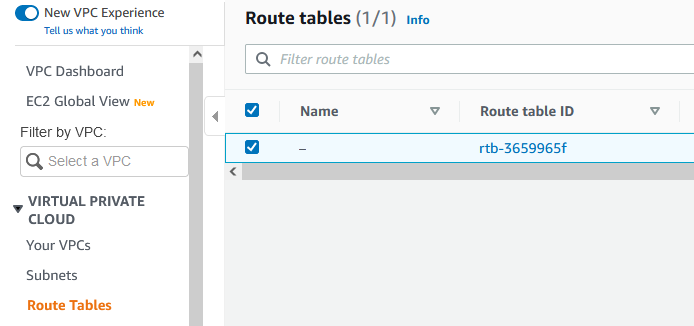
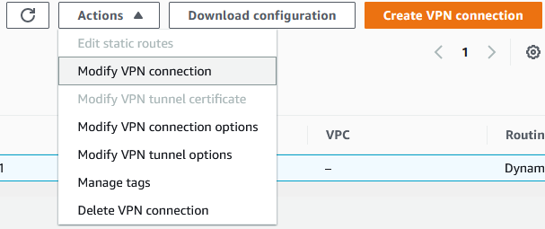

# AWS

### VPC

All needed configurations will be performed under the [**VPC Dashboard**](https://us-east-1.console.aws.amazon.com/vpc/home)**.**

| Table of Content                                                        |
| ----------------------------------------------------------------------- |
| ****[**Virtual Private Gateways**](aws.md#virtual-private-gateways)**** |
| [Create VPN connection](aws.md#create-vpn-connection)                   |

#### **Virtual Private Gateways**

**​**We first need to create a Virtual Private Gateway that will act as a VPN concentrator on the AWS side. You will not need to fill out any information when creating the Virtual Private Gateway.

.png>)

After the Virtual Private Gateway has been created it has to be attached to your VPC.

#### Create VPN connection

See below screenshot below for settings.

| **Target gateway type** | Specify Virtual private gateway and then choose your previously created Virtual private gateway in the dropdown. |
| ----------------------- | ---------------------------------------------------------------------------------------------------------------- |
| **Customer gateway**    | New                                                                                                              |
| IP address              | Specify the IP address of your CoreWeave VPN ([Please see note before proceeding](aws.md#notes))                 |
| Routing options         | Static                                                                                                           |
| Static IP prefixes      | Specify your CoreWeave VPC Network                                                                               |

See screenshot below for settings.

| **Inside IPv4 CIDR for tunnel 1** | Choose a network to be used on the tunnel or let AWS choose one for you. Please note that the first usable IP address in the /30 will be the AWS side and the last usable IP address will be the CoreWeave side. |
| --------------------------------- | ---------------------------------------------------------------------------------------------------------------------------------------------------------------------------------------------------------------- |
| **Pre-sared key for tunnel1**     | 32-64 Alphanumeric random string. Please note that CoreWeave will not allow a PSK under 32 chars.                                                                                                                |
| **Advanced options for tunnel 1** | Edit tunnel 1 options.                                                                                                                                                                                           |
| **Phase 1 encryption algorithms** | Remove AES128 & AES256, leave AES-128-GCM-16 & AES-256-GCM-16.                                                                                                                                                   |
| **Phase 2 encryption algorithms** | Remove AES128 & AES256, leave AES-128-GCM-16 & AES-256-GCM-16                                                                                                                                                    |
| **Phase 1 integrity algorithms**  | Leave as is.                                                                                                                                                                                                     |
| **Phase 2 integrity algorithms**  | Leave as is.                                                                                                                                                                                                     |

See screenshot below for settings\

| **Phase 1 DH group numbers**    | Leave as is.              |
| ------------------------------- | ------------------------- |
| **Phase 2 DH group numbers**    | Leave as is.              |
| **IKE Version**                 | Remove ikev1, keep ikev2. |
| **Phase 1 lifetime (seconds)**  | Leave as is.              |
| **Phase 2 lifetime (seconds)**  | Leave as is.              |
| **Rekey margin time (seconds)** | Leave as is.              |
| **Rekey fuzz (percentage)**     | Leave as is.              |

See screenshot below for settings

| **Replay window size (packets)** | Leave as is. |
| -------------------------------- | ------------ |
| **DPD timeout (seconds)**        | Leave as is. |
| **DPD timeout action**           | Clear        |
| **Startup action**               | Add          |

#### Routes

You will now need to add a route back to the CoreWeave VPC network.\
Your routing tables can be found under Virtual Private Cloud -> Route Tables.

After clicking on the Route table ID you will be able to edit the routing table.\
For Destination add your CoreWeave VPC network and for Target your AWS Virtual Private Gateway that was created earlier.

#### Tunnel details

Under Virtual Private Network -> Site-to-Site VPN Connections you will be able to find your newly created VPN. When clicking the VPN ID you can see details about your tunnel. Take note of the Tunnel 1, Outside IP address. This will be needed in the CoreWeave VPN setup.

#### Notes

At the current time as this guide was written, there is no way to get the AWS tunnel endpoint IP before going through all steps. Therefor a random IP can be added as the IP address.

After the VPN has been created and the [Tunnel details](aws.md#tunnel-details) has been noted you can go ahead and create the [CoreWeave VPN](coreweave.md).

When the CoreWeave VPN has been created and you have taken note of the IP assigned to your CoreWeave VPN. \
You will need to create a new AWS Customer Gateway with this IP Address (Virtual Private Network -> Customer Gateways).

When the new Customer Gateway has been created, you will need to edit the previously created VPN (Virtual Private Network -> Site-to-Site VPN Connections).

Select your VPN and then edit it as shown in the screenshot below

Please select your newly created Customer Gateway in the Target customer gateway dropdown.
