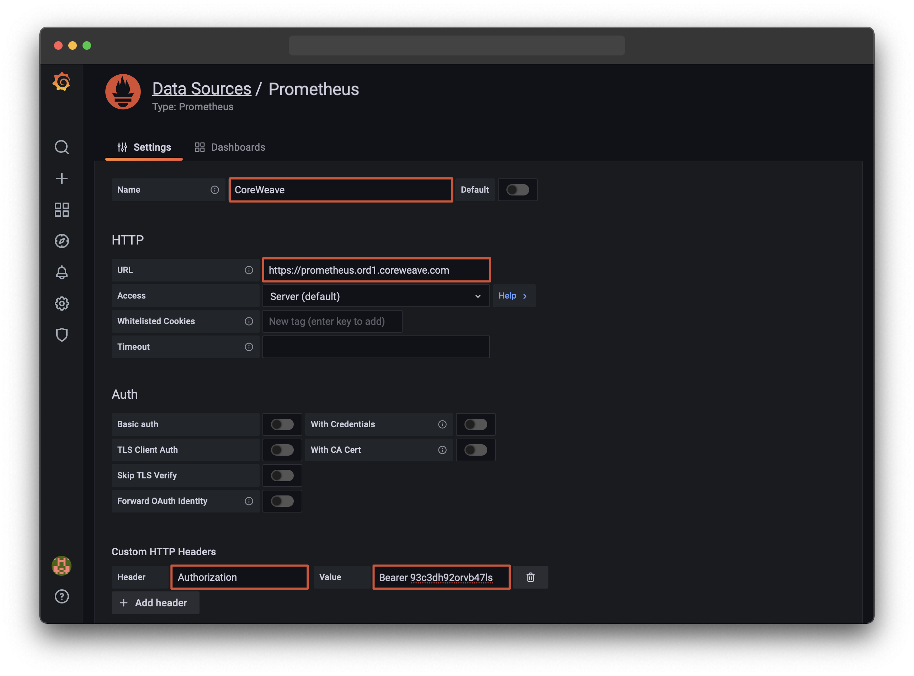

# Grafana

## Managed Grafana Instance 

CoreWeave provides a managed Grafana instance to view predefined dashboards. You can not modify or create your own dashboards in this Grafana instance. To manage your own dashboards, please see the section below on Self Hosted Grafana.


You can access **Grafana** at [https://grafana.coreweave.com](https://grafana.coreweave.com)


## Self Hosted Grafana Instance

You can connect to Prometheus from your own Grafana instance. A Grafana instance can be deployed with one click via [CoreWeave Apps.](https://apps.coreweave.com) You can also connect your existing on-premise Grafana to CoreWeave Cloud's Prometheus service. The following steps need to be taken to add the Prometheus DataSource.

* Login as an admin on your Grafana instance and go to **Configuration** -> **Data Sources**
* **Add New Datasource** and select **Prometheus** as the provider
* Set the new **Datasource Name** to `CoreWeave`
* Under _HTTP Section_ set **URL** to `https://prometheus.ord1.coreweave.com`
* Click the "**Add Header**" button under the _Custom HTTP Headers_ section
* Set the first value (**Header**) to: `Authorization`
* Set the second value (**Value**) to `Bearer <TOKEN>` replace "\<TOKEN>" with your Access Token.
* Click "**Save & Test**" button to verify and save the new Datasource.

You can now choose the new `CoreWeave` Datasource in a dashboard to visualize Prometheus metrics hosted on CoreWeave.&#x20;


There's no need to filter the `namespace` label to your namespace for any metric. It will be automatically inserted on all queries received.

