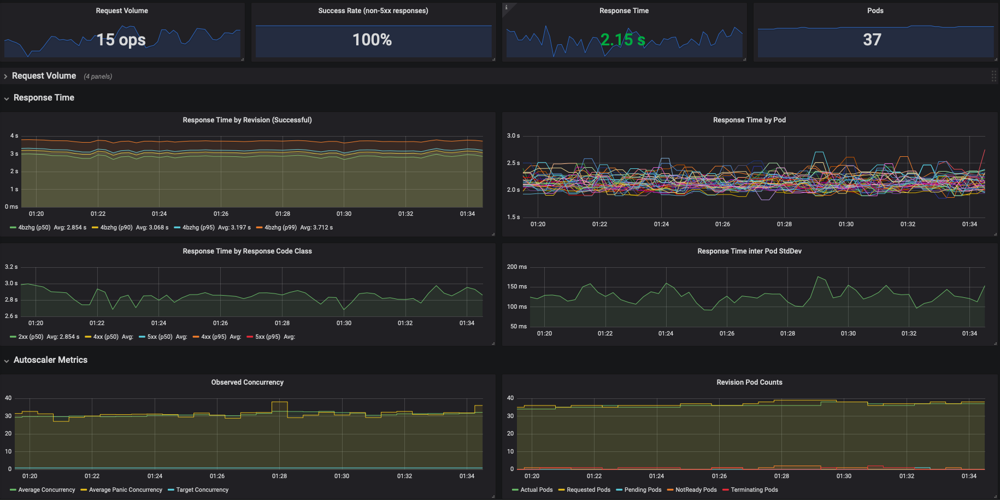

# Serverless

CoreWeave Cloud enables clients to run their own code, manage data, and integrate applications -  all without ever having to manage any infrastructure.

Deploying serverless applications is an especially ideal deployment alternative when the purpose of the application is to serve HTTP or gRPC requests either internally or externally to and from the Internet.

<table data-card-size="large" data-view="cards"><thead><tr><th></th><th></th><th></th><th data-hidden data-card-target data-type="content-ref"></th></tr></thead><tbody><tr><td>Our <strong>applications Catalog</strong> houses tons of apps that you can deploy with a few clicks!</td><td>Learn more --></td><td></td><td><a href="getting-started/applications-catalog.md">applications-catalog.md</a></td></tr></tbody></table>

## KNative on CoreWeave

CoreWeave uses the [KNative](https://knative.dev/docs/serving/getting-started-knative-app/) runtime to support deploying serverless applications with a single manifest, so no additional installation or configuration is necessary to deploy your applications.

## Serverless benefits

<table data-card-size="large" data-view="cards"><thead><tr><th></th><th></th><th></th></tr></thead><tbody><tr><td><span data-gb-custom-inline data-tag="emoji" data-code="1f510">🔐</span> <strong>Automatic public HTTPS endpoints</strong></td><td>Never worry about managing SSL certificates for your serverless applications - with KNative and LetsEncrypt, HTTPS endpoints are automatic with every deployment.</td><td></td></tr><tr><td><span data-gb-custom-inline data-tag="emoji" data-code="1f4c8">📈</span> <strong>Autoscaling by default, including</strong> <a href="https://knative.dev/docs/serving/autoscaling/scale-to-zero/#enable-scale-to-zero"><strong>Scale-to-Zero</strong></a><strong></strong></td><td>High-availability comes built-in with serverless application deployments on CoreWeave, so application resources scale automatically according to their traffic. Scaling to zero means consuming no resources, incurring no billable charges while idle.</td><td></td></tr><tr><td><span data-gb-custom-inline data-tag="emoji" data-code="1f4b0">💰</span> <strong>No charge for public IPs</strong></td><td>Public IP addresses do not incur any additional costs when deploying serverless applications on CoreWeave, making public distribution of the application easy.</td><td></td></tr><tr><td><span data-gb-custom-inline data-tag="emoji" data-code="1f9ea">🧪</span> <strong>Advanced deployment strategies</strong></td><td>CoreWeave's implementation of the KNative runtime supports advanced deployment strategies, including <a href="https://knative.dev/docs/getting-started/first-traffic-split/">traffic splitting techniques</a> useful for blue/green and canary deployment methods.</td><td></td></tr></tbody></table>

<figure><figcaption><p>Serveless deployment diagram</p></figcaption></figure>

## Deployment example

The following example manifest demonstrates how to deploy a simple application manifest onto CoreWeave Cloud.

```yaml
apiVersion: serving.knative.dev/v1 # Current version of Knative
kind: Service
metadata:
  name: helloworld # The name of the app
spec:
  template:
    metadata:
      annotations:
        autoscaling.knative.dev/minScale: "0" # Allow scale to Zero
        autoscaling.knative.dev/maxScale: "10" # Maximum number of Pods allowed to auto-scale to
    spec:
      # The container concurrency defines how many active requests are sent to a single
      # backend pod at a time. This configuration is important as it effects how well requests
      # are load balanced over Pods. For a standard, non-blocking web applocation this can usually
      # be rather high, ie 100. For GPU Inference however, this should usually be set to 1.
      # GPU Inference only processes one request at a time, and one wants to avoid a queue being
      # built up in the local pod instead of centrally in the Load Balancer.
      containerConcurrency: 10 
      containers:
        - image: gcr.io/knative-samples/helloworld-go # The URL to the image of the app
          resources:
            limits:
              cpu: 2
              memory: 4Gi
          env:
            - name: TARGET # The environment variable printed out by the sample app
              value: "Go Sample v1"
```

Once the manifest is applied and the application is deployed, get the public URL of the service using `kubectl get ksvc`:

```bash
$ kubectl get ksvc

NAME            URL                                                       LATESTCREATED         LATESTREADY           READY   REASON
helloworld      https://helloworld.default.knative.chi.coreweave.com      helloworld-ngzsn      helloworld-ngzsn      True
```


**Note**

If the value of the URL provided does not have `https`, it may be that the domain is too long. Please [contact your CoreWeave Support Specialist](https://cloud.coreweave.com/contact) for assistance.


## Monitoring

Managed [Grafana](https://grafana.com/) monitoring provides insights into requests, success rates, response times and auto-scaling metrics transparently. No metrics-specific code needs to be added to the serverless application.

<figure><figcaption><p>Grafana dashboard</p></figcaption></figure>

To access Grafana, [log in to your CoreWeave Cloud account](https://cloud.coreweave.com), then navigate to the **Account Details** section in the left-hand navigation menu, and click **Grafana**. Clicking this link will open a new window in your browser.

<figure><figcaption></figcaption></figure>
