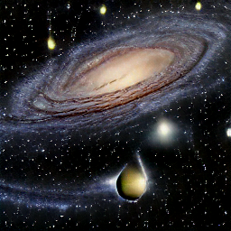

# Scalable Inference with DALL-E Mega

The [DALL-E Mini and Mega](https://huggingface.co/dalle-mini/dalle-mega) models take a text prompt as input, then generate an image as output.

The following example includes code to accept text inputs to generate an image, as well as the code and manifests needed to download the model and deploy an auto-scaling Inference Service on CoreWeave Cloud.

The end result is a HTTP API that can be used to generate images from text input in a concurrent and highly scalable fashion.


**View the example code on GitHub:**


Clone the manifests from GitHub to follow along


## Prerequisites

The following tools must be installed and configured prior to running the example:

* [kubectl](https://docs.coreweave.com/coreweave-kubernetes/getting-started#install-kubernetes-command-line-tools)
* [docker](https://docs.docker.com/get-docker/)
* A CoreWeave Cloud account ([with Kubectl configured to use your CoreWeave kubeconfig](https://docs.coreweave.com/coreweave-kubernetes/getting-started#obtain-access-credentials))
* A [Docker Hub](https://hub.docker.com/) account

## Procedure

### Build and push the Docker images

We require two images:

1. **The Downloader image.** This will download the model to a [shared storage volume](../../../../storage/storage/), the individual inference Pods will load the model from this storage instead of downloading it over internet every time they scale up.&#x20;
2. **The Model Image.** This is what will run DALL-E Mega.


**Important**

The default Docker tag is `latest`. Using this tag is **strongly** **discouraged**, as containers are cached on the nodes and in other parts of the CoreWeave stack. Always use a unique tag, and never push to the same tag twice. Once you have pushed to a tag, **do not** push to that tag again.


Below, we use simple versioning by using the tag `1` for the first iteration of the image.


**Note**

When running the following commands, be sure to replace the example `username` with your Docker Hub `username`.


From the `kubernetes-cloud/online-inference/dalle-mini` directory, run the following commands:

```bash
$ docker login
$ export DOCKER_USER=coreweave
$ docker build -t $DOCKER_USER/model-downloader:1 -f Dockerfile.downloader . 
$ docker build -t $DOCKER_USER/dalle-mini:1 -f Dockerfile . 
$ docker push $DOCKER_USER/model-downloader:1
$ docker push $DOCKER_USER/dalle-mini:1
```


**Note**

This example assumes a public docker registry. To use a private registry, an [imagePullSecret ](https://kubernetes.io/docs/tasks/configure-pod-container/pull-image-private-registry/)needs to be defined.


### Deploy the Kubernetes resources


**Note**

`dalle-mega` may be replaced with `dalle-mini` in the manifests and following commands if you wish to deploy the smaller version of the model.&#x20;


#### PVC


**Note**\
Before continuing, you may either point the `image:` in the following manifests to the image we just built in the previous steps, or you may use the publicly-available image found in the following manifests:

* [`01-model-download-job.yaml`](../../../../../online-inference/dalle-mini/01-model-download-job.yaml)
* [`02-inference-service.yaml`](../../../../../online-inference/dalle-mini/02-inference-service.yaml)


To create a PVC in which to store the model, run the following command from the `kubernetes-cloud/online-inference/dalle-mini` directory:

```bash
$ kubectl apply -f 00-model-pvc.yaml
```

#### Model job download

To deploy the job that downloads the model to the PVC, run the following command from the `kubernetes-cloud/online-inference/bloom-175b/` directory:

```
$ kubectl apply -f 01-model-download-job.yaml
```

To check if the model has finished downloading, wait for the job to be in a `Completed` state:

```
$ kubectl get pods

NAME                        READY   STATUS      RESTARTS   AGE
dalle-mega-download-hkws6   0/1     Completed   0          1h
```

Or, follow the job logs to monitor progress:

```
kubectl logs -l job-name=dalle-mega-download --follow
```

#### InferenceService

Once the model is downloaded, the `InferenceService` can be deployed by invoking:

```
kubectl apply -f 02-inference-service.yaml
```

Loading up the model into GPU memory may take a couple of minutes. To monitor the progress of this, you can wait to see the KServe workers start in the pod logs by invoking:

```
kubectl logs -l serving.kubeflow.org/inferenceservice=dalle-mega --container kfserving-container
```

Alternatively, you can wait for the `InferenceService` to show that `READY` is `True`, and that it has a URL:

<pre class="language-bash"><code class="lang-bash"><strong>$ kubectl get isvc dalle-mega
</strong><strong>
</strong><strong>NAME         URL                                                                        READY   PREV   LATEST   PREVROLLEDOUTREVISION   LATESTREADYREVISION                  AGE
</strong>dalle-mega   http://dalle-mega.tenant-my-namespace.knative.chi.coreweave.com   True           100                              dalle-mega-predictor-default-00001   19h
</code></pre>

Using the provided URL, you can make an HTTP request via your preferred means.

Here is a simple cURL example:

```bash
curl http://dalle-mega.tenant-my-namespace.knative.chi.coreweave.com/v1/models/dalle-mega:predict -d '{"prompt": "Photorealistic galaxy"}' --output prediction.png && open prediction.png
```




The following parameters are supported:

```
- top_k
- top_p
- temperature
- condition_scale
```

You can modify the model parameters by invoking `curl` as follows:

```bash
curl http://dalle-mega.tenant-my-namespace.knative.chi.coreweave.com/v1/models/dalle-mega:predict -d '{"prompt": "Photorealistic galaxy", "parameters": {"top_k": 100, "top_p": 2.0, "temperature": 1.5, "condition_scale": 15.0}}' --output prediction.png && open prediction.png
```


### Hardware and Performance

This example is set to one RTX A6000. Inference times are 5-10 seconds on RTX A6000 and A40 GPUs. Multi GPU Inference is supported, which does provide speedup. Simply increase the number of GPUs in the `limits` section of the `InferenceService` manifest YAML.

GPUs with less VRAM might also work for your use case, down to 16GB GPUs such as the Quadro RTX 5000.


**Additional Resources**

Refer to the[ Node Types](https://docs.coreweave.com/coreweave-kubernetes/node-types) page for all available GPUs and their selectors.


### Autoscaling

Scaling is controlled in the `InferenceService` configuration. This example is set to always run one replica, regardless of number of requests.

Increasing the number of `maxReplicas` will allow the CoreWeave infrastructure to automatically scale up replicas when there are multiple outstanding requests to your endpoints. Replicas will automatically be scaled down as demand decreases.

#### Example

```yaml
spec:
  predictor:
    minReplicas: 1
    maxReplicas: 1
```

By setting `minReplicas` to `0`, Scale To Zero can be enabled, which will completely scale down the `InferenceService` when there have been no requests for a period of time.

When a service is scaled to zero, no cost is incurred.
