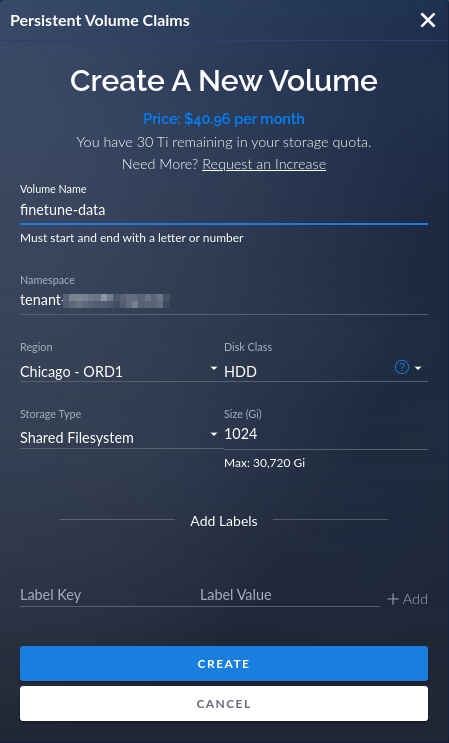

# Fine-tune Large Language Models with CoreWeave Cloud

## Introduction

This guide demonstrates how to fine-tune a Large Language Model (LLM) using a custom dataset with CoreWeave Cloud. It serves as a practical example of a starter project but is not intended to be a comprehensive production application in its current form.

Fine-tuning an LLM can be costly; however, this guide illustrates how to utilize CoreWeave's architecture with Argo Workflows to automatically scale down to zero active pods after completing the fine-tuning process. This releases the billable computation resources, making this a cost-effective system.

### Features

The scenario in this guide fine-tunes the EleutherAI Pythia model on a single GPU, and can be extended with several advanced features:

* [**Scalable configuration**](finetuning-machine-learning-models.md#parameters-that-adjust-hardware): Run up to 7 GPUs on the same node, and adjust the RAM and number of CPUs.
* [**Model variety**](finetuning-machine-learning-models.md#how-to-change-base-models): This fine-tuner can automatically downloads model from Hugging Face, or use an uploaded model.
* [**Prompt testing**](finetuning-machine-learning-models.md#parameters-for-prompt-testing): Characterize the model during fine-tuning by periodically running a prompt file against it and logging the results.&#x20;

The fine-tuner uses PyTorch 2.0, CUDA 11.8, and the latest version of DeepSpeed. It also supports CUDA 12.0-based images.

### Hardware configuration

The default configuration uses 8 vCPUs, 128GB RAM, and a single NVIDIA A40 or A6000 with 48GB VRAM. This cost-effective and optimized configuration costs about $2.00 per hour with CoreWeave's resource-based pricing and is best suited for models with 155 million to 6 billion parameters.

After fine-tuning, this workflow can optionally deploy an inference endpoint configured with 4 vCPUs, 8GB RAM, and a single NVIDIA RTX A5000 with 24GB VRAM. This setup can efficiently perform inference on models with 6 billion parameters and is much more affordable than the fine-tuning configuration, at approximately $0.85 per hour.

If more performance is desired, use workflow parameters to scale up the number of GPUs, RAM, and vCPUs.

## Prerequisite steps

Before proceeding with this demonstration, please complete these preliminary steps:

1. Configure [CoreWeave Kubernetes](../../../../coreweave-kubernetes/getting-started.md)
2. Install [Argo Workflows](../../../../cloud-tools/argo/)
3. [Retrieve the Bearer token](../../../../cloud-tools/argo/#how-to-retrieve-the-client-token) and log into the [Argo web UI](../../../../cloud-tools/argo/#how-to-use-the-web-ui)
4. Install [Argo CLI](../../../../cloud-tools/argo/use-the-argo-workflows-cli.md)

Once those steps are complete, proceed with the steps below.

## Clone the GitHub repository

Clone the [`coreweave/kubernetes-cloud`](https://github.com/coreweave/kubernetes-cloud) repository to the local workstation, then change to the `finetuner-workflow` directory.

<pre class="language-bash"><code class="lang-bash"><strong>git clone https://github.com/coreweave/kubernetes-cloud.git
</strong>cd kubernetes-cloud/finetuner-workflow
</code></pre>


**Important**

Make sure to pull the latest version of the **`master`** branch to get the latest changes.


## Create a PVC

The demonstration uses a shared filesystem called a PVC (Persistent Volume Claim) for storing the base model, fine-tuning data, and sharing them between multiple fine-tune runs.&#x20;

Create the PVC using one of the two options below.

### Option 1: Create the PVC with kubectl

To create the PVC, apply the [`finetune-pvc.yaml`](../../../../../finetuner-workflow/finetune-pvc.yaml) manifest with `kubectl` and confirm the PVC was created successfully.

```bash
kubectl apply -f finetune-pvc.yaml
```

Result:

```
persistentvolumeclaim/finetune-data created
```

The manifest has reasonable defaults, but if it requires editing, keep the following points in mind:

* HDD storage is preferred over NVMe. It's more cost-effective and the fine-tuner does not need high I/O performance.&#x20;
* The model checkpoints require between 1024 and 2048 GB of storage. If more space is needed later, it's simple to [expand it in place](../../../../storage/storage/).&#x20;
* By default, the workflow expects a PVC named `finetune-data`. If this changes, remember to adjust the `pvc` [parameter](finetuning-machine-learning-models.md#common-parameters) accordingly. &#x20;

### Option 2: Create the PVC with CoreWeave Cloud

For an interactive experience, create the PVC in a web browser.&#x20;

Navigate to [Storage Volumes](https://cloud.coreweave.com/storage) in CoreWeave Cloud.

Click **New Volume**, and enter the requested fields:

* Volume Name: **finetune-data**
* Region: **Chicago - ORD1**
* Disk Class: **HDD**
* Storage Type: **Shared Filesystem**
* Size (Gi): Choose a size between **1024** and **2048** Gi

<figure><figcaption><p>Deploy a PVC</p></figcaption></figure>

Click **Create** and verify that the PVC is created successfully.

## Optional: Deploy a Filebrowser app

The `filebrowser` app provides an easy way to transfer data to and from the PVC created in the previous step.&#x20;


**Optional**

It's also possible to use a [Virtual Server](broken-reference) to load files onto the PVC. This flexibility represents one of CoreWeave's key advantages.


1. Navigate to [CoreWeave Applications](https://apps.coreweave.com/), and then click the **Catalog** tab.
2. Locate `filebrowser` and click **Deploy**.
3. Assign it a short name, such as `finetune`, to avoid SSL CNAME issues
4. Select the **ORD1** location.&#x20;
5. Hover over `finetune-data` in **Available Volumes** to reveal the `+` icon, and click it to attach the volume. Ensure that it is mounted, as demonstrated in the example below.
6. Click **Deploy**.

<figure><figcaption><p>Screenshot of filebrowser deployment</p></figcaption></figure>

## Load the fine-tuning dataset

Connect to the PVC using the filebrowser application, or use a [virtual server](broken-reference).&#x20;

Create a directory on the PVC called `dataset`, then load the fine-tuning files into that directory.

The data should be in individual plain text files with a `.txt` extension and in the exact format desired for prompts and responses. When the workflow runs, Argo will tokenize the dataset using [a fast Golang component](https://github.com/wbrown/gpt\_bpe/blob/main/cmd/dataset\_tokenizer/dataset\_tokenizer.go).

Partition the data into separate files to make it easier to add and remove subsets. When loading multiple datasets, create a meaningful directory name for each.

If using a different top-level directory name than `dataset`, change the `dataset` parameter to match before invoking the workflow.&#x20;

## About the repository files

This is an inventory of the files in the `finetuner-workflow` directory of the `coreweave/kubernetes-cloud` repository, cloned [earlier in this guide](finetuning-machine-learning-models.md#4.-clone-the-github-repository).

| Filename                                                                                     | Description                                                                                                                                           |
| -------------------------------------------------------------------------------------------- | ----------------------------------------------------------------------------------------------------------------------------------------------------- |
| [`finetune-workflow.yaml`](../../../../../finetuner-workflow/finetune-workflow.yaml)         | The Argo workflow itself. Many parameters at the top of this file are discussed later.                                                                |
| [`finetune-pvc.yaml`](../../../../../finetuner-workflow/finetune-pvc.yaml)                   | The PVC declaration applied in the [prerequisites section](finetuning-machine-learning-models.md#5.-create-a-shared-filesystem-volume) of this guide. |
| [`finetune-role.yaml`](../../../../../finetuner-workflow/finetune-role.yaml)                 | The `ServiceAccount` role used by Argo.                                                                                                               |
| [`finetuner/Dockerfile`](../../../../../finetuner-workflow/finetuner/Dockerfile)             | A Dockerfile used to build a fine-tuner image after modifying the `finetuner.py` code.                                                                |
| [`finetuner/ds_config.json`](../../../../../finetuner-workflow/finetuner/ds\_config.json)    | <p>The deepspeed configuration placed in the container. </p><p><strong>We recommend not modifying this.</strong></p>                                  |
| [`finetuner/evaluator.py`](../../../../../finetuner-workflow/finetuner/evaluator.py)         | Prompt testing functions                                                                                                                              |
| [`finetuner/finetuner.py`](../../../../../finetuner-workflow/finetuner/finetuner.py)         | The simple reference example fine-tune training code.                                                                                                 |
| [`finetuner/inference.py`](../../../../../finetuner-workflow/finetuner/inference.py)         | Inference endpoint                                                                                                                                    |
| [`finetuner/requirements.txt`](../../../../../finetuner-workflow/finetuner/requirements.txt) | The Python requirements and versions. It's possible to create a `venv`, but this is mainly for the `Dockerfile` build.                                |
| [`finetuner/utils.py`](../../../../../finetuner-workflow/finetuner/utils.py)                 | Utility classes for the fine-tuner.                                                                                                                   |

## Set up the ServiceAccount

The workflow requires a ServiceAccount, Role, and a RoleBinding. Create those by applying the [`finetune-role.yaml`](../../../../../finetuner-workflow/finetune-role.yaml) manifest.&#x20;

```bash
kubectl apply -f finetune-role.yaml
```

Output:

```bash
serviceaccount/finetune created
role.rbac.authorization.k8s.io/role:finetune created
rolebinding.rbac.authorization.k8s.io/rolebinding:finetune-finetune created
```

## Run Argo Workflows

Most of the parameters defined in [`finetune-workflow.yaml`](../../../../../finetuner-workflow/finetune-workflow.yaml) have default values which can be overridden as needed and don't need to be specified.&#x20;


**Require parameter**

The **`run_name`** parameter is required. Make this unique and short because it's used for the `InferenceService` DNS name.&#x20;


Here's an example that sets `run_name` to `my-example` and runs an inference service when fine-tuning is complete.

```bash
argo submit finetune-workflow.yaml \
     -p run_name=my-example \
     -p run_inference=true \
     --serviceaccount finetune
```

Expand to see the example output:

<details>

<summary>Click to expand - example output</summary>

```
Name:                finetune-bl5f2
Namespace:           tenant-96362f-dev
ServiceAccount:      inference
Status:              Pending
Created:             Tue Apr 18 18:15:52 -0400 (now)
Progress:            
Parameters:          
  run_name:          my-example
  run_inference:     true
  pvc:               finetune-data
  model:             EleutherAI/pythia-2.8b-deduped
  dataset:           dataset
  retokenize:        false
  tokenizer:         
  reorder:           
  sampling:          100
  eot_token:         
  pad_token:         
  boundary_token:    \n
  boundary_index:    -1
  context:           2048
  prompt_file:       
  prompt_every:      0
  prompt_tokens:     200
  prompt_samples:    5
  top_k:             50
  top_p:             0.95
  temperature:       1
  repetition_penalty: 1.1
  train_ratio:       0.9
  batch_size:        -1
  force_fp16:        false
  batch_size_divisor: 1.0
  random_seed:       42
  learn_rate:        5e-5
  epochs:            1
  gradients:         5
  zero_stage:        3
  no_resume:         false
  logs:              logs
  wandb_key:         
  project_id:        huggingface
  inference_only:    false
  region:            ORD1
  trainer_gpu:       A40
  trainer_gpus:      1
  trainer_cores:     8
  trainer_ram:       192
  inference_gpu:     RTX_A5000
  model_downloader_image: ghcr.io/wbrown/gpt_bpe/model_downloader
  model_downloader_tag: 73cceb0
  tokenizer_image:   ghcr.io/wbrown/gpt_bpe/dataset_tokenizer
  tokenizer_tag:     73cceb0
  finetuner_image:   gooseai/finetuner
  finetuner_tag:     cuda-11-8-torch-2-rc10
  inference_image:   coreweave/ml-images
  inference_tag:     pytorch-huggingface-81d5ce11
```

</details>

### Common parameters

The [`finetune-workflow.yaml`](../../../../../finetuner-workflow/finetune-workflow.yaml) manifest has many adjustable parameters. The table below lists the parameters that are most commonly adjusted.

<table><thead><tr><th width="211">Parameter</th><th width="322">Description</th><th>Default Value</th></tr></thead><tbody><tr><td><code>run_name</code></td><td><p><strong>Required</strong> </p><p>Used for DNS and inference service names. Make this unique and short.<br><br>The results are stored in <code>results-&#x3C;run_name></code>.</p></td><td>None</td></tr><tr><td><code>dataset</code></td><td>PVC dataset directory</td><td><code>dataset</code></td></tr><tr><td><code>reorder</code></td><td><p>Sort the input text files by:</p><ul><li><code>size_ascending</code></li><li><code>size_descending</code></li><li><code>name_ascending</code></li><li><code>name_descending</code></li><li><code>random</code></li><li><code>none</code></li><li><code>shuffle</code> </li></ul><p><strong>Note</strong>: <code>shuffle</code> sorts the path using the <code>none</code> format, but also randomizes the order of tokens, which is useful for large sequential datasets, such as novels. This is different from the trainer shuffling, which selects contexts randomly. </p><p></p><p>When using an option other than <code>shuffle</code> or <code>none</code>, we recommend passing <code>-no_shuffle</code> to the trainer.</p></td><td><code>none</code></td></tr><tr><td><code>run_inference</code></td><td>Start an test inference service when the fine-tuning exercise is done. This is not intended for production use.</td><td><code>false</code></td></tr><tr><td><code>inference_only</code></td><td>If <code>true</code>, skip fine-tuning and only run the inference endpoint. Set this to <code>false</code> on the first run.</td><td><code>false</code></td></tr><tr><td><code>pvc</code></td><td>PVC name to use for the dataset and model artifacts.</td><td><code>finetune-data</code></td></tr><tr><td><code>region</code></td><td>The CoreWeave region. Generally, this should be <code>ORD1</code>.</td><td><code>ORD1</code></td></tr><tr><td><code>dataset</code></td><td>Dataset directory relative to the <code>pvc</code> root.</td><td><code>dataset</code></td></tr><tr><td><code>context</code></td><td>Training context size in tokens. Affects the tokenization process as well.</td><td><code>2048</code></td></tr><tr><td><code>epochs</code></td><td>Number of times the fine-tuner should train on the dataset.</td><td><code>1</code></td></tr><tr><td><code>learn_rate</code></td><td>How quickly the model should learn the fine-tune data. Too high a learn rate can be counterproductive and replace the base model's training.</td><td><code>5e-5</code></td></tr><tr><td><code>wandb_key</code></td><td><strong>Strongly recommended.</strong> Use an API key from <a href="http://wandb.ai">http://wandb.ai</a> to report on fine-tuning metrics with nice charts.</td><td>None</td></tr></tbody></table>

### Parameters that adjust hardware

To adjust performance, modify these hardware parameters.

<table><thead><tr><th>Parameter</th><th width="309.3333333333333">Description</th><th>Default Value</th></tr></thead><tbody><tr><td><code>trainer_gpu</code></td><td>Type of training GPU</td><td><code>A40</code></td></tr><tr><td><code>trainer_gpus</code></td><td>Number of training GPUs</td><td><p>Default: <code>1</code> </p><p>Valid Range is <code>1</code> to <code>7</code>.</p></td></tr><tr><td><code>inference_gpu</code></td><td>Type of inference GPU</td><td><code>RTX_A5000</code></td></tr><tr><td><code>trainer_cores</code></td><td>Number of vCPU cores</td><td><code>8</code></td></tr><tr><td><code>trainer_ram</code></td><td>Gigabytes of RAM</td><td><code>192</code></td></tr></tbody></table>

### How to change base models

The fine-tuner supports models that use the [Hugging Face](https://huggingface.co/docs/transformers/index) `AutoModelForCausalLM` transformer class.

The default model is [EleutherAI/pythia-2.8-deduped](https://huggingface.co/EleutherAI/pythia-2.8b-deduped). To change models, specify the Hugging Face model identifier to download. Models are cached in the PVC `cache` directory.&#x20;

If a custom model is uploaded, specify the model's path from the PVC root.

<table><thead><tr><th width="153">Parameter</th><th width="257.3333333333333">Description</th><th>Default Value</th></tr></thead><tbody><tr><td><code>model</code></td><td>Model identifier, or path to an uploaded model.</td><td><code>EleutherAI/pythia-2.8b-deduped</code></td></tr></tbody></table>

The fine-tuner assumes the model's tokenization format is BPE (Byte Pair Encoding), a common subword tokenization technique.

### Parameters for prompt testing

It's often useful to characterize a model during fine-tuning, so the demonstration accepts a prompt file to periodically run against the model. The results are sent to Weights and Biases (wandb) and logged. The `top_k`, `top_p`, `temperature`, and `repetition_penalty` parameters are also adjustable.

To use prompt testing, set these parameters.

| Parameter            | Description                                                                                                                                                                                                                                               | Default Value |
| -------------------- | --------------------------------------------------------------------------------------------------------------------------------------------------------------------------------------------------------------------------------------------------------- | ------------- |
| `prompt_file`        | <p>Prompts file to read when testing the model and reporting the outputs. This is useful for monitoring the progress and training effectiveness.</p><p></p><p>One prompt per line, newlines escaped with <code>\n</code> if the prompt is multi-line.</p> | none          |
| `prompt_every`       | Interval of step counts to run the prompts tests. If `0`, it will perform these tests at each checkpoint.                                                                                                                                                 | `0`           |
| `prompt_tokens`      | Number of tokens to generate per prompt.                                                                                                                                                                                                                  | `200`         |
| `prompt_samples`     | Number of times to evaluate each prompt.                                                                                                                                                                                                                  | `5`           |
| `top_k`              | Sampling parameter used during prompt evaluation.                                                                                                                                                                                                         | `50`          |
| `top_p`              | Sampling parameter used during prompt evaluation.                                                                                                                                                                                                         | `0.95`        |
| `temperature`        | Sampling parameter used during prompt evaluation.                                                                                                                                                                                                         | `1.0`         |
| `repetition_penalty` | Sampling parameter used during prompt evaluation.                                                                                                                                                                                                         | `1.1`         |

### Other invocation methods

We've shown how to set workflow parameters on the command line, but there are other methods available.

<details>

<summary>Click to expand - How to use a parameters file</summary>

To use a [parameters file](https://argoproj.github.io/argo-workflows/walk-through/parameters/), create `finetune_params.yaml`.


```yaml
run_name: my-example
dataset: dataset
reorder: random
run_inference: true
inference_only: false
model: EleutherAI/pythia-2.8b-deduped
```


Then, modify the command line to use the `--parameter-file` option:

```bash
argo submit finetune-workflow.yaml \
     --parameter-file finetune_params.yaml \
     --serviceaccount finetune
```

</details>

<details>

<summary>Click to expand - How to use the web UI</summary>

1. Navigate to your Argo Workflows deployment in the [Applications Catalog](https://apps.coreweave.com/).
2. Navigate to the **Access URL,** found at the top of the page.&#x20;
3. Paste the Bearer token in the **client authentication** field, then click **Login**.&#x20;
4. Click **Submit new workflow**.
5. Upload [`finetune-workflow.yaml`](../../../../../finetuner-workflow/finetune-workflow.yaml), or paste the contents into the **Workflow** text area.
6. In the **Parameters** section, modify the values according to your requirements.
7. In the **Service Account** field, enter: `finetune`.
8. Click **Submit**.

</details>

<details>

<summary>Click to expand - How to use the API</summary>

To use the [Argo Workflows API](https://argoproj.github.io/argo-workflows/swagger/), you'll use a tool like `curl` to send an HTTP request to the Argo server.&#x20;

First, convert your workflow from YAML to JSON with `argo list`.

<pre class="language-bash"><code class="lang-bash"><strong>argo list -o json finetune-workflow.yaml > finetune-workflow.json
</strong></code></pre>

Next, create a JSON file with the parameter values you want to submit:


```json
{
  "run_name": "my-example",
  "dataset": "dataset",
  "reorder": "random",
  "run_inference": "true",
  "inference_only": "false",
  "model": "EleutherAI/pythia-2.8b-deduped",
  "serviceaccount": "finetune"
}
```


Submit the workflow to the API with `curl`.

```bash
curl -X POST -H "Content-Type: application/json" \
     -H "Authorization: Bearer <the-token>" \
     -d @finetune-workflow.json \
     --data-urlencode parameters@params.json \
     http://<argo-server-address>/api/v1/workflows/<namespace>/submit

```

* Replace `<the-token>` with the Bearer token [you retrieved in the prerequisites](finetuning-machine-learning-models.md#retrieve-the-bearer-token) section.
* Replace `<argo-server-address>` with the [Access URL](finetuning-machine-learning-models.md#2.-install-argo-workflows) of the Argo server.
* Replace `<namespace>` with your workflow namespace.

You can find the namespace by running:

```bash
$ kubectl get deployments | grep argo-server
fine-tuner-argo-server           1/1     1            1           3d20h

```

The namespace in this example is `fine-tuner-argo-server`.

</details>

<details>

<summary>Click to expand - How to use Helm charts</summary>

To use a [Helm chart](https://helm.sh/), first create a new directory.

```bash
mkdir finetune-helm-chart

cd finetune-helm-chart
```

Then, initialize the chart. This command generates a basic Helm chart structure in the `finetune` directory.

```bash
helm create finetune
```

Move your existing `finetune-workflow.yaml` file into the `templates` directory within the `finetune` Helm chart.

```bash
mv ../finetune-workflow.yaml finetune/templates/
```

Create `values.yaml` in the `finetune` directory with the same parameters as the original Argo command line, plus the `serviceaccount` value.


```yaml
run_name: my-example
dataset: dataset
reorder: random
run_inference: true
inference_only: false
model: EleutherAI/pythia-2.8b-deduped
serviceaccount: finetune
```


Modify the `finetune-workflow.yaml` file in the `templates` directory to use Helm chart parameters as desired. **This is a simplified example of the parameter syntax, do not copy and paste this directly.**

```yaml
apiVersion: argoproj.io/v1alpha1
kind: Workflow
metadata:
  generateName: "finetune-"
spec:
  entrypoint: main
  # Example Helm parameter syntax
  arguments:
    parameters:
      - name: run_name
        value: {{ .Values.run_name }}
      - name: dataset
        value: {{ .Values.dataset }}
      - name: reorder
        value: {{ .Values.reorder }}
      - name: run_inference
        value: {{ .Values.run_inference }}
      - name: inference_only
        value: {{ .Values.inference_only }}
      - name: model
        value: {{ .Values.model }}
  serviceAccountName: {{ .Values.serviceaccount }}
```

Install the Helm chart with the `helm install` command:

```bash
helm install finetune-release ./finetune
```

This will deploy the workflow with the values from `values.yaml`.

#### More options

To customize the parameter values when deploying the Helm chart, either update the `values.yaml` file directly or use the `--set` option with the `helm install` command. For example:

```bash
helm install finetune-release ./finetune \
     --set run_name=new-example,dataset=new-dataset
```

This deploys the workflow and uses the `--set` option to override the corresponding values in `values.yaml`.

</details>

## Use the web UI to observe the workflow

Navigate to the Argo Workflows deployment in the [Applications Catalog](https://apps.coreweave.com/), then click the **Access URL** at the top of the page to open the login screen.&#x20;


**Note**

The deployment may require up to 5 minutes to request a TLS certificate. If an HTTPS security warning occurs, please wait for the certificate to be installed.


Paste the Bearer token, which was retrieved [in the prerequisites section](finetuning-machine-learning-models.md#retrieve-the-bearer-token), into the **client authentication** box then click **Login**.&#x20;

<figure><figcaption><p>Screenshot of Argo login screen</p></figcaption></figure>

Navigate to the **Workflows** menu to see the progress as it goes through the tokenization, fine-tune, and inference stages.

<figure><figcaption><p>Argo Workflows HTTPS request, via the web UI</p></figcaption></figure>

## Use the Argo CLI to observe the workflow

To instruct Argo to observe the workflow progress in the CLI,  add `--watch` to the command line.

```bash
argo submit finetune-workflow.yaml \
     -p run_name=my-example \
     -p run_inference=true \
     --serviceaccount finetune \
     --watch
```

To attach to a running workflow and observe it, first locate the workflow name.

```bash
argo list
```

Then, watch the workflow. Substitute the workflow name where indicated.

```bash
argo watch <workflow name>
```

The output is similar to this:

<details>

<summary>Click to expand - Argo watch output</summary>

```
Name:                finetune-bl5f2
Namespace:           tenant-96362f-dev
ServiceAccount:      inference
Status:              Failed
Message:             child 'finetune-bl5f2-4194046320' failed
Conditions:          
 PodRunning          False
 Completed           True
Created:             Tue Apr 18 18:15:52 -0400 (2 minutes ago)
Started:             Tue Apr 18 18:15:52 -0400 (2 minutes ago)
Finished:            Tue Apr 18 18:17:12 -0400 (1 minute ago)
Duration:            1 minute 20 seconds
Progress:            1/3
ResourcesDuration:   1m18s*(1 cpu),4m3s*(100Mi memory)
Parameters:          
  run_name:          my-example
  download_dataset:  true
  run_inference:     true
  pvc:               finetune-data
  model:             EleutherAI/pythia-2.8b-deduped
  dataset:           dataset
  retokenize:        false
  tokenizer:         
  reorder:           
  sampling:          100
  eot_token:         
  pad_token:         
  boundary_token:    \n
  boundary_index:    -1
  context:           2048
  prompt_file:       
  prompt_every:      0
  prompt_tokens:     200
  prompt_samples:    5
  top_k:             50
  top_p:             0.95
  temperature:       1
  repetition_penalty: 1.1
  train_ratio:       0.9
  batch_size:        -1
  force_fp16:        false
  batch_size_divisor: 1.0
  random_seed:       42
  learn_rate:        5e-5
  epochs:            1
  gradients:         5
  zero_stage:        3
  no_resume:         false
  logs:              logs
  wandb_key:         
  project_id:        huggingface
  inference_only:    false
  region:            ORD1
  trainer_gpu:       A40
  trainer_gpus:      1
  trainer_cores:     8
  trainer_ram:       192
  inference_gpu:     RTX_A5000
  model_downloader_image: ghcr.io/wbrown/gpt_bpe/model_downloader
  model_downloader_tag: 73cceb0
  tokenizer_image:   ghcr.io/wbrown/gpt_bpe/dataset_tokenizer
  tokenizer_tag:     73cceb0
  dataset_downloader_image: ghcr.io/coreweave/dataset-downloader/smashwords-downloader
  dataset_downloader_tag: 7dba2c7
  finetuner_image:   gooseai/finetuner
  finetuner_tag:     cuda-11-8-torch-2-rc10
  inference_image:   coreweave/ml-images
  inference_tag:     pytorch-huggingface-81d5ce11

STEP                 TEMPLATE         PODNAME                    DURATION  MESSAGE
 ● finetune-bl5f2    main
 ├───✔ tokenizer(0)  model-tokenizer  finetune-bl5f2-2169410118  7s
 └───● finetuner     model-finetuner  finetune-bl5f2-3837635091  1h
```


</details>

During fine-tuning, the time elapsed is displayed, along with the expected completion time. Checkpointing and loss reporting are also provided.

## View Argo logs


**Important**

If the process appears to hang at the message `Loading the model`, this is a known bug in the terminal display that can happen while downloading the model.&#x20;

To fix this, kill the workflow job and resubmit it. The display issue should not reoccur after the first download.


To view the logs, run the following command and substitute the workflow name where indicated.

```bash
argo logs <workflow-name>
```

## Artifacts and Inference

After fine-tuning is complete, the tuned model is in the `/finetunes/{{run_name}}/final` directory of the PVC. It can be downloaded directly, or if the inference service was deployed, query the new model from the inference service URL.&#x20;

If [KNative CLI is installed](https://knative.dev/docs/getting-started/quickstart-install/#install-the-knative-cli), discover the service URL with:

```bash
kn service list
```

Otherwise, use `kubectl`:

```bash
kubectl get ksvc
NAME                                              URL                                                                                                  LATEST                                      AGE     CONDITIONS   READY   REASON
inference-western-predictor-default               http://inference-western-predictor-default.tenant-example.knative.chi.coreweave.com               inference-western-predictor-default-00007   2d21h   3 OK / 3     True
```

Then, with the URL available and [`jq`](https://stedolan.github.io/jq/) installed, use `curl` to run a test query:

```shell
curl -XPOST -H "Content-type: application/json" -d '{
  "prompt": "She danced with him in the honky-tonk"
}' 'http://inference-western-predictor-default.tenant-example.knative.chi.coreweave.com/completion' |jq .
```

That should return a result similar to:

```
  % Total    % Received % Xferd  Average Speed   Time    Time     Time  Current
                                 Dload  Upload   Total   Spent    Left  Speed
100   935  100   828  100   107    147     19  0:00:05  0:00:05 --:--:--   188

{
  "generated_text": "She danced with him in the honky-tonk hall as if to say, \"You got me into this mess. Now I'll get you out of it. Let's split it and go our separate ways. Maybe I'll get lucky and make you my partner.\"\nHe grinned. \"You never know. Don't let anyone stop you. But if someone tries to arrest you, let them worry about that.\"\n\"I'll do that. Now, about that money?\"\n\"Money? What money?\"\n\"The loan they paid to your uncle to buy your brother out of that mine. I'm not sure why they did that.\"\nHe grinned. \"That's what I've been trying to figure out myself. They want more power over the land they're buying so they can put up cattle. But they're not taking long to figure out that I'm onto them, so keep this money safe until we figure out the best way to handle it. Don't try"
}
```

## Summary

These are the basic steps for downloading a base model, tokenizing a dataset, fine-tuning the model, and running test inferences against the new model. Even though this just begins to explore the capabilities of fine-tuning, it provides a solid starting point and a guide to inspire more production projects.&#x20;
