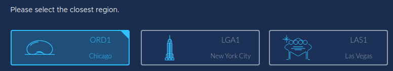

# Data Center Regions

CoreWeave Cloud is served from **three geographically diverse regions** in the United States. Located **directly adjacent to large metropolitan population centers**, CoreWeave's data centers provide low latency access to accelerated compute to **over 51 million people**.

Broken up into three geographical buckets, US East, Central and West, our data centers each have redundant **200Gbps+ public internet connectivity from Tier 1 global carriers**, and are connected to each other **with 400Gbps+ of dark fiber transport** to allow for easy, **free transfers of data within CoreWeave Cloud**.

### LGA1 - Weehawken, NJ - US East :cityscape:

Located at the mouth of the Lincoln Tunnel, **LGA1 provides ultra-low latency to the NYC metropolitan area** covering over 20 million people. This **ISO 27001, SOC2 compliant** data center is **packed with NVIDIA GPU accelerated Cloud Instances**, with near unlimited compute and storage infrastructure to go with it.

**Region Label:** `LGA1`

### ORD1 - Chicago, IL - US Central :baseball:

Located just outside downtown Chicago, ORD1 serves the Central US. This **ISO 27001, SOC2, HIPAA compliant** data center is built for the most demanding workloads, including **distributed training** using NVIDIA A100 NVLINK accelerators **connected with Infiniband GPUDirect RDMA**.

**Region Label:** `ORD1`

### LAS1 - Las Vegas, NV - US West :game\_die:

Located in fabulous Las Vegas, LAS1 serves the Western US. **Powered by 100% renewable energy**, LAS1's ISO 27001, SOC2 and HIPAA compliant infrastructure **brings scale NVIDIA GPU accelerated compute to the US West**, serving both **Las Vegas and the Los Angeles basin with low latency connectivity**.&#x20;

**Region Label:** `LAS1`

### How to Schedule Resources by Region

It's easy to schedule your workloads, whether they're containerized micro-services or Virtual Servers in any of CoreWeave's US regions. To schedule a Virtual Server in a specific region, we've added an easy to use region selector on the [CoreWeave Cloud Virtual Server UI](https://cloud.coreweave.com/virtual-servers) when creating a new VS.



To schedule resources in a specific region using the Kubernetes API, simply add an affinity to your deployment (or other deployable resource) like below:

```yaml
  affinity:
    nodeAffinity:
      requiredDuringSchedulingIgnoredDuringExecution:
        nodeSelectorTerms:
        - matchExpressions:
          - key: topology.kubernetes.io/region
            operator: In
            values:
              - LGA1
```

### Availability Matrix and Identifiers

_**GPU Instance Regional Availability**_

| Resource Name    |         LGA1         |         ORD1         |         LAS1         |
| ---------------- | :------------------: | :------------------: | :------------------: |
| A100 80GB NVLINK |      :no\_entry:     |      :no\_entry:     |        :soon:        |
| A100 40GB NVLINK |      :no\_entry:     | :white\_check\_mark: |      :no\_entry:     |
| A100 80GB PCIe   |      :no\_entry:     | :white\_check\_mark: |      :no\_entry:     |
| A100 40GB PCIe   |      :no\_entry:     | :white\_check\_mark: |      :no\_entry:     |
| A40              | :white\_check\_mark: | :white\_check\_mark: | :white\_check\_mark: |
| RTX A6000        | :white\_check\_mark: | :white\_check\_mark: | :white\_check\_mark: |
| RTX A5000        | :white\_check\_mark: | :white\_check\_mark: | :white\_check\_mark: |
| RTX A4000        | :white\_check\_mark: | :white\_check\_mark: | :white\_check\_mark: |
| Quadro RTX 5000  | :white\_check\_mark: | :white\_check\_mark: | :white\_check\_mark: |
| Quadro RTX 4000  | :white\_check\_mark: | :white\_check\_mark: | :white\_check\_mark: |

_**CPU Instance Regional Availability**_

| Resource Name       |         LGA1         |         ORD1         |         LAS1         |
| ------------------- | :------------------: | :------------------: | :------------------: |
| amd-epyc-milan      | :white\_check\_mark: | :white\_check\_mark: | :white\_check\_mark: |
| amd-epyc-rome       | :white\_check\_mark: | :white\_check\_mark: |      :no\_entry:     |
| intel-xeon-scalable | :white\_check\_mark: | :white\_check\_mark: | :white\_check\_mark: |
| intel-xeon-v4       | :white\_check\_mark: | :white\_check\_mark: | :white\_check\_mark: |
| intel-xeon-v3       | :white\_check\_mark: | :white\_check\_mark: | :white\_check\_mark: |

_**Storage Class Names**_

| Resource Name |       LGA1       |       ORD1       |       LAS1       |
| ------------- | :--------------: | :--------------: | :--------------: |
| Block NVMe    |  block-nvme-lga1 |  block-nvme-ord1 |  block-nvme-las1 |
| Shared NVMe   | shared-nvme-lga1 | shared-nvme-ord1 | shared-nvme-las1 |
| Block HDD     |  block-hdd-lga1  |  block-hdd-ord1  |  block-hdd-las1  |
| Shared HDD    |  shared-hdd-lga1 |  shared-hdd-ord1 |  shared-hdd-las1 |

_**Public IP Space**_

| IP Space Use    |       LGA1       |        ORD1       |        LAS1       |
| --------------- | :--------------: | :---------------: | :---------------: |
| NAT Egress      | 216.153.56.64/26 |  207.53.234.0/27  |  216.153.48.0/27  |
| Public Range    |  216.153.60.0/22 |  216.153.50.0/22  |  216.153.49.0/24  |
|                 |                  |  207.53.234.0/24  |  216.153.54.0/23  |
|                 |                  | 207.53.235.128/25 | 216.153.48.128/25 |
| Burstable Range |  108.165.0.0/21  |  108.165.16.0/21  |   108.165.8.0/21  |
