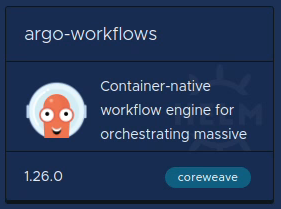
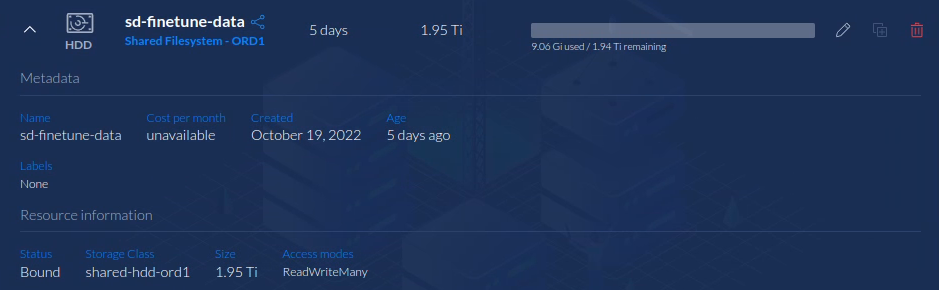
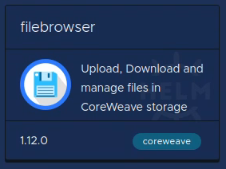
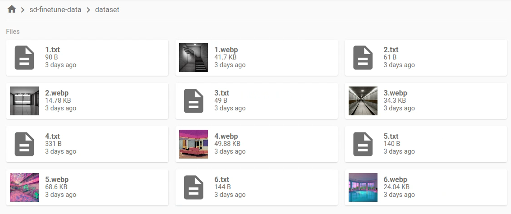
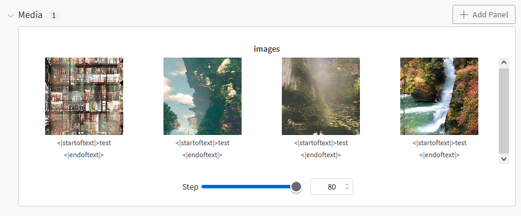
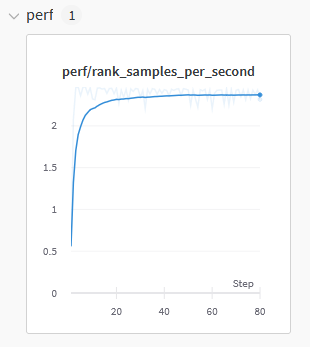
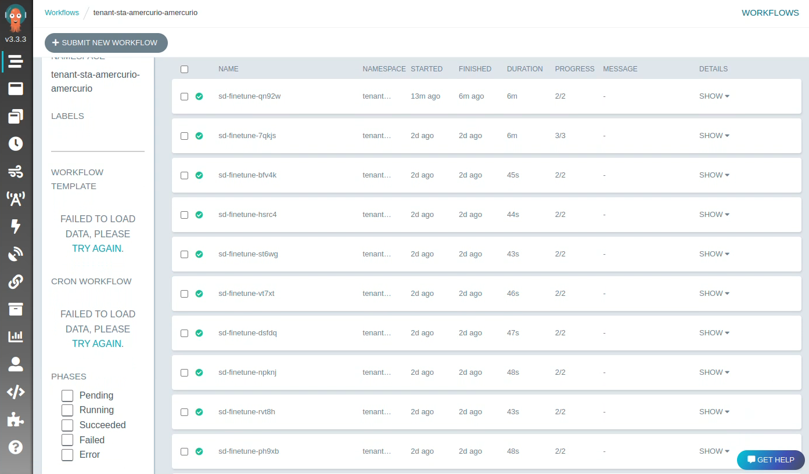

# Fine-tune Stable Diffusion Models with CoreWeave Cloud

Fine-tuning and training Stable Diffusion can be computationally expensive, but CoreWeave Cloud allows you to train Stable Diffusion models with on-demand compute resources and infrastructure that scale down to zero active pods, incurring no charges, after training is complete.&#x20;

This guide is a reference example of [how to use an Argo Workflow](broken-reference) to create a pipeline at CoreWeave to fine-tune and train Stable Diffusion models. It's a working demonstration to get you started, but it's not intended to be a production application.&#x20;


**Two-in-one demonstration**

This article covers both **DreamBooth** and **Textual Inversion** training methods. Most of the steps are the same for both methods. But, when they are different, we used tabbed sections and colored highlights to indicate which training method applies.&#x20;

* <mark style="background-color:green;">DreamBooth</mark> steps are marked in green.
* <mark style="background-color:orange;">Textual Inversion</mark> steps are marked in orange.


## Prerequisites

This guide contains all the information required to train Stable Diffusion, but assumes that you have already followed the process to set up the CoreWeave Kubernetes environment. If you have not done so already, follow the [Get Started with CoreWeave](../../../../coreweave-kubernetes/getting-started.md) steps before proceeding.

It also assumes you are familiar with the topics covered in these articles.

* [Get Started with Inference](../../../inference/online-inference.md)
* [Tensorizer](../../../inference/tensorizer.md)
* [Get Started with Workflows](../argo.md)

## Resources

### Hardware

This reference example uses the following optimal container configuration for training Stable Diffusion models, but you can use any configuration you wish, as long as it meets the minimum requirements. This configuration is currently $1.52 per hour using CoreWeave's [resource based pricing](../../../../../resources/resource-based-pricing.md) model.

* 8 vCPU (AMD EPYC)
* 32GB RAM
* NVIDIA A40/A6000 GPUs (48GB VRAM)

There is an optional test [Inference endpoint](../../../inference/examples/pytorch-jax/hugging-face/pytorch-hugging-face-diffusers-stable-diffusion-text-to-image.md) that can be enabled and deployed automatically when the model completes fine-tuning. This Inference container defaults to the following configuration, which currently costs $0.65 per hour with [resource based pricing](../../../../../resources/resource-based-pricing.md).

* 4 vCPU
* 8GB RAM
* NVIDIA Quadro RTX 5000 (16GB VRAM)

### GitHub repository

To follow this guide, clone the latest version of the CoreWeave [kubernetes-cloud repository](https://github.com/coreweave/kubernetes-cloud/tree/master) and navigate to the project directory for your preferred fine-tuning method:

* <mark style="background-color:green;">DreamBooth</mark> fine-tuning templates are in [**kubernetes-cloud/sd-dreambooth-workflow**](https://github.com/coreweave/kubernetes-cloud/tree/master/sd-dreambooth-workflow)
* <mark style="background-color:orange;">Textual Inversion</mark> fine-tuning templates are in [**kubernetes-cloud/sd-finetuner-workflow**](https://github.com/coreweave/kubernetes-cloud/tree/master/sd-finetuner-workflow)

## Understanding the Argo Workflows&#x20;

Each of the Argo Workflow templates used in the examples have a similar structure. They consist of three important sections:

* Workflow parameters
* Main template
* Individual step templates

Throughout the file, you will see many template tags, surrounded by double braces: `{{` and `}}`. Many of these are simple variable substitutions using workflow and step parameters. Expression template tags that start with `{{=` contain [expr code](https://github.com/antonmedv/expr/blob/master/docs/Language-Definition.md).&#x20;

### Parameters

All of the Workflow parameters and their default values are defined at the top of the workflow templates, and cover the following categories:

* Fine-tuning hyperparameters
* File paths
* Workflow step controls
* Container images

All the parameters have suitable defaults, but make sure to review them and adjust according to your needs.

### Main template

The workflow is defined by a main template that lists the steps in the order they should be run. Each of the steps have the parameters defined and some include a `when` value which tells the workflow when the step should be skipped.

### Step templates

The step templates define how the job will be run, including the container image, resource requests, command, etc.

The step that creates the inference service is different because it applies manifest to the cluster instead of running a custom job. This manifest defines the inference service. For this reason, the guide will ask you to create a service account with permission to create inference services. The workflow will then use this service account to apply the manifest.

The inference service step has custom-defined success and failure conditions. Without these, Argo will mark the step as succeeded as soon as it successfully applies the manifest. By using these custom conditions, Argo will monitor the new inference service and only consider the step complete after the inference service start successfully. This makes it easy to run additional steps afterwards using the inference service, like creating batches of images.

## Triggering the Argo Workflows

This guide offers two ways to deploy everything needed to trigger the workflows.

The first is through the Argo Workflow UI. From there, you can see all of the deployed workflow templates. Clicking on one will allow you to submit a new run after editing all of the parameter's default values.

The second is through the [Argo Rest API's](https://argoproj.github.io/argo-workflows/rest-api/) `/api/v1/events/<namespace>/<discriminator>` endpoint. The discriminator will be defined in a `WorkflowEventBinding` deployed alongside each `WorkflowTemplate`.


**Note**

You can view all of the available endpoints in your Argo Workflows deployment by clicking on the **API Docs** button in the sidebar of the UI.


## About the fine-tuning methods

This guide explains how to deploy an Argo Workflow to fine-tune a Stable Diffusion base model on a custom dataset, then use the fine-tuned model in an inference service.

The base model being trained on can be provided directly in a [PVC (PersistentVolumeClaim)](broken-reference), or in a Stable Diffusion model identifier from [Hugging Face's model repository](https://huggingface.co/models). The dataset trained upon needs to be in the same PVC in text and image format.&#x20;

As described earlier, you can choose one of two different methods to train the base model, either DreamBooth or Textual Inversion. Here's a short orientation of each before getting started.

### DreamBooth method

The DreamBooth method allows you to fine-tune Stable Diffusion on a small number of examples to produce images containing a specific object or person. This method for fine-tuning diffusion models was introduced in a paper publish in 2022, [DreamBooth: Fine Tuning Text-to-Image Diffusion Models for Subject-Driven Generation](https://arxiv.org/abs/2208.12242). A lighter introductory text was also released along with the paper [in this blog post](https://dreambooth.github.io/).

To summarize, the DreamBooth method is a way to teach a diffusion model about a specific object or style using approximately three to five example images. After the model is fine-tuned on a specific object using DreamBooth, it can produce images containing that object in new settings.

The DreamBooth method uses "Prior Preservation Loss", which means class-specific loss is combined with the loss from your custom dataset. For example, when using the DreamBooth method to teach the model about a specific dog, the model will also be fine tuned against generic images of dogs. This helps prevent the model from forgetting what normal dogs look like.

In the paper a special token, "sks", is used in the prompts for the custom dataset. It is not necessary to use a special token like "sks", but it allows you to use this token in inference prompts to create images containing the dog in the custom dataset. The "sks" token was chosen because it appears very rarely in the data used to train the text encoder.

### Textual Inversion method

The Textual Inversion training method captures new concepts from a small number of example images and associates the concepts with words from the pipeline's text encoder. The model then uses these words and concepts to create images from text prompts with fine-grained control. Textual Inversion was introduced in the 2022 paper, [An Image is Worth One Word: Personalizing Text-to-Image Generation using Textual Inversion](https://arxiv.org/abs/2208.01618).

The Textual Inversion examples in this guide allow you to fine-tune Stable Diffusion with your own dataset using the same technique used for pre-training.

## Example templates

The GitHub repository for this guide has template files for both training methods. Refer to the tables below to learn about each file.



<mark style="background-color:green;">DreamBooth Templates</mark>

| Filename                         | Description                                                        |
| -------------------------------- | ------------------------------------------------------------------ |
| `db-workflow-template.yaml`      | The Argo Workflow Template itself.                                 |
| `db-workflow-event-binding.yaml` | The Event Binding used to trigger the Workflow via an API call.    |
| `inference-role.yaml`            | The inference role you configured earlier.                         |
| `db-finetune-pvc.yaml`           | The model storage volume described earlier.                        |
| `huggingface-secret.yaml`        | The Hugging Face token used to download a base model.              |
| `wandb-secret.yaml`              | The Weights and Biases token used for reporting during finetuning. |



<mark style="background-color:orange;">Textual Inversion Templates</mark>

| Filename                                  | Description                                                                                                       |
| ----------------------------------------- | ----------------------------------------------------------------------------------------------------------------- |
| `sd-finetune-workflow-template.yaml`      | The Argo Workflow Template itself                                                                                 |
| `sd-finetune-workflow-event-binding.yaml` | The Event Binding used to trigger the Workflow via an API call.                                                   |
| `inference-role.yaml`                     | The inference role you configured earlier in this demo                                                            |
| `sd-finetune-pvc.yaml`                    | A model storage volume, as described earlier in this demo                                                         |
| `sd-finetuner/Dockerfile`                 | A Dockerfile that can be used to build your own fine-tuner image, should you modify the fine-tuner code           |
| `sd-finetuner/finetuner.py`               | The entry point for the Stable Diffusion fine-tuner.                                                              |
| `sd-finetuner/datasets.py`                | Script that contains the functionality to handle different dataset formats (i.e. DreamBooth vs textual inversion) |
| `sd-finetuner/requirements.txt`           | The Python requirements which list the dependencies for the fine-tuner                                            |
| `huggingface-secret.yaml`                 | The Hugging Face token used to download a base model.                                                             |
| `wandb-secret.yaml`                       | The Weights and Biases token used for reporting during finetuning.                                                |



## Required components

The following Kubernetes-based components are required for this guide. Deploy each of them before proceeding to the [database setup](fine-tune-stable-diffusion-models-with-coreweave-cloud.md#dataset-setup) step.

### Argo Workflows

Deploy Argo Workflows using the [Application Catalog](https://apps.coreweave.com/).&#x20;

From the application deployment menu, click on the **Catalog** tab, then search for `argo-workflows` to find and deploy the application.

<figure><figcaption><p>Argo Workflows</p></figcaption></figure>

### PVC

Create a `ReadWriteMany` PVC storage volume from the [Storage](broken-reference) menu.

`1TB` to `2TB` is recommended for training Stable Diffusion models, depending on the size of the dataset and how many fine-tunes you wish to run.  Later, if you later require more space, it's easy to [increase the size](broken-reference) of the PVC as needed.

The PVC can be shared between multiple fine-tune runs. We recommend using HDD type storage, because the fine-tuner does not require high performance storage.

<figure><figcaption><p>Configuring a PVC storage volume from the Cloud UI</p></figcaption></figure>

By default, this workflow uses a specific PVC depending on your fine-tune method:

* The <mark style="background-color:green;">DreamBooth</mark> PVC is `db-finetune-data`
* The <mark style="background-color:orange;">Textual Inversion</mark> PVC is `sd-finetune-data`&#x20;

This name can be changed in the configuration after you are familiar with the workflow. If you prefer, you can also deploy the PVC with the YAML snippet for your method below, then use `kubectl apply -f` to  apply it.



<mark style="background-color:green;">DreamBooth YAML</mark>


```yaml
apiVersion: v1
kind: PersistentVolumeClaim
metadata:
  name: db-finetune-data
spec:
  storageClassName: shared-hdd-las1
  accessModes:
    - ReadWriteMany
  resources:
    requests:
      storage: 2000Gi
```




<mark style="background-color:orange;">Textual Inversion YAML</mark>


```yaml
apiVersion: v1
kind: PersistentVolumeClaim
metadata:
  name: sd-finetune-data
spec:
  storageClassName: shared-hdd-ord1
  accessModes:
    - ReadWriteMany
  resources:
    requests:
      storage: 2000Gi
```




### Secrets

The workflow interacts with Hugging Face to (potentially) download the base model, and Weights and Biases to log metrics during the fine tuning. The fine-tuner can accept these account tokens over the command line, but the Workflow will read them from Kubernetes secrets.

Before applying the secrets, you need to edit both `wandb-secret.yaml` and `huggingface-secret.yaml` to include your account tokens. Make sure to base64 encode them before pasting them into the file.

For example, if your WandB token is `my-special-token` then run the following:&#x20;

```bash
$ echo "my-special-token" -n | base64
bXktc3BlY2lhbC10b2tlbiAtbgo= 
```

Then, paste the output into `wandb-secret.yaml`:


```yaml
apiVersion: v1
data:
  token: bXktc3BlY2lhbC10b2tlbiAtbgo=
kind: Secret
metadata:
  name: huggingface-token-secret
type: Opaque
```


After editing both of the secret files to include your tokens, run the following command to apply them:

```bash
$ kubectl apply -f wandb-secret.yaml
$ kubectl apply -f huggingface-secret.yaml
```

## Optional Component: filebrowser

The filebrowser component is optional, but may make your interaction easier. This application allows you to easily transfer files and folders to and from your PVC. You can deploy filebrowser from the [Application Catalog](https://apps.coreweave.com/).

We recommend using a short name, such as `finetune`, for the filebrowser application to avoid SSL CNAME issues. When deploying filebrowser, make sure to add the `sd-finetune-data` PVC that you created earlier to the filebrowser list of mounts.


**Tip**

You may prefer to use a Virtual Server to interact with the PVC via ssh, or use some other mechanism. This flexibility is one of CoreWeave's key advantages.


<figure><figcaption><p>The filebrowser application</p></figcaption></figure>

## Dataset Setup

At this point, you should have a PVC set up that is accessible via the filebrowser application or some other mechanism. Now it's time to populate the PVC with your dataset.&#x20;

Select the tab for your chosen fine-tuning method.



<mark style="background-color:green;">DreamBooth dataset</mark>

For each dataset you want to use, create a directory with a meaningful name such as `data/example-dog` and place your dataset images in that directory.

<figure><figcaption><p>An example dataset containing images of a dog</p></figcaption></figure>

The fine-tuner will use Prior Preservation loss which means "generic" images (AKA class images) will be used during fine-tuning. The fine-tuner will generate these "generic" images prior to starting the training loop using the base model and a provided prompt, but you can also upload these images to a separate folder in the PVC. For example, if you are fine-tuning the model based on pictures of your dog, you would want to use images of random dogs for the "generic" images. By default, the workflow will use 100 class images.

<figure><figcaption><p>An example class images dataset of generic dogs</p></figcaption></figure>


**Note**

These generic datasets can be reused for different fine-tuned models.&#x20;




<mark style="background-color:orange;">Textual Inversion dataset</mark>

For each dataset you want to use, create a directory with a meaningful name such as `dataset`.

The data will be text-image pairs, where each pair has the same filename. The caption files must have the `.txt` file extension, and image formats supported are `.png`, `.jpg`, `.jpeg`, `.bmp`, and `.webp`.

Here is an example dataset, in the directory named `dataset`, with six text-image pairs. Each image has its caption in a corresponding `.txt` file.

<figure><figcaption><p>A dataset with text-image pairs</p></figcaption></figure>



## Permissions Setup

In order to automatically create an `InferenceService`, the Argo Workflow job needs special permissions. The YAML snippet below exemplifies a `ServiceAccount` with the required permissions.

To follow along, copy the snippet below into a file titled `inference-role.yaml`:


```yaml
apiVersion: v1
kind: ServiceAccount
metadata:
  name: inference
---
apiVersion: rbac.authorization.k8s.io/v1
kind: Role
metadata:
  name: role:inference
rules:
  - apiGroups:
      - serving.kubeflow.org
    resources:
      - inferenceservices
    verbs:
      - '*'
  - apiGroups:
      - serving.knative.dev
    resources:
      - services
      - revisions
    verbs:
      - '*'
---
apiVersion: rbac.authorization.k8s.io/v1
kind: RoleBinding
metadata:
  name: rolebinding:inference-inference
roleRef:
  apiGroup: rbac.authorization.k8s.io
  kind: Role
  name: role:inference
subjects:
  - kind: ServiceAccount
    name: inference
```


Invoking `kubectl apply -f inference-role.yaml` will apply the permissions described above.

## Deploy the Workflow template

To deploy the workflow template, you can use `kubectl` or the Argo CLI.

Select the tab for your chosen fine-tuning method.



<mark style="background-color:green;">DreamBooth Workflow deployment</mark>

To use `kubectl`, run the following command:

```
kubectl apply -f db-workflow-template.yaml
```

To use Argo's CLI, run the following command:

```
argo template create db-workflow-template.yaml
```



<mark style="background-color:orange;">Textual Inversion Workflow deployment</mark>

To use `kubectl`, run the the following command:

```
kubectl apply -f sd-finetune-workflow-template.yaml
```

To use Argo's CLI, run the following command:

```
argo template create sd-finetune-workflow-template.yaml
```



## Run the Workflow

You can trigger runs of the workflow from the Argo UI, or by setting up a webhook.

### Use Argo Workflows UI

Once deployed, you should see the workflow template in the Argo Workflows UI. An example of Textual Inversion method is shown below. If you use the DreamBooth method, everything is the same except the name will be `db-finetune-template`.

<figure><figcaption><p>Deployed Workflow Template in the Argo UI</p></figcaption></figure>

To trigger a new run of the workflow through the UI, click on the template, then the submit button, then change the necessary parameters. The most common parameters are shown below, but there are many other workflow parameters you may want to review.



<mark style="background-color:green;">DreamBooth parameters</mark>

* `run_name`
* `instance_dataset`
* `instance_prompt`
* `class_dataset`
* `class_prompt`
* `output`



<mark style="background-color:orange;">Textual Inversion parameters</mark>

* `run_name`&#x20;
* `dataset`&#x20;



### Use Webhook

To trigger workflow runs by calling an Argo REST endpoint, you first need to deploy a `WorkflowEventBinding`. This sets a custom `discriminator` that tells Argo how to map an endpoint to the workflow template you just deployed.

Select the tab for your chosen fine-tuning method.



<mark style="background-color:green;">DreamBooth WorkflowEventBinding</mark>

The `WorkflowEventBinding` is defined in `db-workflow-event-binding.yaml` and the discriminator is set to `db-finetune`. It also maps a few values in the body of the HTTP request to parameters in the workflow template as an example.

To deploy the `WorkflowEventBinding`, run the following:

```bash
kubectl apply -f db-workflow-event-binding.yaml
```

Now you can trigger the workflow with the `/api/v1/events/<namespace>/db-finetune`.



<mark style="background-color:orange;">Textual Inversion WorkflowEventBinding</mark>

The `WorkflowEventBinding` is defined in `sd-finetune-workflow-event-binding.yaml` and the discriminator is set to `sd-finetune`. It also maps a few values in the body of the HTTP request to parameters in the workflow template as an example.

To deploy the `WorkflowEventBinding`, run the following:

```bash
kubectl apply -f sd-finetune-workflow-event-binding.yaml
```

Now you can trigger the workflow with the `/api/v1/events/<namespace>/sd-finetune`.



The domain used for the API is the same one used to navigate to the UI. You can find the URL by running `kubectl get ingress`.&#x20;

The namespace in the URL is the Kubernetes namespace where you've deployed all of the resources. To find your default namespace, run:

```bash
kubectl config view --minify --output 'jsonpath={..namespace}'
```

The Argo API uses the same authentication that you used to login to the UI. For more information about generating the token, see [Get Started with Workflows](../argo.md#generate-the-token).

Use the information you've collected above to complete the bash commands below, which will hit the endpoint to trigger workflow runs.



<mark style="background-color:green;">DreamBooth endpoint</mark>

<pre class="language-bash"><code class="lang-bash"><strong>export ARGO_API=&#x3C;enter the URL>
</strong><strong>export NAMESPACE=&#x3C;enter your k8s namespace>
</strong><strong>export ARGO_TOKEN=&#x3C;enter your Argo token>
</strong><strong>
</strong><strong>export INSTANCE_DATASET=&#x3C;path to instance dataset>
</strong><strong>export INSTANCE_PROMPT=&#x3C;instance prompt to use>
</strong><strong>export CLASS_DATASET=&#x3C;path to the class dataset>
</strong><strong>export CLASS_PROMPT=&#x3C;class prompt to use>
</strong><strong>export NUM_CLASS_IMAGES=&#x3C;number of class images to generate and/or use>
</strong><strong>export OUTPUT=&#x3C;path to folder where the model will be saved>
</strong><strong>
</strong>curl --location "https://${ARGO_API}/api/v1/events/${NAMESPACE}/db-finetune" \
     --header "${ARGO_TOKEN}" \
     --header 'Content-Type: application/json' \
     --data "{
       \"run_name\": \"example-dog\",
       \"instance_dataset\": \"${INSTANCE_DATASET}\",
       \"instance_prompt\": \"${INSTANCE_PROMPT}\",
       \"class_dataset\": \"${CLASS_DATASET}\",
       \"class_prompt\": \"${CLASS_PROMPT}\",
       \"num_class_image\": \"${NUM_CLASS_IMAGES}\",
       \"output\": \"${OUTPUT}\"
    }"
</code></pre>



<mark style="background-color:orange;">Textual Inversion endpoint</mark>

<pre class="language-bash"><code class="lang-bash"><strong>export ARGO_API=&#x3C;enter the URL>
</strong><strong>export NAMESPACE=&#x3C;enter your k8s namespace>
</strong><strong>export ARGO_TOKEN=&#x3C;enter your Argo token>
</strong><strong>
</strong><strong>export DATASET=&#x3C;enter the name of your dataset directory>
</strong><strong>
</strong><strong>curl --location "https://${ARGO_API}/api/v1/events/${NAMESPACE}/sd-finetune" \
</strong>     --header "${ARGO_TOKEN}" \
     --header 'Content-Type: application/json' \
     --data "{
          \"run_name\": \"full-test\",
          \"dataset\": \"${DATASET}\"
     }"
</code></pre>



## Observe the Workflow

At this point, we can observe the running workflow via several mechanisms.

### `argo list`

Using the `argo list` command, you can see information about all of the workflows. Use this command to find the name of the workflow that was just launched.

You can also filter by statuses. To get all running workflows, run:

```bash
$ argo list --status Running
```

* For <mark style="background-color:green;">DreamBooth</mark>**,** the output should look like this:

```bash
NAME                         STATUS    AGE   DURATION   PRIORITY   MESSAGE
db-finetune-template-4fe7b   Running   3m    3m         0 
```

* For <mark style="background-color:orange;">Textual Inversion</mark>, the output should look like this:

```bash
NAME                         STATUS    AGE   DURATION   PRIORITY   MESSAGE
sd-finetune-template-5zx10   Running   2m    2m         0  
```

### `argo watch`

Invoking `argo watch <workflow name>` tells Argo that we want to watch the job as it goes through all of its stages. Here is example output:



<mark style="background-color:green;">DreamBooth output</mark>

<pre class="language-bash"><code class="lang-bash"><strong>Name:                db-finetune-template-4fe7b
</strong>Namespace:           tenant-sta-nav-npratt
ServiceAccount:      inference
Status:              Running
Conditions:          
 PodRunning          True
Created:             Mon Apr 10 11:32:53 -0400 (3 minutes ago)
Started:             Mon Apr 10 11:32:53 -0400 (3 minutes ago)
Duration:            3 minutes 22 seconds
Progress:            1/2
ResourcesDuration:   13s*(1 cpu),1m26s*(100Mi memory)
Parameters:          
  run_name:          example-dog
  pvc:               db-finetune-data
  model:             stabilityai/stable-diffusion-2-1-base
  instance_dataset:  data/example-dog
  instance_prompt:   a photo of sks dog
  prior_loss_weight: 1
  class_dataset:     generic/dogs-2
  class_prompt:      a photo of dog
  output:            finetunes/docs-example
  num_class_images:  100
  lr:                2e-6
  lr_scheduler:      constant
  lr_warmup_steps:   0
  batch_size:        1
  epochs:            4
  seed:              42
  checkpointing_steps: 200
  image_log_steps:   100
  image_log_amount:  4
  resolution:        512
  use_tensorizer:    true
  run_inference:     true
  inference_only:    false
  region:            LAS1
  trainer_gpu:       A40
  trainer_gpu_count: 1
  inference_gpu:     Quadro_RTX_5000
  downloader_image:  ghcr.io/wbrown/gpt_bpe/model_downloader
  downloader_tag:    e2ef65f
  finetuner_image:   navarrepratt/sd-finetuner
  finetuner_tag:     df-14
  serializer_image:  navarrepratt/sd-serializer
  serializer_tag:    df-14
  inference_image:   navarrepratt/sd-inference
  inference_tag:     df-14-3

STEP                           TEMPLATE          PODNAME                                                DURATION  MESSAGE
 ● db-finetune-template-4fe7b  main                                                                                 
 ├───✔ downloader(0)           model-downloader  db-finetune-template-4fe7b-model-downloader-956898090  49s         
 └───● finetuner               model-finetuner   db-finetune-template-4fe7b-model-finetuner-1551742686  2m 
</code></pre>



<mark style="background-color:orange;">Textual Inversion output</mark>

```bash
Name:                sd-finetune-template-5zx10
Namespace:           tenant-sta-nav-npratt
ServiceAccount:      inference
Status:              Running
Conditions:          
 PodRunning          True
Created:             Mon Apr 10 10:45:06 -0400 (4 minutes ago)
Started:             Mon Apr 10 10:45:06 -0400 (4 minutes ago)
Duration:            4 minutes 24 seconds
Progress:            1/2
ResourcesDuration:   12s*(1 cpu),1m16s*(100Mi memory)
Parameters:          
  run_name:          full-test
  pvc:               sd-finetune-data
  model:             stabilityai/stable-diffusion-2
  dataset:           pokemon/512_small
  lr:                5e-6
  epochs:            10
  batch_size:        1
  use_ema:           False
  gradient_checkpointing: False
  use_8bit_adam:     False
  adam_beta1:        0.9
  adam_beta2:        0.999
  adam_weight_decay: 1e-2
  adam_epsilon:      1e-8
  seed:              42
  save_steps:        500
  resolution:        512
  resize:            False
  center_crop:       False
  resize_interp:     lanczos
  shuffle:           True
  image_log_steps:   500
  image_log_amount:  4
  project_id:        sd-finetune
  use_tensorizer:    true
  run_inference:     true
  inference_only:    false
  region:            ORD1
  trainer_gpu:       RTX_A6000
  trainer_gpu_count: 1
  inference_gpu:     Quadro_RTX_5000
  downloader_image:  ghcr.io/wbrown/gpt_bpe/model_downloader
  downloader_tag:    e526c65
  finetuner_image:   navarrepratt/sd-finetuner
  finetuner_tag:     ucg
  serializer_image:  navarrepratt/sd-serializer
  serializer_tag:    df-14
  inference_image:   navarrepratt/sd-inference
  inference_tag:     df-14-3

STEP                           TEMPLATE          PODNAME                                                DURATION  MESSAGE
 ● sd-finetune-template-5zx10  main                                                                                 
 ├───✔ downloader(0)           model-downloader  sd-finetune-template-5zx10-model-downloader-956898090  15s         
 └───● finetuner               model-finetuner   sd-finetune-template-5zx10-model-finetuner-1551742686  4m
```



### `argo logs`

Invoking `argo logs -f <workflow name>` watches the logs in real time.


**Important**

If this process appears to hang while outputting the message `Loading the model`, this is due to a bug in the terminal display code which is exposed during initial model download and caching. To fix this, kill the relevant pod or job, then resubmit it. This should result in the proper progress display.


During fine-tuning, the time elapsed is displayed, alongside the expected time to complete. Checkpointing and loss reporting is also reported within the logs as well as WandB.


**Note**

You can instantly watch a submitted workflow by using the `--watch` option when running the `submit` command:

`argo submit --watch`


### WandB Logging

Logs for the fine-tuning workflow can be tracked and visualized using [Weights & Biases (WandB)](https://wandb.ai/).&#x20;

<figure><figcaption><p>Generated samples during fine-tuning</p></figcaption></figure>

The Media tab is where you can see images being generated during the fine-tuning process for every `image_log_steps` amount of steps. This can also be adjusted depending on how often you want to sample from the model during fine-tuning.&#x20;

<figure><figcaption><p>Performance metrics</p></figcaption></figure>

In the performance tab you will see how fast the GPU is performing in a metric of samples per second.

<figure><figcaption><p>Fine-tuning metrics</p></figcaption></figure>

For the training tab, a multitude of fine-tuning metrics are recorded which indicates whether or not the workflow is making progress by reducing loss over time. These metrics can be very useful in determining whether or not the model has reached convergence.

### Web UI

You can access your Argo Workflow application via the web UI to see all the fine-tuner jobs, and to check their statuses.

<figure><figcaption><p>Argo Workflow Web UI</p></figcaption></figure>

## Artifacts and Inference

Once the model completes fine-tuning, the the model artifacts are available in:

* For <mark style="background-color:green;">DreamBooth</mark>, the directory is supplied to the workflow as the `output` parameter.
* For <mark style="background-color:orange;">Textual Inversion</mark>, the directory name pattern is `{{pvc}}/finetunes/{{run_name}}`.

You can download the model at this point, or you can run the `InferenceService` on the model.

If you followed the directions for Inference Service, and have installed the KNative client, you can get the URL by invoking `kn service list`.

Services can also be listed without the KNative Client by executing `kubectl get ksvc`.&#x20;

See ethe xample output for your fine-tune method:



<mark style="background-color:green;">DreamBooth output</mark>

```
NAME                                      URL                                                                                               LATESTCREATED                                   LATESTREADY                                     READY   REASON
inference-example-dog-predictor-default   https://inference-example-dog-predictor-default.tenant-sta-nav-npratt.knative.chi.coreweave.com   inference-example-dog-predictor-default-00001   inference-example-dog-predictor-default-00001   True     
```



<mark style="background-color:orange;">Textual Inversion output</mark>

```
NAME                               URL                                                                                                LATESTCREATED                            LATESTREADY                              READY   REASON
inference-test-predictor-default   http://inference-test-predictor-default.tenant-sta-amercurio-amercurio.knative.chi.coreweave.com   inference-test-predictor-default-00001   inference-test-predictor-default-00001   True    
```



### Test Query&#x20;

To run a test query, run the `curl` example for your fine-tune method:



<mark style="background-color:green;">DreamBooth test query</mark>

```shell-session
curl https://inference-example-dog-predictor-default.tenant-sta-nav-npratt.knative.chi.coreweave.com/v1/models/docs-example:predict \
    -d '{"prompt": "A photo of sks dog at the beach", "parameters": {"seed": 42, "width": 512, "height": 512}}' \
    --output beach_dog.pngproduce
```

The above command should produce an image similar to:

<figure><figcaption><p>A photo of sks dog at the beach</p></figcaption></figure>



<mark style="background-color:orange;">Textual Inversion test query</mark>

```shell-session
curl http://inference-test-predictor-default.tenant-sta-amercurio-amercurio.knative.chi.coreweave.com/v1/models/test:predict \
    -d '{"prompt": "California sunset on the beach, red clouds, Nikon DSLR, professional photography", "parameters": {"seed": 42, "width": 512, "height": 512}}' \
    --output sunset.png
```

The above command should produce an image similar to:

<figure><figcaption><p>California sunset on the beach, red clouds, Nikon DSLR, professional photography</p></figcaption></figure>



The model and dataset have now been run through the fine-tuning process to do test inferences against the new model.

## Cleaning Up

Once you are finished with the example, you can delete all of the resources that were created.

First, you can run `kubectl delete -f <file name>` for all of the `yaml` files that were previously used to deploy resources.


**Note**

For the PVC to be deleted, everything using it will need to be deleted first.


You can delete the Argo deployment through the CoreWeave Cloud UI from the Application page.

To delete all of the inference services that were created from the workflow runs, you need to use the `kubectl delete isvc <inference service name>` command. In order to see all of the current inference services, you can run `kubectl get isvc`.&#x20;


**Note**

By default, the inference service will scale down to 0 active pods after not being used for 30 minutes. When scaled down to 0, they won't incur any charges since no compute is being used.


This concludes the demonstration. Now that you know how to run a simple Argo workflow at CoreWeave, you can expand this example for production jobs.&#x20;
