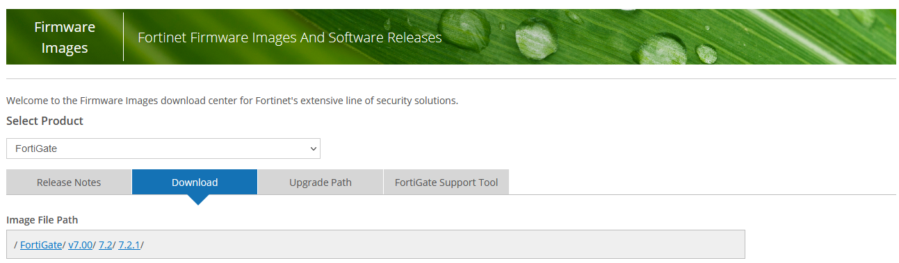
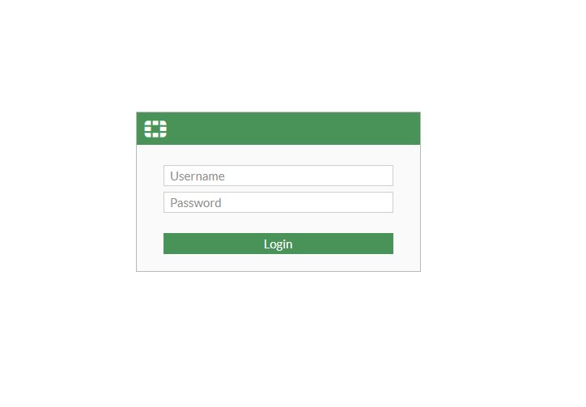
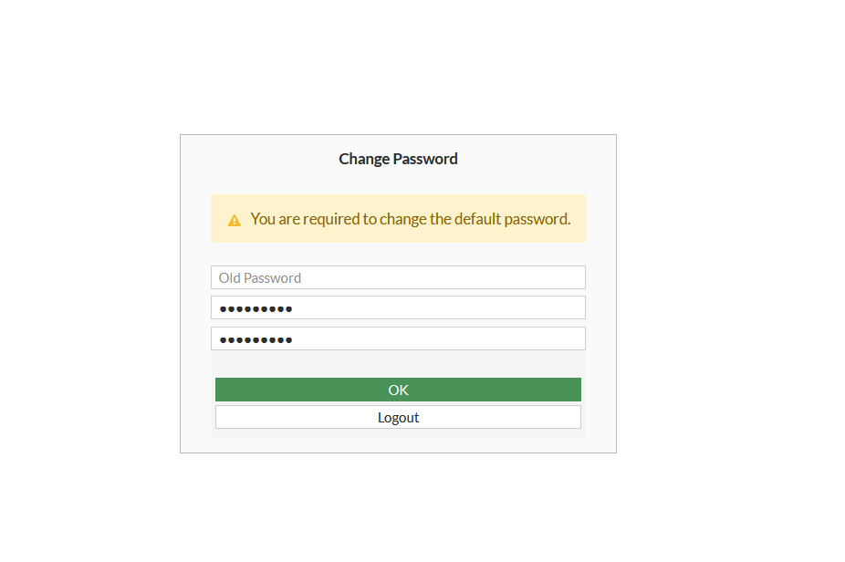
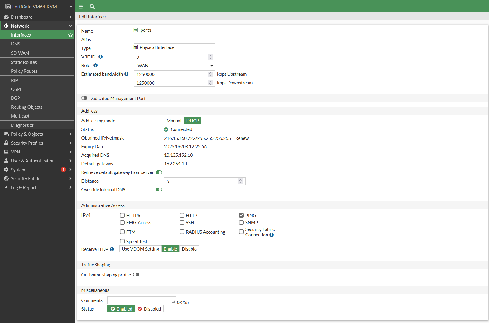

# Fortinet

Currently, the only supported Fortinet Firewall product on CoreWeave Cloud is `FGT_VM64_KVM`.


**Note**

CoreWeave is not currently not able to supply Fortinet licenses. Licenses will need to be [purchased separately from Fortinet](https://www.fortinet.com/corporate/about-us/request-a-quote).


## Setup

Before getting started on this guide, bear the following prerequisites in mind:

* **You** **must have a** [**Fortinet account**](https://customersso1.fortinet.com/saml-idp/bbdywjwfz0urnd4t/login/?SAMLRequest=PHNhbWxwOkF1dGhuUmVxdWVzdCB4bWxuczpzYW1scD0idXJuOm9hc2lzOm5hbWVzOnRjOlNBTUw6Mi4wOnByb3RvY29sIiBJRD0iXzZkNjVmZTgwLTQ2MDQtNDhhZS04MjE2LWVlM2E5NmFlNTQ1ZSIgVmVyc2lvbj0iMi4wIiBJc3N1ZUluc3RhbnQ9IjIwMjItMDktMTRUMTQ6MjI6MDZaIiBQcm90b2NvbEJpbmRpbmc9InVybjpvYXNpczpuYW1lczp0YzpTQU1MOjIuMDpiaW5kaW5nczpIVFRQLVBPU1QiPjxzYW1sOklzc3VlciB4bWxuczpzYW1sPSJ1cm46b2FzaXM6bmFtZXM6dGM6U0FNTDoyLjA6YXNzZXJ0aW9uIj5mb3J0aW5ldC5jb20tb25lc3NvPC9zYW1sOklzc3Vlcj48c2FtbHA6TmFtZUlEUG9saWN5IEZvcm1hdD0idXJuOm9hc2lzOm5hbWVzOnRjOlNBTUw6Mi4wOm5hbWVpZC1mb3JtYXQ6dW5zcGVjaWZpZWQiIEFsbG93Q3JlYXRlPSJ0cnVlIj48L3NhbWxwOk5hbWVJRFBvbGljeT48c2FtbHA6UmVxdWVzdGVkQXV0aG5Db250ZXh0IENvbXBhcmlzb249ImV4YWN0Ij48c2FtbDpBdXRobkNvbnRleHRDbGFzc1JlZiB4bWxuczpzYW1sPSJ1cm46b2FzaXM6bmFtZXM6dGM6U0FNTDoyLjA6YXNzZXJ0aW9uIj51cm46b2FzaXM6bmFtZXM6dGM6U0FNTDoyLjA6YWM6Y2xhc3NlczpQYXNzd29yZFByb3RlY3RlZFRyYW5zcG9ydDwvc2FtbDpBdXRobkNvbnRleHRDbGFzc1JlZj48L3NhbWxwOlJlcXVlc3RlZEF1dGhuQ29udGV4dD48L3NhbWxwOkF1dGhuUmVxdWVzdD4%3D\&SigAlg=http%3A%2F%2Fwww.w3.org%2F2001%2F04%2Fxmldsig-more%23rsa-sha256\&Signature=YBmtjqc7IkRdxiaezW1zAjbP%2FOPbmeEzc8pIfrFQCdZ1h9W3FUhXIDUDRNuxzVl441xiDfMaT9dWR98yRaenqnt5mdsAOaMeD%2B7XKQ6TRGb6ougEyY0%2BlOLRp%2F80BQhBjwy%2BOhi3pO3LObaQYX2kEYzdIXeR6pWv3uoXNy3kEmMHsUDd9ihgN9wKILO9sdvyYERvpqPsn%2BOJzgShUNTWcFDaBFe243agfu%2FHLv5f4C01cWm1%2FblUc6lZXQVVYvDeCcVtvOvWu5dWT8%2FPo%2FbNQ7GC9CTXJuDEgPoubUnux1lfhKVCdCeM%2B6fOqPhmR30yqcU0IEo55D6pQK17A5PwCw%3D%3D) in order to have access to FortiGate images.
* **Your** [**L2VPC** **must be created**](../../../coreweave-kubernetes/networking/layer-2-vpc-l2vpc/) before the firewall is deployed.

### Acquiring the FortiGate image

The FortiGate image must be imported into your CoreWeave namespace by downloading the image file from [the Fortinet website](https://support.fortinet.com/Download/FirmwareImages.aspx), then imported [using a Kubernetes manifest](fortinet.md#importing-the-fortigate-image).


**Tip**

If you'd prefer some assistance in this process,[ reach out to your CoreWeave Support Specialist](https://cloud.coreweave.com/contact).

In the future, a selection of images will be available right from the Cloud, removing the need for a manual import.


First, navigate to [the Fortinet Firmware Images and Software Releases catalog](https://support.fortinet.com/Download/FirmwareImages.aspx). From the drop-down menu, select the **FortiGate** product.

From the **Download** tab, select the FortiGate version you would like to download. In the example shown here, version `7.2.1` is selected.

<figure><figcaption><p>The Fortinet Firmware Images and Software Releases catalog with listed downloads</p></figcaption></figure>

Scroll down until the image file is accessible. In this example, the file is named `FGT_VM64_KVM-v7.2.1.F-build1254-FORTINET.out.kvm.zip`. Click on the filename to download the file.

Once the download is complete, extract the image file, then upload it to a publicly accessible URL, such as a [CoreWeave Object Storage public bucket](../../../storage/object-storage.md).

### Importing the FortiGate image

The FortiGate image will be imported into a new [block storage volume](../../../storage/storage.md#block-storage-volumes), which is created using a Kubernetes manifest such as the one described below.

The fields that comprise this manifest are:

| Option name                  | Description                                                                                                        |
| ---------------------------- | ------------------------------------------------------------------------------------------------------------------ |
| `metadata.name`              | The name to assign to the block storage that will contain the FortiGate image                                      |
| `metadata.namespace`         | Your namespace                                                                                                     |
| `spec.source.http.url`       | The source URL for the unpacked QCOW2 image                                                                        |
| `pvc`                        | A storage device (`PersistentVolumeClaim`) will be created to import the image; this stanza configures that device |
| `pvc.accessModes`            | The access modes for the block storage to be created; see [Storage](broken-reference) for more information         |
| `pvc.volumeMode`             | Specifies the type of storage volume this will be; for importing purposes, `Block` is appropriate                  |
| `storageClassName`           | The name to give the storage class                                                                                 |
| `resources.requests.storage` | The size of the volume to be created                                                                               |


**Additional Resources**

Read our documentation on[ importing external images](../../../virtual-servers/root-disk-lifecycle-management/importing-a-qcow2-image.md) for more information.


#### **Example manifest**

```yaml
apiVersion: cdi.kubevirt.io/v1beta1
kind: DataVolume
metadata:
  name: fgt721
  namespace: tenant-example
spec:
  source:
      http:
         url: "http://example.com/fgt721.qcow2"
  pvc:
    accessModes:
      - ReadWriteOnce
    volumeMode: Block
    storageClassName: block-nvme-lga1
    resources:
      requests:
        storage: 2Gi
```

#### Applying the manifest

To apply the manifest and initialize the image import, use `kubectl apply`:

```bash
$ kubectl apply -f fgt721-dv.yaml

datavolume.cdi.kubevirt.io/fgt721 created
```

#### Verifying the import

The `kubectl --watch` command can be used to track the progress of your import:

```bash
$ kubectl get --watch datavolume fgt721

NAME     PHASE     PROGRESS   RESTARTS   AGE
fgt721   Pending   N/A                   3s
fgt721   ImportScheduled   N/A                   25s
fgt721   ImportInProgress   N/A                   39s
fgt721   ImportInProgress   0.00%                 51s
fgt721   ImportInProgress   10.57%                58s
fgt721   ImportInProgress   49.75%                78s
...
fgt721   Succeeded          100.0%                97s
```

The import will go through four phases:

1. `Pending`
2. `ImportScheduled`
3. `ImportInProgress`
4. `Succeeded`

Once the import has reached the `Succeeded` status, you are ready to proceed.


**Note**

If the import does not start, refer to the [importing external images](../../../virtual-servers/root-disk-lifecycle-management/importing-a-qcow2-image.md) documentation or [reach out to your CoreWeave Support Specialist](https://cloud.coreweave.com/contact).


### Deploying FortiGate

Now that the image is accessible within your CoreWeave namespace, we'll use a Kubernetes manifest to deploy the FortiGate instance.

The fields that comprise this manifest are:

| Option Name                         | Instructions                                                                                                                                                                                                                                                                             |
| ----------------------------------- | ---------------------------------------------------------------------------------------------------------------------------------------------------------------------------------------------------------------------------------------------------------------------------------------- |
| `metadata.name`                     | The name to assign to the FortiGate Firewall                                                                                                                                                                                                                                             |
| `spec.network.vpcs.name`            | <p>The name of your VPC(s)<br><strong>Note:</strong> Multiple VPCs can be specified by adding additional <code>- name: vpc</code> items to the <code>vpcs.name</code> list</p>                                                                                                           |
| `spec.public`                       | Specifies whether or not the CoreWeave networking IP should be publicly accessible; for most instances, this will be `true`                                                                                                                                                              |
| `resources`                         | Correlates to the license you have purchased; refer to [Fortinet's FortiGate-VM virtual licenses and resources guide](https://docs.fortinet.com/document/fortigate-private-cloud/7.2.0/kvm-administration-guide/367417/fortigate-vm-virtual-licenses-and-resources) for more information |
| `storage.root.source.pvc.name`      | The name of the data volume [created earlier](fortinet.md#importing-the-fortigate-image) (for this example, `fgt721`)                                                                                                                                                                    |
| `storage.root.source.pvc.namespace` | Your namespace                                                                                                                                                                                                                                                                           |

**Example manifest**

A complete manifest for deploying the FortiGate instance looks similar to the following example.

```yaml
apiVersion: virtualservers.coreweave.com/v1alpha1
kind: VirtualServer
metadata:
  name: fgt-prod1
spec:
  initializeRunning: true
  network:
    vpcs:
    - name: vpc-lga1
    public: true
    directAttachLoadBalancerIP: true
  os:
    definition: a
    type: linux
  region: LGA1
  resources:
    cpu:
      count: 1
      type: amd-epyc-milan
    definition: a
    memory: 2Gi
  storage:
    root:
      accessMode: ReadWriteOnce
      size: 2Gi
      source:
        pvc:
          name: fgt721 
          namespace: tenant-example
      storageClassName: block-nvme-lga1
      volumeMode: Block
```

Once this manifest is composed, use `kubectl apply` to apply the manifest and begin provisioning the instance:

```bash
$ kubectl apply -f fgt-prod1.yaml

virtualserver.virtualservers.coreweave.com/fgt-prod1 created
```

To verify the deployment's status, use the `--watch` option:

```
$ kubectl get --watch virtualserver fgt-prod1

NAME        STATUS    REASON                                                    STARTED   INTERNAL IP   EXTERNAL IP
fgt-prod1   Pending   Waiting for DataVolume to be ready - CSICloneInProgress   False                   216.153.61.23
fgt-prod1   Pending   Waiting for VirtualMachineInstance to be ready            False                   216.153.61.23
fgt-prod1   Pending   Waiting for VirtualMachine to be ready                    False                   216.153.61.23
fgt-prod1   Pending   virt-launcher pod has not yet been scheduled              False                   216.153.61.23
fgt-prod1   Pending   Guest VM is not reported as running                       False                   216.153.61.23
fgt-prod1   VirtualServerReady   VirtualServerReady                                        True      216.153.61.23   216.153.61.23
```

This command will also display the `EXTERNAL IP` attached to your FortiGate instance.

Once the `STATUS` changes to `VirtualServerReady`, you will be able to reach your FortiGate instance via HTTP or console.


**Note**

It could take up to one minute for the FortiGate instance to be fully loaded and accessible.


## Accessing FortiGate

There are two ways to access your newly deployed FortiGate instance. The first is by using your browser to navigate to the provisioned address of the instance, and the second is by using the `virtctl` console to access the instance's address.

### Using HTTP


**Note**

HTTPS connections to your FortiGate instance will require a license. Only HTTP or the CLI console may be used to access the instance before a license is acquired.


[As shown earlier](fortinet.md#applying-and-verifying-deployment), the external IP address provisioned for the FortiGate instance can be obtained by running:

```bash
$ kubectl get --watch virtualserver <name-of-fortigate-pod>
```

To access the instance from your browser, navigate to `http://<EXTERNAL IP ADDRESS>`. The default username is `admin`. Leave the password field empty, then click the **Login** button.


**Important**

Please change your default password immediately, especially if your FortiGate is exposed to the Internet via an external IP address.


<figure><figcaption><p>The FortiGate login screen</p></figcaption></figure>

The next screen will prompt you to change your password. It is highly recommended to create a strong, unique password.

<figure><figcaption><p>The FortiGate change password prompt</p></figcaption></figure>

### Using the `virtctl` console

[The `virtctl` console](https://kubevirt.io/user-guide/operations/virtctl\_client\_tool/) can be used to access the FortiGate instance by invoking:

```bash
$ virtctl console fgt-prod1
```

This will launch the console log-in prompts:

```bash
Successfully connected to fgt-prod1 console. The escape sequence is ^]

FortiGate-VM64-KVM login: admin
Password: 
You are forced to change your password. Please input a new password.
New Password: 
Confirm Password: 
Welcome!

FortiGate-VM64-KVM # 
```

The default username is `admin.` The password field should be left blank, then hit the return key.

## Security

It is **strongly advised** to set up access to your FortiGate either via your VPC interface or via an IPSec tunnel. Then, from the **Interfaces -> Administrative Access** panel, disable all administrative access except for `PING` on the public-facing interface (`port1`).


**Important**

Ensure that your connection is through a VPC interface or an IPSec tunnel before disabling administrative access on the WAN interface. Should you lose access, the console may be used to restore any needed permissions.


<figure><figcaption><p>The administrative access panel on the Fortinet Web portal</p></figcaption></figure>


**Additional Resources**

For additional information on Fortinet, consult the  [Fortinet Documents Library](https://docs.fortinet.com/document/fortigate/7.2.1/administration-guide/954635/getting-started).

