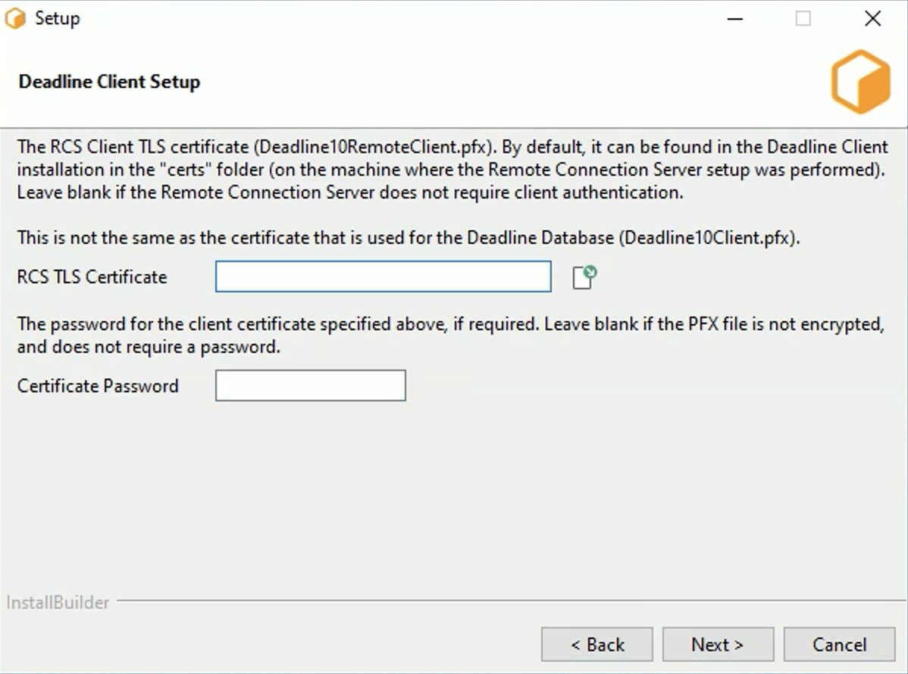

# Deadline

### **Summary of Terms**

CoreWeave provides these terms as a point of reference for terminology that will be used in future discussions on the topic of Deadline. 

**DCC \(application\) -** Digital Content Creation application. This includes any software which generates a digital artifact at the beginning of the pipeline \(e.g., Maya, Houdini, Photoshop\). This does not explicitly include editing/compositing applications such as Nuke. However, you may hear the use of DCC about these applications in certain scenarios.  

**Worker \(AKA slave\) -** A server or container running the Deadline client that can execute rendering tasks. 

**Task -** A specific step or operation to be performed within a job. Many tasks can belong to a single job. Most commonly, a task is a single frame of a potentially multi-frame rendering. 

**Job -** A group of tasks to be executed on a specific project, most often a scene file or DCC project file \(e.g., .mb, .ma, .hip, etc.\).  

**Repository -** The Deadline Repository is the central file share of the deadline render farm. It holds the settings and state for the system. Workers and services must read the repository and connect to the database to schedule jobs; archive completed tasks, and much more. 

**Database -** Deadline requires a backend MongoDB to track information relating to jobs placed in the queue. 

**Queue \(verb\) -** To list a job as ready to be scheduled. 

**Priority -** Priority is a user-submitted parameter included in the job submission process. It allows user input into the order in which the job is scheduled. This is measured against the pool, submission time, and user-defined weighted/balanced scheduling parameters to determine which jobs will render when. 

**Pool -** A logical grouping of workers based on the priority in which a worker will process a job submitted to a specified pool, if at all. This affects both the scheduling order and how different workers will prioritize jobs within a specific workflow. An example is one pool for animations and one for stills. A specific group of workers will prioritize the animation pool, and potentially another group of workers may prioritize the stills pool. 

**Group -**  A set of workers grouped by resource type, e.g., installed software, hardware class, etc. This does not affect the order in which jobs are scheduled and mainly prevents incorrect resources from being dispatched onto jobs. 

## **Thinkbox Deadline Documentation** 

### **Getting Started** 

CoreWeave uses Thinkbox Deadline, the most responsive modern render management solution for accessing render nodes and scaling your workloads automatically. We’ll assume that you already have some familiarity with it and that you already have Deadline and its associated MongoDB installed.  

If you don't already have it installed, you can download the latest version here:  

### Download Thinkbox Deadline:

[https://www.awsthinkbox.com/deadline](https://www.awsthinkbox.com/deadline)  
****

\(NOTE: CoreWeave only supports Deadline versions from 10.1.13.2 and up. If you have an existing installation, it is recommended that you upgrade before integrating. If you have a previous version and cannot upgrade, please contact our customer support team for assistance.\)  
****

If you are not familiar with Thinkbox Deadline, there are a number of resources available to help you get familiar with how it works. Please review the links below for more information.  

#### Thinkbox Deadline Documentation and User Guide:

[https://docs.thinkboxsoftware.com/products/deadline/10.0/1\_User%20Manual/index.html](https://docs.thinkboxsoftware.com/products/deadline/10.0/1_User%20Manual/index.html)  

#### Thinkbox Deadline REST API Guide:

[https://docs.thinkboxsoftware.com/products/deadline/10.0/1\_User%20Manual/manual/rest-overview.html](https://docs.thinkboxsoftware.com/products/deadline/10.0/1_User%20Manual/manual/rest-overview.html)  
****

#### Thinkbox Deadline YouTube Installer Guide:

[https://www.youtube.com/watch?v=-kpljH60whE](https://www.youtube.com/watch?v=-kpljH60whE)  

### Your CoreWeave Welcome Pack 

In order to properly set up your Deadline repository, you’ll need to enter some key information to ensure that everything is set up to your specifications and the correct file paths are mapped. Please make sure you have your CoreWeave Welcome Pack email handy so that you have the following information:  

• The CoreWeave Repo IP address

• The CoreWeave Remote Connection Server \(RCS\) Certificate

• The CoreWeave Remote Connection Server \(RCS\) temporary password  

If you haven’t received your CoreWeave Welcome Pack, please check the Spam folder of your email client or contact us at support@coreweave.com for further assistance.    

### **Choosing Your Installation Directory** 

While CoreWeave will manage your Deadline repository, you'll still need to configure your client so that everything is set up to your specifications and file path mappings.  

After reading and accepting the End User License Agreement \(EULA\), you’ll need to specify a location on where you want your client to live on your computer. Some of our users prefer to run multiple versions of Deadline at once. If this applies to you, we suggest creating one main folder for all your Deadline versions and associated files. It will make it easier to find and map your work later on, regardless of which version you want to use. Just make sure you name it something that's easy to remember!  

### IP Address and Port Mapping 

You'll need to point your client to the repository that contains the remote connection server that CoreWeave uses. This will allow CoreWeave to ask the server to retrieve the files you need as well as make changes to them when required.  

CoreWeave uses RCS to connect to your files so please choose the “Remote Connection Server” \(RCS\) option.   

Add the IP address and port for your Remote Connection Server \(RCS\) namespace. \(These should be included in your CoreWeave Welcome pack.\)  

Please ensure that you're using:4433 as the port. CoreWeave uses TLS to ensure your privacy and security and strongly recommend not using the default:8080 port when connecting to our services.  

4: Make sure the radio button for the remote connection server is checked as you'll be using a Remote Connection Server to connect to CoreWeave.  

### RCS Client Security Certificate 

CoreWeave is committed to your privacy and security. In order to connect to the CoreWeave repository, you’ll need to add the security certificate and the initial password that was included in your CoreWeave Welcome Pack.     
  

Please make sure you change the temporary password after submitting.     

#### Deadline Launcher Setup 

Because you'll be rendering to CoreWeave's services in the Cloud and not your local machine, you'll need to ensure that it's pointing to the right place.

Please ensure that both the "Launch Worker when Launcher starts" and "Install Launcher As Service" boxes are both **unchecked**.     

This will now spin up your instances and connect to the right servers.  

You now should see the Deadline Launcher in your dock where you'll be able to perform key tasks like testing your connection, launch your workers, etc...   

If you do not see the Deadline Launcher, go to the search bar on Windows and type "Launcher", select Deadline Launcher to open. 

### Changing Your Repository Settings 

If you need to change your Repository settings, there are a few things you'll need to do.    
  

1: Right-click on the Deadline Launcher in your dock and choose the "Change Repository..." option.

2: You'll see a modal appear with a few options. To change your settings:

a\) Make sure that "Remote Connection Server" is checked.

b\) Update the IP address and port as required.  

\(NOTE: When you change the IP address, you'll need to re-upload your certificate and re-enter your password for security purposes. You can do that in the fields immediately below the IP address.\)  

### Launching The Deadline Monitor 

When the Deadline Monitor launches, the monitor window should appear pretty quickly.     

If you encounter any errors, please check the following:

• You have the correct Deadline client running

• Your IP address and port number is correct

• Your file paths are pointing to the right place.

• Ensure that the "Super User" mode is enabled.

• Under Worker Settings, ensure that "Use Worker's IP address for Remote Control" and "Use fully qualified domain name \(FQDN\) for Machine Name instead of “host name" are both checked.

### Remote Connection Server \(RCS\) Worker Settings

Most customers won’t be rendering on their local machines and will instead render in the cloud. You'll need to modify the worker settings to ensure that your renders go to the right place. To do this:  

• Uncheck the “Launch worker when Launcher Starts” option

• Uncheck the “Install Launcher As Service account with network access” option

### Running The Deadline Launcher

After your settings have been entered, it’s now time to launch Deadline and get started.

Go to your desktop and right-click on the Deadline icon that appears in the dock. The application should load and you should be greeted with a screen that shows you your Jobs, Tasks and Workers.    
   

The title bar of the “Workers” module should show you having a direct connection to the CoreWeave repository.

