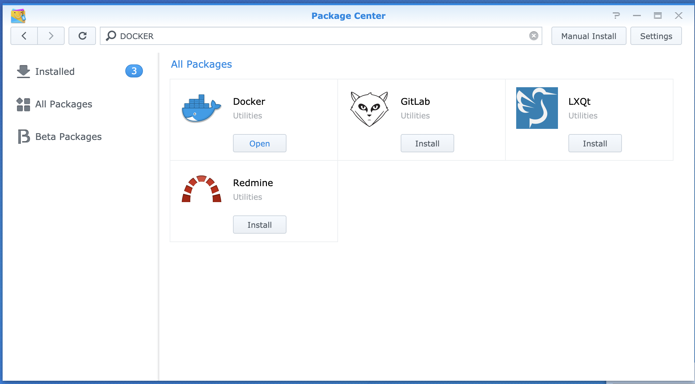
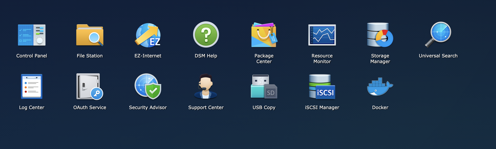
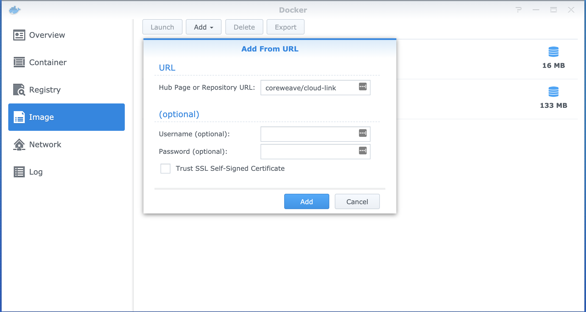
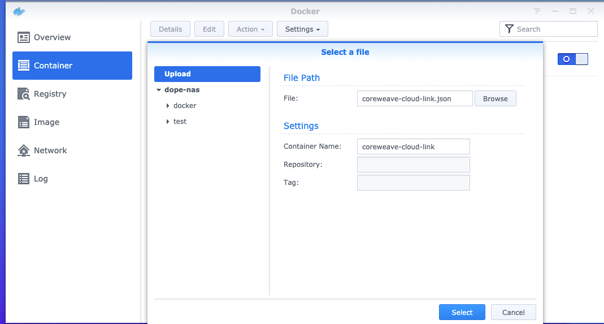
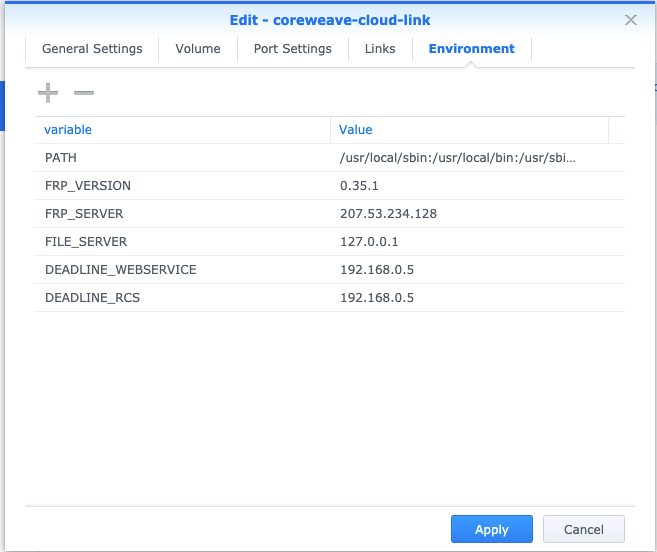
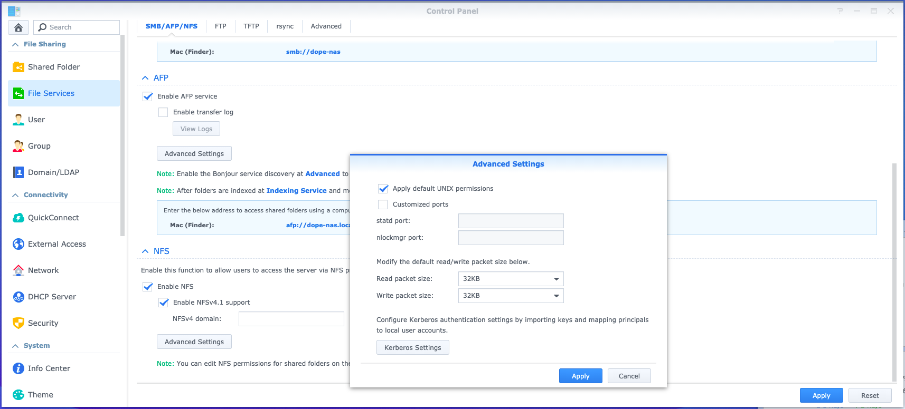
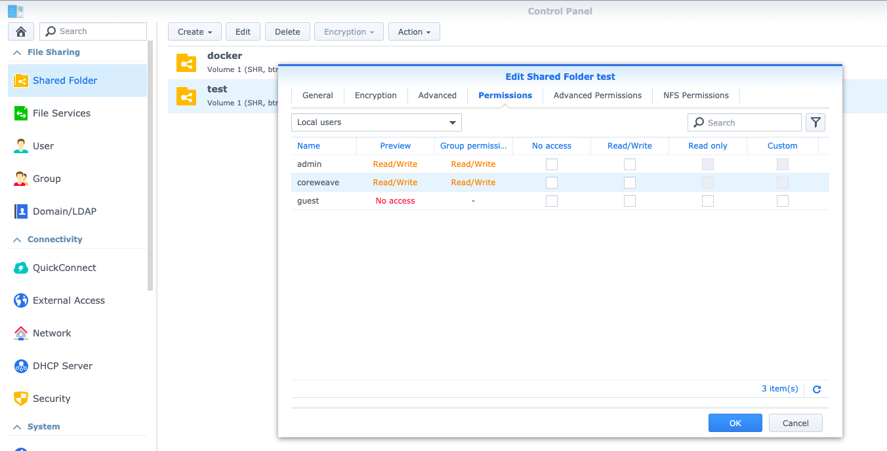
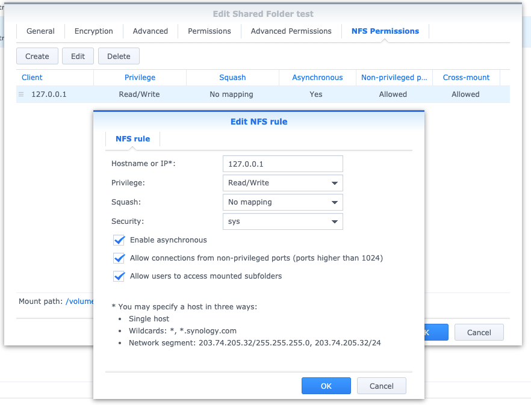

# Synology NAS

[Synology](https://www.synology.com) can natively run [CoreWeave CloudLink](./#cloud-link) as a Docker container. This makes integration with Synology storage straightforward, without need for any external components or firewall modifications.

#### Requirements

* Any [Synology model capable of running Docker](https://www.synology.com/en-us/dsm/packages/Docker), i.e. any Synology able to run the latest version of DSM
* Admin credentials to the NAS

### Setup

This guide will show you how to expose your storage as both **SMB (Windows File Sharing)** and **NFS** to CoreWeave. You are likely already using one of the two, and will want to expose whichever protocol you are currently using. Synology has demonstrated better performance on SMB over WAN links, if you are using both SMB and NFS in your environment we therefore recommend using SMB for CloudLink.

1\. Deploy the CloudLink Server in your CoreWeave namespace on [Apps](https://apps.coreweave.com). It is likely that your CoreWeave specialist has already done this for you, and this step can be skipped.

2\. Install Docker the Docker package via the Package Center in the Synology UI.

3\. Once installed, open Docker from the main menu

4\. Inside the Docker window, navigate to Image, select Add and Add From URL. Add `coreweave/cloud-link`. No username and password needed.

5\. Once the image is loaded, navigate to Container, and select Settings and Import. Upload the `coreweave-cloud-link.json` file provided by your CoreWeave specialist.

6\. Once loaded, select the newly created container and hit Edit. Do not change any settings except those under Environment. The file provided to you likely already has all the settings needed, please validate that they are correct.

| Variable             | Description                                                                                          |
| -------------------- | ---------------------------------------------------------------------------------------------------- |
| FRP\_SERVER          | CoreWeave CloudLink Server IP from Step 1                                                            |
| FILE\_SERVER         | NFS/SMB File Server. This is always 127.0.0.1 for Synology                                           |
| DEADLINE\_WEBSERVICE | If running the Deadline Repository locally, IP address of the server running the Deadline Webservice |
| DEADLINE\_RCS        | If running the Deadline Repository locally, IP address of the server running the Deadline RCS        |

7\. Start the container. Successful connection to the CoreWeave CloudLink Server is identified by a state of Running and an uptime that is increasing. If the container is restarting, it means that the CoreWeave CloudLink server cannot be reached. Validate the `FRP_SERVER` environment variable and that outbound connections on port `7000` to that IP address is allowed in your firewall.

8\. In the Control Panel, navigate to File Services. If you are primarily using **SMB (Windows File Sharing)** to access your data, SMB is likely already enabled. CoreWeave CloudLink will then use SMB to connect to your storage.

9\. If you are primarily using **Linux**, you will want to use **NFS** for CoreWeave CloudLink. SMB users can skip this step and any other NFS related step. Make sure NFSv4.1 is enabled as well as packet sizes are set to `32KB` under Advanced Settings.

10\. If using **SMB (Windows File Sharing):** Create a specific User account for CoreWeave. Provide the username and password to your CoreWeave specialist. Give this user permissions on all Shared Folders that should be accessible from CoreWeave Cloud. Note down the share names and provide them to your CoreWeave specialist.

11\. If using **NFS**, add NFS permissions on all Shared Folders that should be accessible from CoreWeave Cloud. The permissions should be setup as the table below. Provide the Mount path of the shares to your specialist.

| Setting                                     | Value                                                                       |
| ------------------------------------------- | --------------------------------------------------------------------------- |
| Client Hostname or IP                       | 127.0.0.1                                                                   |
| Privilege                                   | Read/Write or Read-Only if writing render outputs to CoreWeave storage only |
| Squash                                      | Implementation dependent, start out with No mapping if unsure               |
| Security                                    | Sys                                                                         |
| Enable Asynchronous                         | Yes                                                                         |
| Allow connections from non-privileged ports | Yes                                                                         |
| Allow users to access mounted subfolders    | Yes                                                                         |

12\. Done! With the information gathered, your CoreWeave specialist will now test file access and finish the setup.
