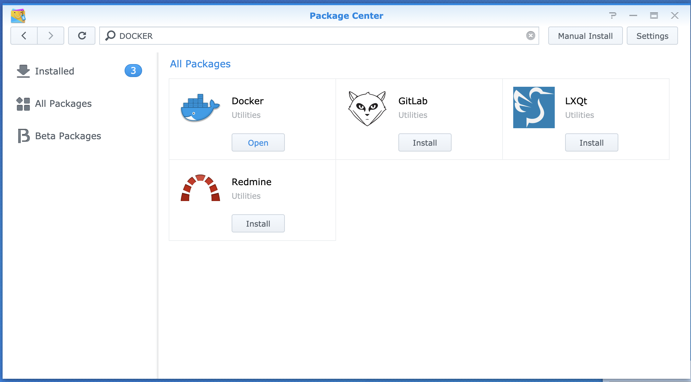

# Synology NAS

[Synology](https://www.synology.com) is capable of natively running [CoreWeave CloudLink](./) as a Docker container. This makes integration with Synology storage straightforward, without the need for any external components or firewall modifications.

This guide will also explain how to expose both **Windows File Sharing (SMB/CIFS)** and **NFS** to CoreWeave. You are likely already using one of the two, and will want to expose whichever protocol you are currently using.

## Prerequisites

* Any [Synology model capable of running Docker](https://www.synology.com/en-us/dsm/packages/Docker), i.e., any Synology model able to run the latest version of DSM
* Admin credentials to the NAS
  * Credentials are provided to you by your CoreWeave Support Specialist in the form of a JSON file titled `coreweave-cloud-link.json`

## Setup

### Installing CloudLink on CoreWeave Cloud

First, [log in to your CoreWeave Cloud account](https://cloud.coreweave.com), then navigate to [the applications Catalog](https://apps.coreweave.com/) on CoreWeave Cloud. Search for `CloudLink`, then select the CloudLink application. Deploy the CloudLink Server into your CoreWeave namespace by clicking the **Deploy** button in the upper right-hand corner.


&#x20;**Note**

It is likely that your CoreWeave specialist has already done this for you, in which case, this step can be skipped.


The server status screen shown after deployment will provide you with the CloudLink server's IP, which you will need later for use with docker-compose.

### Installing Docker on Synology

From the Synology Package Center, install the Docker application.

Once installed, open the Docker application from the Synology main menu.

<figure><figcaption>
The Docker application in the Synology main menu
</figcaption></figure>

Inside the Docker window, navigate to **Image**, then select **Add**, then **Add From URL**. Add `coreweave/cloud-link`. No username and password is needed.

Once the Docker image is loaded, navigate to the **Container** menu, then select **Settings**, then **Import**. Upload the `coreweave-cloud-link.json` file provided by your CoreWeave Specialist.

Once loaded, select the newly created container, then hit **Edit**. Confirm these are correct, then click **Select**.


**Important**

Do not change any settings except those under **Environment** - the file provided to you already has all the required configurations.&#x20;


| Variable              | Description                                                                                                       |
| --------------------- | ----------------------------------------------------------------------------------------------------------------- |
| `FRP_SERVER`          | CoreWeave CloudLink Server IP                                                                                     |
| `FILE_SERVER`         | NFS/SMB File Server - for Synology, this is `127.0.0.1`                                                           |
| `DEADLINE_WEBSERVICE` | If running the Deadline Repository locally, this is the IP address of the server running the Deadline Web service |
| `DEADLINE_RCS`        | If running the Deadline Repository locally, this is the IP address of the server running Deadline RCS             |

Once you are satisfied with these configurations, click **Apply**, then start the container. Successful connection to the CoreWeave CloudLink Server is identified by the `Running` state and an uptime that is increasing.


**Important**

If the container is restarting, it means that the CoreWeave CloudLink server cannot be reached. Validate the `FRP_SERVER` environment variable, and ensure that outbound connections to that IP address on port `7000` are allowed.


### Configure the file server

Select the tab that corresponds to your filesystem type.



From the Control Panel, navigate to **File Services**. If you are primarily using **SMB (Windows File Sharing)** to access your data, SMB is likely already enabled. CoreWeave CloudLink will then use SMB to connect to your storage.

<figure><figcaption>
Adjusting shared folder permissions for SMB
</figcaption></figure>

Ensure that a specific User Account has been created for CoreWeave. Provide the username and password to your CoreWeave Support Specialist. Give this account permissions on all Shared Folders that will be accessible from CoreWeave Cloud. Take note of the share names and provide them to your CoreWeave Support Specialist.



If you are primarily using **Linux**, you will want to select **NFS** for CoreWeave CloudLink. Under **Advanced Settings**, make sure `NFSv4.1` is **enabled**, and set **packet sizes** to `32KB`.

<figure><figcaption>
Example configuration for NFSLinux users
</figcaption></figure>

Ensure that permissions for all Shared Folders accessible from CoreWeave Cloud are setup as described below. Provide the Mount path of the shares to your CoreWeave Specialist.

| Setting                                     | Value                                                                           |
| ------------------------------------------- | ------------------------------------------------------------------------------- |
| Client Hostname or IP                       | `127.0.0.1`                                                                     |
| Privilege                                   | `Read/Write` or `Read-Only` if writing render outputs to CoreWeave storage only |
| Squash                                      | Implementation-dependent, start out with `No mapping` if unsure                 |
| Security                                    | `Sys`                                                                           |
| Enable Asynchronous                         | `Yes`                                                                           |
| Allow connections from non-privileged ports | `Yes`                                                                           |
| Allow users to access mounted subfolders    | `Yes`                                                                           |

<figure><figcaption>
Described NFS settings as shown in the <strong>Edit NFS rules</strong> window
</figcaption></figure>


