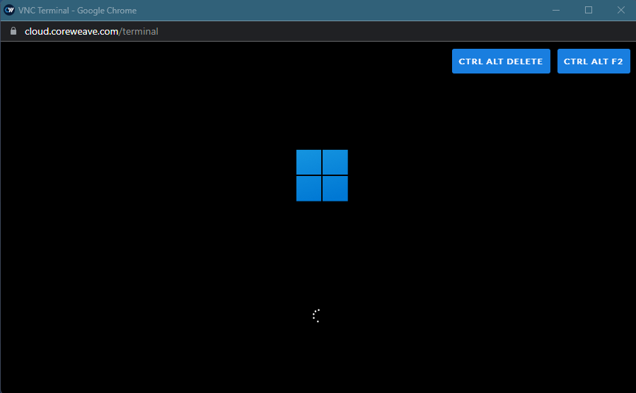
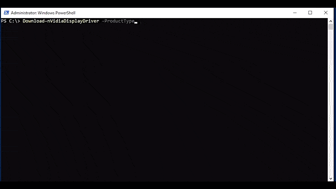

# Windows Images

**Objective:** Learn the various features and enhancements in Windows images provided by CoreWeave Cloud.\
**Overview:** CoreWeave offers a variety of operating system base images, enhanced to run on CoreWeave Cloud, via our **vd-images** namespace. This guide details the Windows specific ones.

## Cloud-Init

Windows images on CoreWeave cloud use [Cloudbase-Init](https://github.com/cloudbase/cloudbase-init), a Windows implementation of Canonical's [cloud-init](https://github.com/canonical/cloud-init).

By default, we enable the following plugins (executed sequentially):

1. [UserDataPlugin](https://cloudbase-init.readthedocs.io/en/latest/plugins.html#user-data-main)
2. [LocalScriptsPlugin](https://cloudbase-init.readthedocs.io/en/latest/plugins.html#local-scripts-execution-main)
3. [SetHostNamePlugin](https://cloudbase-init.readthedocs.io/en/latest/plugins.html#setting-hostname-main)

### Adding Custom Userdata

When creating a new Virtual Server on CoreWeave cloud, instance specific information such as user account information and SSH keys are automatically passed through as Cloud-Init Userdata. When deploying a new Virtual Server, one has the ability to add additional information via Userdata as well.&#x20;

#### Via `kubectl` [YAML](https://github.com/coreweave/kubernetes-cloud/blob/17c3bbe10f8ded84835f07118521dcc42af297af/virtual-server/examples/kubectl/virtual-server-cloudinit.yaml#L45):&#x20;

```yaml
  cloudInit: |
    write_files:
    -   encoding: b64
        content: JFBTVmVyc2lvblRhYmxlIHwgT3V0LUZpbGUgQzpcdGVzdC50eHQ=
        path: C:\test.ps1
        permissions: '0644'
    runcmd:
      - 'Powershell.exe -File C:\test.ps1'
```

#### Via the [CoreWeave Apps Web UI](../../../virtual-servers/deployment-methods/coreweave-apps.md):&#x20;

Within the Virtual Server deployment form, switch to the YAML tab:

 (1).png>)

Towards the bottom of the page, a commented out cloudInit section will be pre-populated. Uncomment to add custom user data:

.png>)


For more information on what be added via native cloudInit Userdata, view the Cloudbase Solutions documentation [here](https://cloudbase-init.readthedocs.io/en/latest/userdata.html#userdata).


### CoreWeave Userdata Features

There are several CoreWeave init scripts included in our base Windows image, that can be enabled via cloudInit Userdata.&#x20;

#### Add SMB Mounts

Samba shares (Or any SMB/CIFS compliant share) can be added via cloudInit, to be mounted to the first available drive letter, at initial user login.

Using an example from a Samba instance hosted via CoreWeave Cloud Apps, we can derive the following information:

 (1).png>)

Using our share information, we can populate the cloudInit `key: value` pairs:

```yaml
  cloudInit: |
    SmbMounts:
    - share: vol01
      server: fil01.tenant-orgname-namespace.coreweave.cloud
      username: gaben
      password: hunter2
    - share: vol02
      server: fil01.tenant-orgname-namespace.coreweave.cloud
      username: gaben
      password: hunter2
```


By default, available drive letters are randomized and the first available one is selected per share. \
\
Drive letters can be manually specified by adding, E.G: `Drive: Z`


#### Enroll a Parsec Teams Machine

CoreWeave Windows images support [Parsec Teams](https://parsec.app/teams). To enroll a Parsec Teams machine, add the following when deploying a VS:&#x20;

```yaml
  cloudInit: |
    ParsecTeams:
      ComputerKey: key_generated_from_parsec_admin_panel
      TeamId: parsec_team_id
      # Use EITHER Group ID or EMail or User ID
      GroupId: parsec_group_id
      UserId: parsec_user_id
      EMail: parsec_user_email
```


If a Parsec machine is assigned to an EMail that isn't part of the Team, the machine will be made available to them after they've been invited and accepted the invitation.\
\
If none of `GroupId`, `UserId`, or `EMail` is provided, the machine will be added to the Parsec Team unassigned.


For more information on Parsec Teams and where to obtain your enrollment key, please visit [Parsec's documentation](https://support.parsec.app/hc/en-us/articles/360054176332-Team-Computers).


When enrolling a Parsec Teams machine, Boolean values `Parsec: true` and `EDID: true` will also need to be added to your manifest.


#### Install Additional Software

All CoreWeave Windows images are pre-loaded with [Chocolatey](https://community.chocolatey.org/packages) package manager. On non Server editions of Windows, [WinGet](https://winget.run/) is included as well.&#x20;

Software specified via cloudInit will be installed automatically at initial user logon:

```yaml
  cloudInit: |
    Choco_Install:
      - googlechrome
      - firefox
    WinGet_Install:
      - Discord.Discord
      - Microsoft.VisualStudioCode
```

#### Power-off with no interactive input

Windows images include scripts that can detect user activity (E.G, moving the mouse, keyboard inputs). When enabled, it can detect a specified period of no user input, and automatically shutdown. A prompt along with a 5 minute grace period when the timer threshold is reached. Adding the following will prompt the user after 10 minutes of no activity, and shutoff automatically after an additional 5 minutes if the prompt is not acknowledged:

```yaml
  cloudInit: |
    shutoff_on_idle: 10
```


This feature should be combined with `RunStrategy: RerunOnFailure` via `vm.Spec` to prevent the instance from automatically powering back on once shutoff.

Additionally, boolean flag `Autologon` should be set to `true`, as the idle tracker runs within the user context.


#### Configure Readiness Probe

The CoreWeave Cloud UI adds a [Readiness Probe](https://kubernetes.io/docs/tasks/configure-pod-container/configure-liveness-readiness-startup-probes/#define-readiness-probes) to Windows Virtual Servers, to better communicate when start-up procedures have completed. Windows images include a simple TCP listener on port `1337` to communicate with the Kubernetes API. The port Windows listens on can be changed via Cloud-Init:

```yaml
# Port used to evaluate Readiness
readinessProbePort: 1234
# If disableReadinessProbe is true, readiness probes will be disabled, enabled by default
disableReadinessProbe: false
cloudInit: |
  readinessProbePort: 1234
```


Note `readinessProbePort` must also be set in the YAML section of the Virtual Server deployment, outside of the cloudInit block. \
\
Setting `readinessProbePort` in the cloudInit block to 0 will disable the listener in Windows.


#### Display Requests Override

Certain applications in Windows, like Parsec, can disrupt idle an inactivity timers. This can mean that despite setting a lock screen or screensaver timer, they never engage when a Parsec session (or other application) is active.&#x20;

This behavior can be overridden via cloudInit. For Parsec or Teradici, only the application name is required. For other applications, specify the executable name:&#x20;

```yaml
  cloudInit: |
    DisplayRequestsOverride:
      - Parsec
      - Teradici
      - chrome.exe
```

### Boolean Userdata Features

Some Userdata features can be enabled with Boolean values `true` or `false`.&#x20;

#### Teradici PCoIP Graphics Agent for Windows

CoreWeave Cloud supports [Teradici PCoIP](https://docs.teradici.com/documentation/graphics-agent-for-windows/release-notes) on both Linux and Windows. Adding the following will install the graphics agent on initial logon, pointed to our licensing server:

```yaml
  cloudInit: |
    Teradici: true
```


Teradici should not be combined with either Parsec or Virtual Display options below.


#### Virtual Display

Many applications on Windows require a display connected to GPU in order to render on it. Adding the below value will attach a virtual 4k monitor to all available outputs, and disconnect the built-in VNC display:

```yaml
  cloudInit: |
    EDID: true
```


When the Virtual Display is enabled, Windows will only output to the attached GPU, making the built-in VNC terminal inaccessible. Connecting via `virtctl vnc` will result in one of the blank screens below:



For serial console access (Windows Special Admin Console), use `virtctl console` instead.


#### Parsec Remote Desktop

CoreWeave strongly recommends [Parsec](https://parsec.app/) for remote access on Windows GPU instances. Adding the following will install Parsec on initial logon:

```yaml
  cloudInit: |
    EDID: true
    Parsec: true
```


Parsec requires the use of a Virtual Display, and thus must always be installed alongside `EDID: true`.


#### Automatic Logon

This flag configures the user account created for automatic logon.

```yaml
  cloudInit: |
    Autologon: true
```

## Operating System Customizations

There are several modifications made to a vanilla Windows instance in order to optimize for use on CoreWeave Cloud. Depending on one's use case, these can be disabled or modified.

#### CoreWeave Resize Disk

By default, when the root disk of a Windows image is expanded, Windows will automatically expand the root disk partition to use all of the available space. Additionally, any new block volumes mounted to a Windows instance will automatically be initialized and partitioned as GPT, and formatted as NTFS.&#x20;

Via Windows Apps and Features, the default behavior can be modified:

 (1).png>)

Selecting "Modify" will prompt for an action to perform when it is detected that the root disk can be expanded. The default action of `ReSize` will expand the root disk. `NewPartition` will create a new partition with the unallocated space, and automatically assign a drive letter. Entering no value will disable any automatic action.

 (1).png>)

After selecting the desired re-size disk option, an additional prompt appears to set an action for newly detected RAW disks. Automatic formatting can be enabled or disabled with `true` or `false`.

.png>)

#### CoreWeave Auto Shutdown

Instance power-off based on interactive user input can be configured via [cloudInit](windows-images.md#coreweave-userdata-features) when an instance is initially deployed. Once an instance has already been deployed, this feature is also configurable via Windows Apps and Features:&#x20;

.png>)

Modifying will prompt for an integer value in minutes to configure auto-shutoff, or set to 0 to disable:

.png>)

#### CoreWeave Windows Update

In order to ensure system stability and predictability, native Windows Update is disabled by default on CoreWeave instances. Instead, through custom scripts, updates are applied as follows:

* Windows Defender updates are applied daily at 3AM UTC, or as soon as possible if missed
  * These are silent and do not require reboots
* On the second Wednesday of the month (one day after [Patch Tuesday](https://en.wikipedia.org/wiki/Patch\_Tuesday)), at 3AM UTC, or as soon as possible if missed:
  * PSWindowsUpdate module is updated
  * On non-Server OS, WinGet is updated (if applicable)&#x20;
  * All Windows Updates are applied silently, without forcing reboot
  * If there is a pending reboot and no user is logged in, the system is rebooted to finish applying patches
  * If there is a pending reboot and a user logged in, the user is presented with a GUI prompt notifying them of pending system patches requiring a reboot
* Each day at 3AM UTC, the system is again checked for pending reboots. If there is a user logged in, they are notified and asked to reboot. If there is no user logged in, the system will be automatically rebooted.&#x20;

There are no user configurable options for CoreWeave Windows Update. To revert to the default Windows Update behavior, simply uninstall from Windows Apps and Features:

.png>)

#### CoreWeave PowerShell Profile

When launching a new PowerShell session, users are presented with some helpful system stats:

 (1).png>)

To disable this functionality, simply delete the profile:

```powershell
rm "$env:SystemRoot\System32\WindowsPowerShell\v1.0\Microsoft.PowerShell_profile.ps1" -Force -Verbose
```

### CoreWeave PowerShell Module

Included in CoreWeave Windows Images is a PowerShell module that provides functions for useful tasks and automation; moreover, some of the Cloud-Init Userdata features rely on the CoreWeave PowerShell module.&#x20;

#### Using the CoreWeave PowerShell Module

The CoreWeave PowerShell Module is a system-wide module - as all Windows Images on CoreWeave Cloud use at minimum PowerShell version 5.1, the module will be automatically imported when any of its functions are called.&#x20;

To manually import the CoreWeave Module:

```powershell
Import-Module CoreWeave -WarningAction SilentlyContinue
```

#### Get-nVidiaDeviceDriverParameters

This function matches and returns properties of the currently attached NVIDIA GPU. If there is not a valid driver installed and Windows cannot identify the attached GPU, the PCI ID will attempt to be matched instead. The output from this function is formatted for use in automating NVIDIA driver downloads.

```
Get-nVidiaDeviceDriverParameters
VERBOSE: After matching, GPU is NVIDIA Quadro RTX 4000, type is Quadro, series is Quadro RTX Series, product is Quadro
RTX 4000, OS is Windows Server 2022, Current driver is 516.25

Name                           Value
----                           -----
ProductType                    Quadro
ProductSeries                  Quadro RTX Series
Product                        Quadro RTX 4000
OperatingSystem                Windows Server 2022
RunningDriverVersion           516.25
```

#### Download-nVidiaDisplayDriver

This function automates downloading drivers from NVIDIA. This function has many parameters, each of which include argument completers:

```powershell
Syntax
    Download-nVidiaDisplayDriver [-ProductType] <string> [-ProductSeries] <string> [-Product] <string> [-OperatingSystem] <string> [-Language] <string> [[-DCH] <bool>] [[-RunningDriverVersion] <string>] [-Force ] [<CommonParameters>]
```



The easiest way to use this function is to combine with [Get-nVidiaDeviceDriverParameters](windows-images.md#get-nvidiadevicedriverparameters). The returned output will be the location of the downloaded driver file:

```powershell
PS C:\> $Parameters = Get-nVidiaDeviceDriverParameters
VERBOSE: After matching, GPU is NVIDIA Quadro RTX 4000, type is Quadro, series is Quadro RTX Series, product is Quadro RTX 4000, OS is Windows Server 2019
PS C:\> Download-nVidiaDisplayDriver @Parameters -Language 'English (US)'
VERBOSE: Target driver version is 516.25
C:\Users\user\AppData\Local\Temp\1\516.25-nvidia-rtx-winserv-2016-2019-2022-64bit-international-dch-whql.exe
```

#### Install-nVidiaDisplayDriver

This function installs a downloaded NVIDIA driver file. If no path is provided, it will attempt to match and download the correct driver.

Setup will be ran directly and silently if it is detected that there is an attached NVIDIA GPU device. If no NVIDIA GPU device is detected, drivers will be manually added to the Windows Driver Store via `pnputil`.

```powershell
Synopsis
 
    Install-nVidiaDisplayDriver [[-DriverPath] <string>] [-CleanInstall] [-ForceInstall] [<CommonParameters>]
```


`-ForceInstall` will force the installation of the same or older driver version. `-CleanInstall` will wipe existing driver configurations.


The easiest way to use this function is to run it directly, allowing auto-match of the attached NVIDIA GPU. If you're already running the latest driver, no action will be taken:

```powershell
PS C:\> Install-nVidiaDisplayDriver
Transcript started, output file is C:\Logs\InstallnVidiaDisplayDriver.LOG
VERBOSE: After matching, GPU is NVIDIA Quadro RTX 4000, type is Quadro, series is Quadro RTX Series, product is Quadro  RTX 4000, OS is Windows Server 2022, Current driver is 516.25                                                           VERBOSE: Target driver version is 516.25
VERBOSE: Target driver 516.25 is less than or equal to running driver 516.25 and Force flag was not passed, we're not
gonna download anything
Transcript stopped, output file is C:\Logs\InstallnVidiaDisplayDriver.LOG
0
```


In the event new drivers are installed, a reboot is required, but not **enforced**.


#### Configure-AutoLogon

This function is called when [`Autologon: true`](windows-images.md#automatic-logon). The `-Action` parameter will either enable or disable automatic logon, with `$true` or `$false` respectively.

```powershell
Synopsis
    
    Configure-AutoLogon [[-InputObject] <pscredential>] [-Action] <bool> [<CommonParameters>]
```

The easiest way to use this function is to combine with `Get-Credential`:

```powershell
Configure-AutoLogon -Action:$true -InputObject (Get-Credential)
```

#### Enroll-ParsecTeamMachine

This function is called by the [Parsec Teams Cloud-Init feature](windows-images.md#enroll-a-parsec-teams-machine). If an instance was not enrolled at the time of deployment, enrollment can be completed silently using this function.

```powershell
Synopsis
    
    Enroll-ParsecTeamMachine [[-APIHost] <string>] [-ComputerKey] <string> [-TeamID] <string> [[-AppRuleID] <string>] [[-GuestAccess] <bool>] [[-UserID] <int>] [[-GroupID] <int>] [[-EMail] <string>] [[-BinPath] <string>] [<CommonParameters>]
```

#### Invoke-SilentMSI

This function automates silently installing a provided [Windows Installer](https://docs.microsoft.com/en-us/windows/win32/msi/windows-installer-portal) file.&#x20;

```powershell
Synopsis
    
    Invoke-SilentMSI [-Action] <string> [[-MSI] <string>] [[-InstallerArgs] <string[]>] [<CommonParameters>]
```

An example installing [PowerShell 7](https://docs.microsoft.com/en-us/powershell/scripting/install/installing-powershell-on-windows?view=powershell-7.2):

```powershell
PS C:\> Start-BitsTransfer -Source https://github.com/PowerShell/PowerShell/releases/download/v7.2.4/PowerShell-7.2.4-win-x64.msi -Destination $env:TEMP
PS C:\> Invoke-SilentMSI -Action Install -MSI "$env:TEMP\PowerShell-7.2.4-win-x64.msi" -InstallerArgs @('ADD_FILE_CONTEXT_MENU_RUNPOWERSHELL=1','ADD_EXPLORER_CONTEXT_MENU_OPENPOWERSHELL=1','ENABLE_PSREMOTING=1','REGISTER_MANIFEST=1')
Transcript started, output file is C:\Logs\PowerShell7-x647.2.4.0.LOG
VERBOSE: Beginning installation of PowerShell 7-x64 7.2.4.0
VERBOSE: PowerShell 7-x64 7.2.4.0  has completed with exit code 0: ERROR_SUCCESS
Transcript stopped, output file is C:\Logs\PowerShell7-x647.2.4.0.LOG
0
```

A given MSI can also be uninstalled using the same function:

```powershell
PS C:\> Invoke-SilentMSI -Action Remove -MSI "$env:TEMP\PowerShell-7.2.4-win-x64.msi"
Transcript started, output file is C:\Logs\PowerShell7-x647.2.4.0.LOG
VERBOSE: Beginning REMOVAL of PowerShell 7-x64 7.2.4.0
VERBOSE: PowerShell 7-x64 7.2.4.0  REMOVAL has completed with exit code 0: ERROR_SUCCESS
Transcript stopped, output file is C:\Logs\PowerShell7-x647.2.4.0.LOG
0
```
