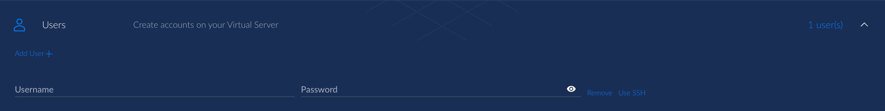

# User Accounts

User accounts can be provisioned onto Virtual Servers in a few different ways. You can add as many user accounts as you like to your Virtual Servers.


**Important**

Users created on Virtual Servers are automatically given **administrative privileges (`sudo` access).**




## **Deployment method:** <mark style="background-color:blue;">CoreWeave Cloud UI</mark>

From the [CoreWeave Cloud UI](../../../virtual-servers/deployment-methods/coreweave-apps.md) Virtual Server deployment menu, click the **Users** expandable.

The first user account created will be used as the first administrative user account on the Virtual Server, and can be configured to use either an SSH public key or a password for authentication.

A username and password is presented as the default - to switch to using an SSH key, click "Use SSH" beside the password field.

<figure><figcaption></figcaption></figure>

Additional user accounts may either be added using the UI, or they may be provisioned in the YAML manifest editor under the `users` block:

<figure><figcaption></figcaption></figure>

This `users` block is a YAML list, in which usernames and passwords or SSH public keys can be included. Multiple users in this configuration may look something like this example:

<pre class="language-yaml" data-overflow="wrap"><code class="lang-yaml">users:
  - username: 'jill'
    password: '93jrwnffdk'
  - username: 'jack'
<strong>    sshpublickey: AAAAB3NzaC1yc2EAAAABIwAAAQEAklOUpkDHrfHY17SbrmTIpNLTGK9Tjom/BWDSU
</strong>GPl+nafzlHDTYW7hdI4yZ5ew18JH4JW9jbhUFrviQzM7xlELEVf4h9lFX5QVkbPppSwg0cda3
Pbv7kOdJ/MTyBlWXFCR+HAo3FXRitBqxiX1nKhXpHAZsMciLq8V6RjsNAQwdsdMFvSlVK/7XA
t3FaoJoAsncM1Q9x5+3V0Ww68/eIFmb1zuUFljQJKprrX88XypNDvjYNby6vw/Pb0rwert/En
mZ+AW4OZPnTPI89ZPmVMLuayrD2cE86Z/il8b+gw3r3+1nKatmIkjn2so1d01QraTlMqVSsbx
NrRFi9wrf+M7Q==
</code></pre>



## **Deployment method:** <mark style="background-color:green;">Kubernetes CLI</mark>

User accounts are created using the Kubernetes CLI by adding their information to the `users` stanza of the `spec`.

```yaml
  users:
    - username: SET YOUR USERNAME HERE
      password: SET YOUR PASSWORD HERE  
       To use key-based authentication, replace and uncomment SSH-RSA below with your public SSH key
      # sshpublickey: |
        ssh-rsa AAAAB3NzaC1yc2EAAAA ... user@hostname
```



## **Deployment method:** <mark style="background-color:orange;">Terraform</mark>

The Virtual Server's user account options are configured as variables passed into the [Virtual Server Terraform module](https://github.com/coreweave/kubernetes-cloud/tree/master/virtual-server/examples/terraform).

### User account configuration options

The table below describes all available configuration options for user accounts on Virtual Servers.

<table><thead><tr><th width="301.42613833223936">Variable name</th><th width="150">Variable type</th><th width="260.5496313102666">Description</th><th>Default value</th></tr></thead><tbody><tr><td><code>vs_username</code></td><td>String</td><td>The name of the user to create.</td><td><code>linux</code></td></tr><tr><td><code>vs_password</code></td><td>String</td><td>User-defined password for the user account.<br><span data-gb-custom-inline data-tag="emoji" data-code="26a0">⚠</span><strong><code>vs_generate_password</code> must be set to <code>false</code>.</strong></td><td><code>ubuntu2004-docker-master-20210601-ord1</code> (The Ubuntu 20.04 image stored in the Chicago region.)</td></tr><tr><td><code>vs_generate_password</code></td><td>Boolean</td><td>Whether or not to randomly generate a user password for the user account.</td><td><code>true</code></td></tr></tbody></table>

Example in plain text:

```json
variable "vs_username" {
  description = "Virtual Server username"
}

variable "vs_password" {
  type        = string
  default     = "null"
  description = "User provided password (vs_generate_password must be set to false)"
}

variable "vs_generate_password" {
  type        = bool
  default     = true
  description = "Generate password"
```



