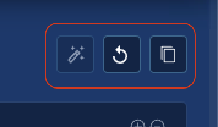

# CGI Rendering

**Introduction**

This example will walk you through the set up of a complete cloud rendering solution for GPU rendering using Blender on CoreWeave Cloud. We will utilize node affinity rules to select the type and quantity of hardware we use for our render, and even pass in a custom `artifact` to our container. When done, you will have a web based file management solution for asset upload and downloading render output, and a highly parallel workflow template to launch your render jobs! 

**Persistent Volume Claim**

We will need a place for all of our render assets and outputs to reside, that is accessible to multiple workers and other services in our namespace. To do this, we will create a shared filesystem [Persistent Volume Claim](https://docs.coreweave.com/coreweave-kubernetes/storage#shared-filesystem). We've set the resource storage request to `100Gi` in this example, but feel free to adjust as necessary.


```yaml
apiVersion: v1
kind: PersistentVolumeClaim
metadata:
  name: shared-data-pvc
spec:
  storageClassName: sharedfs-hdd-replicated
  accessModes:
    - ReadWriteMany
  resources:
    requests:
      storage: 100Gi # 100GB total volume size
```


Once this is created and saved \(we named ours `pvc.yaml`\), run the following to create your claim:

```bash
$ kubectl apply -f pvc.yaml 
persistentvolumeclaim/shared-data-pvc created
```

We now have a shared filesystem of 100GB, named `shared-data-pvc` that we can utilize throughout our rendering example!

**File Browser Service and Deployment**

Because we are attempting to create an easy to use service to render our Blender animation, we will also quickly setup a web based file management platform to upload and download any assets and render output we have. For this, we will be using the open-source utility [File Browser](http://www.filebrowser.xyz).

To get our web based platform running, we have to create both the application deployment, as well as a service with rules on how to deliver the application to the outside world.

Our deployment is going to use our `shared-data-pvc` storage volume as its data directory, and we are going to name it `filebrowser` for reference in our service in just a minute.


```yaml
apiVersion: apps/v1
kind: Deployment
metadata:
  name: filebrowser
spec:
  replicas: 1
  selector:
    matchLabels:
      app: filebrowser
  template:
    metadata:
      labels:
        app: filebrowser
    spec:
      containers:
      - name: filebrowser
        image: hurlenko/filebrowser:latest
        ports:
        - containerPort: 8080
          name: webui
        volumeMounts:
        - name: data-storage
          mountPath: /data
      volumes:
        - name: data-storage
          persistentVolumeClaim:
            claimName: shared-data-pvc
```


We've saved our deployment as `filebrowser-deployment.yaml`. To launch the deployment, run:

```text
$ kubectl apply -f filebrowser-deployment.yaml 
deployment.apps/filebrowser created
```

To check to see if our pod has created successfully, run:

```text
$ kubectl get pods | grep filebrowser
filebrowser-5fddbbf864-8jbpm     1/1     Running      0      3h10m
```

Once we have our application deployed, it's time to make it accessible outside the cluster. To do this, we will launch a service linked to the deployment while grabbing an IP address from the CoreWeave Cloud public IP pool. Our service file is pretty simple, and looks like:


```yaml
apiVersion: v1
kind: Service
metadata:
  name: filebrowser
  annotations:
    metallb.universe.tf/address-pool: public
    metallb.universe.tf/allow-shared-ip: default
  labels:
    app: filebrowser
spec:
  type: LoadBalancer
  externalTrafficPolicy: Local
  ports:
  - port: 80
    protocol: TCP
    name: webui
    targetPort: 8080
  selector:
    app: filebrowser
```


We've saved our service file as `filebrowser-service.yaml` and launch the service by:

```text
$ kubectl apply -f filebrowser-service.yaml
service/filebrowser created
```

Next up is to find the public IP of our service:

```text
NAME            TYPE           CLUSTER-IP       EXTERNAL-IP     PORT(S)             AGE
filebrowser     LoadBalancer   10.135.198.207   64.xx.xx.xx     80:32765/TCP        3h16m
```

Let's now browse to the `EXTERNAL-IP` as listed in our services, and we should be greeted by a login screen!


**Let's get something to render!**

For this example, we want to render something that quickly shows the power available on CoreWeave Cloud, so we're going to take one of the typical Blender benchmarks, [BMW\_27](https://download.blender.org/demo/test/BMW27_2.blend.zip) and upload the unpacked file `bmw27_gpu.blend` to our root path in the File Browser.


**Creating our render workflow!**

This portion of the example assumes that you've already setup your Argo CLI tools by following the steps available here: [https://docs.coreweave.com/workflows/argo](https://docs.coreweave.com/workflows/argo)

Our workflow file is going to do a few things for us:

1. Define the parameters of the overall job, including the file to render, the frame range, how many frames to render per pod, and the maximum number of parallel pods.
2. Auto-generate "slices" to render in parallel on each pod.
3. Define what type of hardware we would like our job to be executed on.
4. Supply the Blender commands and pass in a custom python script to ensure we render on GPU.

Some of the workflow steps in here are a little advanced, so we've commented them where possible. If you don't understand it immediately, don't worry, it will only take a few times interacting with Argo to pick it up.


```yaml
apiVersion: argoproj.io/v1alpha1
kind: Workflow
metadata:
  generateName: render-
spec:
  entrypoint: main
  parallelism: 10 # Maximum number of parallel pods to run (pods x gpu limit = total GPUs)
  activeDeadlineSeconds: 864000 # Cancel operation if not finished in 24 hours
  ttlSecondsAfterFinished: 86400 
  arguments:
    parameters: # These parameters are available as variables throughout our template.
    - name: filename # The location of our blend file, /data/ is the root directory of our Filebrowser app
      value: '/data/bmw27_gpu.blend'
    - name: sliceSize # How many frames to render per pod, let's set it to 1
      value: 1
    - name: start # Start frame of entire sequence to render
      value: 1
    - name: stop # Stop frame of entire sequence to render, let's render 10
      value: 10
    - name: outputLocation # Location to write the output to
      value: "/data/output/bmw27_gpu/"

  volumes:
  - name: data-storage
    persistentVolumeClaim:
      claimName: shared-data-pvc # Mounting in our shared data PVC

  tolerations: # This is here so that our generate slices script only runs on a CPU node.
  - key: is_cpu_compute
    operator: Exists

  templates: # This defines the steps in our workflow.
  - name: main
    steps:
    - - name: slice # Step to generate frame ranges "slices" to run on each pod.
        template: gen-slices
    - - name: render
        template: render-blender
        arguments:
          parameters:
          - name: start
            value: "{{item.start}}"
          - name: stop
            value: "{{item.stop}}"
        withParam: "{{steps.slice.outputs.result}}"

  - name: gen-slices # This is our custom slicing script that runs as bare code in a python container.
    script:
      image: python:alpine3.6
      command: [python]
      source: |
        import json
        import sys
        frames = range({{workflow.parameters.start}}, {{workflow.parameters.stop}}+1)
        n = {{workflow.parameters.sliceSize}}
        slices = [frames[i * n:(i + 1) * n] for i in range((len(frames) + n - 1) // n )]
        intervals = map(lambda x: {'start': min(x), 'stop': max(x)}, slices)
        json.dump(list(intervals), sys.stdout)
  - name: render-blender
    metadata:
      labels:
        coreweave.com/role: render
    inputs:
      parameters:
      - name: start
      - name: stop
      artifacts: # Artifacts are directly mounted inside the container for use by our program.
      - name: blender_gpu # We are mounting a python script that ensures all GPUs are used for our render.
        path: /blender_gpu.py # The python script will be mounted at /blender_gpu.py and accessible by Blender.
        raw:
          data: |

            import bpy

            # Set GPU rendering
            bpy.context.scene.cycles.device = 'GPU'
            bpy.context.preferences.addons['cycles'].preferences.compute_device_type = 'CUDA'
            # Force turn off progressive refine, since we are not in viewport
            bpy.context.scene.cycles.use_progressive_refine = False
            # Enable all available GPUs
            for devices in bpy.context.preferences.addons['cycles'].preferences.get_devices():
                for d in devices:
                    d.use = True
                    if d.type == 'CPU':
                        d.use = False
            # Disable placeholder frame files
            bpy.context.scene.render.use_placeholder = False
            # Force process to over-write existing files
            bpy.context.scene.render.use_overwrite = True

    retryStrategy: # It is important that we define retry logic, in case Blender fails. It fails sometimes. Out of nowhere.
      limit: 1
    container:
      image: nytimes/blender:2.82-gpu-ubuntu18.04 # We are using the Docker container graciously provided by NYT.
      command: ["blender"]
      workingDir: /
      # These are the command line arguments that will be supplied to our Blender process, including the python script above.
      args: [ 
            "-b",
            "{{workflow.parameters.filename}}",
            "--engine", "CYCLES",
            "--factory-startup", "-noaudio",
            "--use-extension", "1",
            "-o", "{{workflow.parameters.outputLocation}}",
            "--python", "blender_gpu.py",
            "-s", "{{inputs.parameters.start}}",
            "-e", "{{inputs.parameters.stop}}",
            "-a"
      ]
      resources: # This is where we request our pod resources.
        requests:
          memory: 8Gi # Requesting a minimum of 8GB system ram
          cpu: 1 # Requesting a minimum of 1 vCPU
        limits:
          cpu: 2 # Requesting a maximum of 2 vCPU
          nvidia.com/gpu: 4 # Requesting 4 GPUs
      volumeMounts:
      - name: data-storage # Mounting in our PVC as /data so it's accessible to our pod.
        mountPath: /data
    affinity: 
      nodeAffinity:
        requiredDuringSchedulingIgnoredDuringExecution:
          nodeSelectorTerms:
          - matchExpressions:
            - key: gpu.nvidia.com/model
              operator: In
              values: # This is where we identify what GPU type we want to run on. All types are listed, but most are commented out.
              - GeForce_GTX_1070_Ti
              - GeForce_GTX_1070
```



Retry logic is best-practice when running rendering in parallel. Due to the constant advancements in CGI rendering platforms and GPU compute, sometimes these things break for no reason, and retries defined in your Argo workflow template will ensure you aren't hunting for lost frames.


Our completed workflow file, which we will save as `blender-gpu-render.yaml` is now setup to render, in parallel, using 10 pods of 4x GeForce GTX 1070\(Ti\) GPUs. Let's see if it works!

To start our render, we do:

```text
$ argo submit --watch blender-gpu-render.yaml
```

Immediately after this command is submitted, you should see the Argo command line kick into high-gear, showing the inputs and the status of your workflow. At first, it may show `Unschedulable` warnings, but that's just because Kubernetes is evicting idle containers and getting your systems ready to run.

After about **1 minute** you should see a screen that looks like:

```bash
Name:                render-sjf6t
Namespace:           tenant-test
ServiceAccount:      default
Status:              Succeeded
Created:             Fri May 29 22:26:01 -0400 (2 minutes ago)
Started:             Fri May 29 22:26:01 -0400 (2 minutes ago)
Finished:            Fri May 29 22:28:12 -0400 (now)
Duration:            2 minutes 11 seconds
Parameters:          
  filename:          /data/bmw27_gpu.blend
  sliceSize:         1
  start:             1
  stop:              10
  outputLocation:    /data/output/bmw27_gpu/

STEP                                                   PODNAME                  DURATION  MESSAGE
 ✔ render-sjf6t (main)                                                                    
 ├---✔ slice (gen-slices)                              render-sjf6t-2863198607  3s        
 └-·-✔ render(0:start:1,stop:1)(0) (render-blender)    render-sjf6t-1206241518  1m        
   ├-✔ render(1:start:2,stop:2)(0) (render-blender)    render-sjf6t-2071804633  1m        
   ├-✔ render(2:start:3,stop:3)(0) (render-blender)    render-sjf6t-2756225068  1m        
   ├-✔ render(3:start:4,stop:4)(0) (render-blender)    render-sjf6t-2726811839  1m        
   ├-✔ render(4:start:5,stop:5)(0) (render-blender)    render-sjf6t-3220888738  1m        
   ├-✔ render(5:start:6,stop:6)(0) (render-blender)    render-sjf6t-3319286957  1m        
   ├-✔ render(6:start:7,stop:7)(0) (render-blender)    render-sjf6t-577269840   1m        
   ├-✔ render(7:start:8,stop:8)(0) (render-blender)    render-sjf6t-3336690355  1m        
   ├-✔ render(8:start:9,stop:9)(0) (render-blender)    render-sjf6t-3980468470  2m        
   └-✔ render(9:start:10,stop:10)(0) (render-blender)  render-sjf6t-2756728893  1m 
```

This shows the status of your 10 frames being rendered on 10 different GPU instances with 4x GTX 1070\(Ti\) each. You can now browse to your File Browser site, and you should see a fresh folder `outputs` with sub-directory `bmw27_gpu` that is filled with your 10, freshly rendered frames!


So, what did we get with all this effort? We got ourselves a beautiful, CGI generated BMW demo file:



With just some small changes to the Argo workflow we just built and used, you can now run your Blender GPU rendering on thousands of GPUs simultaneously!

