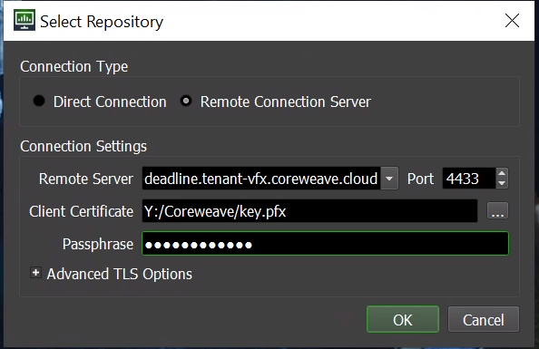

# Deploying Managed Deadline

#### Background

Deadline is an industry standard render management platform developed by Thinkbox. CoreWeave provides a fully managed implementation of Deadline, including all its necessary components, delivered as a service to VFX/rendering companies who require quick setup, zero management, as well as automatic and limitless scalability.

CoreWeave deploys Deadline through a Kubernetes Helm Chart. Helm allows us to template and reconfigure multistage Kubernetes deployments and provide unique configurability to Deadline users. Therefore most of the work done by users of this CoreWeave service is providing the information specific to individual pipelines, everything else will be managed automatically behind the scenes.

The CoreWeave implementation of Deadline is delivered as a High Availability service via Kubernetes. Every component of Deadline is replicated, redundant, and containerized. This makes your Deadline deployments more durable, faster, and more scalable than ever. Containerization of course comes at the cost of needing to convert existing Deadline worker images, thankfully the engineers at CoreWeave are happy to help! Here we provide the names of a few images you can pull today. If you are interested in seeing examples of Dockerfiles and the process to build and configure Deadline worker groups reach out to your CoreWeave support specialist.

## **Thinkbox Deadline Documentation**

### **Getting Started**

CoreWeave uses Thinkbox Deadline, the industry standard render management solution for accessing render nodes and scaling your workloads automatically. We’ll assume that you already have some familiarity with Deadline, if not consider checking out Thinkbox's own Documentation below:

#### Thinkbox Deadline Documentation and User Guide:

{% embed url="https://docs.thinkboxsoftware.com/products/deadline/10.0/1_User%20Manual/index.html" %}

### Deploying the Deadline Application

There are two ways of deploying Deadline on CoreWeave.

1. Fully managed: we deploy the repository and all related components entirely on CoreWeave Cloud **(Preferred)**
2. Workers only: we deploy autoscaled deadline workers on CoreWeave which connect to an on premise Deadline repository

To Get started deploying your deadline repository and workers on CoreWeave login to your cloud dashboard and navigate to the apps interface from the menu on the left. From there, ensure you are within the "catalogue" tab and find Deadline from the list of available applications. Select Deadline and then hit deploy in the upper right. You should now see something like this (NOTE: your App version and Package Version may be different):

.png>)

Inside this box you can see the default values for deploying the Deadline chart. If you're interested in seeing what configuration options are available to you give this a look over. However, for our purposes we can **select everything in this box and delete it**! We will then put in values which only adjust the properties we want change from default.

To make things simpler we will split our configuration into two sections

1. Setup: these values will adjust versions, connectivity, authentication, and enable/disable deadline components
2. Workers: these values will allow us to define our Deadline workers and configure autoscaling.

#### Setup

To begin we should specify what version of Deadline repository/workers we would like to deploy. Our currently supported versions are

10.1.9.2, 10.1.10.6, 10.0.24.4, 10.1.11.5, 10.1.6.4, 10.1.12.1, 10.1.13.2, 10.1.15.2, 10.1.17.4, 10.1.18.5

If you require a version outside of this list, feel free to reach out to your CoreWeave support specialist.

To specify the repository version we would like to deploy we simply add to our YAML

```
version: 10.1.18.5
```

Next, if you plan on deploying **workers only**, add the following on a new line to your YAML

```
repository:
    remoteRepository:
        host: <ON-PREM HOST OR CL FORWARDS>
        port: <REPOSITORY PORT>
        auth:
          certSecret:
            name: <SECRET NAME>
          password: temp123
```

Edit out the values to represent the connection details to your on-prem Deadline repository. If your repository is not accessible over a public IP you should consider first setting up Cloudlink to proxy that connection through. You can find a full guide on setting that up here:


[linux.md](on-premise-integration/linux.md)


After that is set up you can run `kubectl get services` and look for the cloudlink forwards service. Use the external IP of that service as the host in your YAML file.

For either deployment method, if your on-prem repository utilizes TLS certificates, you will need to create a kubernetes secret containing the certificate. You can see the full guide for creating kubernetes secrets [here](https://kubernetes.io/docs/concepts/configuration/secret/) however the basic command is `kubectl create secret generic <secret name> --from-file=<local full path to certificate file>`. Finally, specify the password used to decode the certificate in the final field of the YAML above.

If you are deploying the **full repository**, specify

```
rcs:
  pass: <CERTIFICATE PASSWORD>
```

We will automatically generate a deadline certificate for your repository. This value will allow you to specify the password used to decode that generated certificate.

One final thing that you may choose add is

```
licenseForwarder:
  enabled: true
  auth:
    secrets:
      name: <SECRET NAME>
```

This will enable a license forwarder for utilizing thinkbox UBL. To authenticate your marketplace license allocations you will need to create a secret containing your certificates from the thinkbox marketplace using `kubectl create secret generic <secret name> --from-file=<local full path to directory containing all certificates>`.

If you have followed up to this point and you are utilizing **workers only** your YAML should look something like this:

```
version: 10.1.18.5
repository:
    remoteRepository:
        host: 127.0.0.1
        port: 4433
        auth:
          certSecret:
            name: on-prem-cert
          password: password123
 licenseForwarder:
  enabled: true
  auth:
    secrets:
      name: ubl-certificates
```

Otherwise, your YAML should look something like

```
version: 10.1.18.5
rcs:
  pass: password123
 licenseForwarder:
  enabled: true
  auth:
    secrets:
      name: ubl-certificates
```

#### Workers

In order for Deadline workers to spin up to process our Deadline jobs, we will need to specify in our YAML file what docker images we should use to render each type of job, what hardware we would like to use for those workers, as well as how we would like the scale of compute to respond to jobs in our repository. A worker definition might look something like:

```
workers:
- name: maya-epyc
    enabled: true
    groups:
      - maya-epyc
      - maya
    pools:
      - vfx
    scale:
      pollingNames:
      - name: maya-epyc
        type: Group
      minReplicas: 0
      maxReplicas: 100
      scalingFactor: 1
    image: registry.gitlab.com/coreweave/render-images/maya2022:1
    imagePullSecrets: &imagePullSecrets
      - name: render-images
    env:
      - name: ARNOLD_LICENSE_ORDER
        value: network
      - name: ADSKFLEX_LICENSE_FILE
        value: 127.0.0.1
    affinity:
      nodeAffinity:
        requiredDuringSchedulingIgnoredDuringExecution:
          nodeSelectorTerms:
            - matchExpressions:
                - key: node.coreweave.cloud/cpu
                  operator: In
                  values:
                    - amd-epyc-rome
                    - intel-xeon-v4
                - key: node.coreweave.cloud/class
                  operator: In
                  values:
                    - cpu
        preferredDuringSchedulingIgnoredDuringExecution:
            - weight: 100
              preference:
                matchExpressions:
                  - key: topology.kubernetes.io/region
                    operator: In
                    values:
                      - ORD1
    resources:
      limits:
        cpu: 35
        memory: 130Gi
      requests:
        cpu: 35
        memory: 129Gi
```

Starting from the top `enabled: true` allows you to quickly and enable and disable different worker types during upgrades without removing them from your application. We will talk more about upgrading your deadline deployment later.

```
groups:
  - maya-epyc
  - maya
pools:
  - vfx
```

The next values allow us to specify a list of groups and pools that we would like our Workers to be assigned to inside of Deadline. Workers when initializing will attempt to join these pools and groups, if they do not exist they will attempt to create them.

Scaling is the next important section. Here we specify how we would like our workers to scale in response to jobs submitted to the repository.

```
scale:
  pollingNames:
  - name: maya-epyc
    type: Group
  minReplicas: 0
  maxReplicas: 100
  scalingFactor: 1
```

`pollingNames` is where we specify which tasks should monitored to scale up and down. In this example we are saying that we would like to scale based off of the number of tasks submitted to the Deadline group "maya-epyc," which also happens to be the same group that our workers will join! In fact if you do not specify any polling names, your worker will automatically create a limit with the same name as your worker group and scale based off of that. Other default options for type are User and Pool. Custom polling types are possible, allowing you to scale based on any job association including tags. For more information on Custom polling types reach out to a support specialist.

We can configure the scaling limit for this worker type using limits inside of Deadline later, but for now we can set `minReplicas` and `maxReplicas` as a backstop so that if the Deadline limits are accidently modified incorrectly we will never exceed the max or go below the min number of deadline workers of this type.

Last but not least we have `scalingFactor` which allows us to add an overall multiplier for our scaling. For example a `scalingFactor` of .5 would mean that for ever 2 tasks submitted to the queue we would spin up 1 worker. For most use cases this value can remain at 1.

Next up we configure our worker docker images:

```
image: registry.gitlab.com/coreweave/render-images/maya2022:1
imagePullSecrets: 
- name: render-images
```

In this example we provide a base maya2020 worker image which you can test out as well! In order to use this image you will need to create an image pull secret. Run the command `k create secret docker-registry render-images --docker-username render-images --docker-password "rJX7s8EjsD8UmD6-73yc" --docker-server registry.gitlab.com/coreweave/render-images` in order to create the necessary credentials. The image pull secret value in the worker definitions accepts multiple pull secrets if necessary/convenient.

Next we can add environment variables which will be initialized in the containers on startup. This is a convenient way to provide environment like license settings!

```
env:
  - name: ARNOLD_LICENSE_ORDER
    value: network
  - name: ADSKFLEX_LICENSE_FILE
    value: 127.0.0.1
```

After this we have our affinity which allows us to choose where and what hardware our Deadline workers run on

```
affinity:
      nodeAffinity:
        requiredDuringSchedulingIgnoredDuringExecution:
          nodeSelectorTerms:
            - matchExpressions:
                - key: node.coreweave.cloud/cpu
                  operator: In
                  values:
                    - amd-epyc-rome
                    - intel-xeon-v4
                - key: node.coreweave.cloud/class
                  operator: In
                  values:
                    - cpu
        preferredDuringSchedulingIgnoredDuringExecution:
            - weight: 100
              preference:
                matchExpressions:
                  - key: topology.kubernetes.io/region
                    operator: In
                    values:
                      - ORD1
```

You can read more about affinities, scheduling and provisioning resources on CoreWeave [here](../../coreweave-kubernetes/node-types.md), this example schedules our Maya worker on either amd-epyc-rome or intel-xeon-v4 cpu nodes, with a preference to be scheduled in ORD1, our Chicago datacenter. The resource request at the end of the spec then determines the CPU, GPU, and memory limits for the container.

```
resources:
      limits:
        cpu: 35
        memory: 130Gi
      requests:
        cpu: 35
        memory: 129Gi
```

#### Putting It All Together

Now that we have all our values ready, it's time to put it all together. If you followed up to this point your YAML might looks something like this:

```
version: 10.1.18.5
rcs:
  pass: password123
 licenseForwarder:
  enabled: true
  auth:
    secrets:
      name: ubl-certificates
workers:
  images:
  - name: maya-epyc
      enabled: true
      groups:
        - maya-epyc
        - maya
      pools:
        - vfx
      scale:
        pollingNames:
        - name: maya-epyc
          type: Group
        minReplicas: 0
        maxReplicas: 100
        scalingFactor: 1
      image: registry.gitlab.com/coreweave/render-images/maya2022:1
      imagePullSecrets: &imagePullSecrets
        - name: render-images
      env:
        - name: ARNOLD_LICENSE_ORDER
          value: network
        - name: ADSKFLEX_LICENSE_FILE
          value: 127.0.0.1
      affinity:
        nodeAffinity:
          requiredDuringSchedulingIgnoredDuringExecution:
            nodeSelectorTerms:
              - matchExpressions:
                  - key: node.coreweave.cloud/cpu
                    operator: In
                    values:
                      - amd-epyc-rome
                      - intel-xeon-v4
                  - key: node.coreweave.cloud/class
                    operator: In
                    values:
                      - cpu
          preferredDuringSchedulingIgnoredDuringExecution:
              - weight: 100
                preference:
                  matchExpressions:
                    - key: topology.kubernetes.io/region
                      operator: In
                      values:
                        - ORD1
      resources:
        limits:
          cpu: 35
          memory: 130Gi
        requests:
          cpu: 35
          memory: 129Gi
```

Note that it is common to have many worker types, sometimes multiple different hardware variations for the same DCC (e.g maya-epyc, maya-xeon, maya-A4000, etc.). Now we can just **paste that into Kubeapps and hit Deploy!**

If all goes well then you should see a number of deadline specific pods in your namespace if you run `kubectl get pods`. It is normal while the repository is installing for some components to restart. When the pod labeled `repository-init` transitions to state "Complete" then you should no longer see any deadline components restart.

### Managing/Updating Your Deadline Repository

Once your deadline repository is in the running state you can connect to it. By default the deadline remote connection server is the simplest way to connect, and can be reached at rcs-\<Name Of Deadline Release>-\<Your Namespace Name>.coreweave.cloud, where \<Name of Deadline Release> is the name we used when deploying the deadline application.



We place that address in the "Remote Server" box in the Repository selection, by default the RCS uses port 4433. To retrieve your certificate to connect run `k cp $(kgp` `| grep rcs | grep "<Name of Deadline Release> | grep -o '^\S*'):/tmp/clientkey.pfx <local directory to store key>/key.pfx` and be sure to replace `<Name of Deadline Release>` and `<local directory to store key>` with their respective values. Select your downloaded certificate in the "Select Repository" dialogue and then enter the passphrase you specified in your setup YAML.

Once connected Navigate to View > Panels > Limits and you will see pre-populated limits created on install. Open one up and you should see something like:

.png>)

Note: due to limitations in the Deadline API we can only programaticly create "license limits" while they function identically to resource
