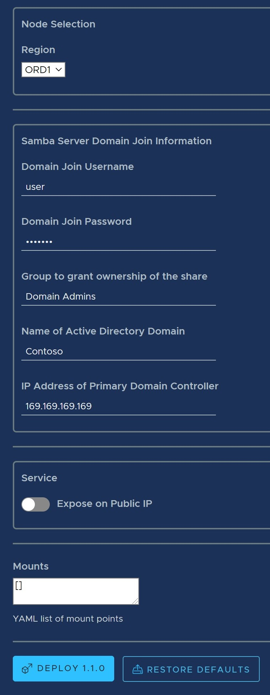
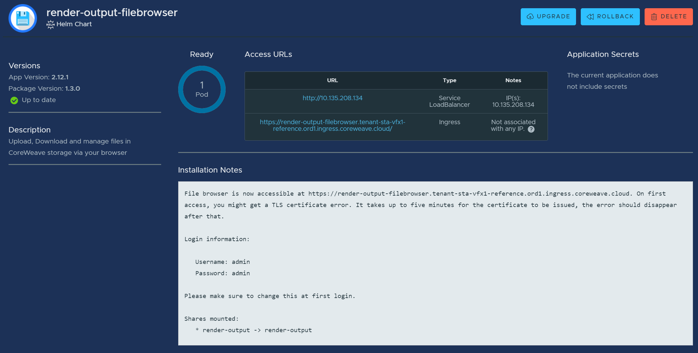

# VFX Studio Components Guide

This guide gives an overview of the different application components available to studios on CoreWeave Cloud. For a more comprehensive review of cloud-native CoreWeave VFX solutions view [cloud-studio-reference-guide.md](cloud-studio-reference-guide.md "mention").

### Requirements:

1. Create a CoreWeave Cloud account
2. Prepare your management environment using the guide [here](../../coreweave-kubernetes/getting-started.md)
3. (optional) Install Helm on your local system to manage and update applications deployed in your namespace.

## Storage

Storage is a broad topic and many solutions may require customization and careful consideration if part of a larger integration with CoreWeave support specialists.

### Provisioning Storage

Begin by logging into your cloud account and navigating to apps. Clicking on the Catalog tab you should see a range of applications that you can deploy. Find the application "filesystem-volume."

.png>)

Selecting this, click deploy in the upper right and then select in the creation dialogue the name, region, storage type, and storage size for your PVC object. The available storage types are our NVMe and HDD tiers. (NOTE: this application will create a shared filesystem, if you require block storage volumes please see our documentation [here](vfx-studio-components-guide.md#storage) on provisioning storage using YAML manifests and kubectl).

.png>)

We are going to walk through setting up a filesystem-volume for render-outputs -- a common use case that should come in handy! When rendering on CoreWeave cloud, ensuring that applications don't attempt to write over the internet to on prem storage is essential. Typically large amounts of data that is accessed infrequently such as render outputs belongs on our HDD tier. We will be provisioning everything in our Chicago datacenter (ORD) but feel free to provision resources in the datacenter closest to you.

.png>) .png>) .png>)

Once you hit Deploy you should see the following message and an instance of the filesystem-volume application in the "Applications" tab.

If you would like to see the resource inside of Kubernetes you can use `kubectl get pvc` to list all the available storage volumes in your namespace and then use `kubectl describe pvc <name of pvc>` to get more information about the resource you created. If you installed Helm in your local terminal you can also use `helm list` to see the full list of applications deployed in your namespace which should.

With this storage deployed, you can now mount this shared volume into any kubernetes pod or a CoreWeave virtual server to begin rendering to.

### Exposing Storage Externally

CoreWeave provides many methods out of the box for exposing your PVCs to external workstations or on-prem services. You can also expose PVCs in custom ways using your own containerized images.

#### Samba

.png>) .png>)

You can deploy both standard and active directory flavors of samba using the apps catalog accessible from your cloud dashboard. After selecting Samba from the catalog and hitting deploy select the same region you deployed your filesystem volume in (NOTE: while it is possible to deploy the samba server in a region different from the PVC it is not recommended due to storage latency and you will see degraded performance). Create a user for this share, if you require more advanced access permissions consider pairing our samba-ad option with your on prem active directory domain services. In the "Mounts" section you should specify the name of the pvc you created in the previous step. Sometimes it may be easier to edit the application using the raw YAML manifest accessible using the tabs under the name entry box such as:

```
mounts:
  - name: render-output
    pvc: render-output
```

If you would like the service to be accessible from places over the internet, ensure you have "enable public IP" set to **true**.

 .jpg) .png>) .png>)

#### Connecting to Samba (WIN)

.png>)

In order to connect. Map the network drive.

.png>)

.png>)

.png>)

Select the mount, press ok, and enter credentials.

.png>)

#### NFS

To expose the same storage over NFS you can deploy the NFS application in the catalogue. The process is very similar to deploying samba, ensure that you deploy the application in the same region as the storage you created. One major difference between this deployment and those available with Samba is that our one-click NFS solution does not include any authentication, for that consider integrating with active directory directly or use network policies to ensure access to the NFS service is only accessible to the correct endpoints.

 .jpg>) 


#### Filebrowser

A final option for accessing your cloud storage remotely is using the Filebrowser application from the catalogue. This will provide you a web interface for uploading and downloading files from your cloud storage. Similar to both previous items it may be easier to specify your PVC mount using the YAML editor inside the deployment form. Once deployed you should see a URL in the "Access URLs" section for you to access the web interface.

_**Important**_\*\* after your first login you must change the password of your filebrowser. Go to Settings > User Management and set up new users.\*\*



#### Media Shuttle (TEMP not available)

.png>)

[Media Shuttle](https://www.signiant.com/products/media-shuttle/) makes it easy to share and receive media from outside parties. CoreWeave offers the Media Shuttle server to use with your own subscription or licensed via CoreWeave. Please reach out to your CoreWeave representative if you'd like to license Media Shuttle via CoreWeave.

The first step is to gather your Media Shuttle registration key.

.png>)

Press "Add" (above) and the checkbox (below). Then copy the registration key.

.png>)

.png>)

Update the name, registry key, and add a [Persistent Volume Claim](https://docs.coreweave.com/coreweave-kubernetes/storage) to mount.

.png>)

.png>)

## Virtual Workstations

Virtual workstations are a great way for artists across the world to access applications with high powered CPU and GPU acceleration. CoreWeave's virtual workstations are deployed on top of open source project Kubevirt. To gain further control over virtual servers you can use virtctl, a guide to installing and using virtctl is available [here](../../virtual-servers/remote-access-and-control.md).

For a general guide to getting started with virtual servers check out:


[coreweave-apps.md](../../virtual-servers/deployment-methods/coreweave-apps.md)


.png>)

For our virtual server we are going to mount in our shared storage as a filesystem using the following YAML modification:

```
filesystems: 
  - name: render-outputs
    source:
      type: pvc
      name: render-outputs
```

## Rendering

CoreWeave offers a fully managed, auto-scaled Deadline solution for handling medium-large studio's render farm needs. To see information about setting up Deadline within your namespace see :


[deadline.md](deadline.md)


One modification we may choose to make in our worker values is to ensure that our shared storage is mounted into our Deadline workers. This is as simple as adding the following to our worker definition:

```
volumeMounts:
  - name: render-output
    mountPath: /mnt/output
volumes:
  - name: general
    persistentVolumeClaim:
      claimName: render-output
```

This follows the standard Kubernetes syntax for describing volumeMounts and volumes which can be found [here](https://kubernetes.io/docs/concepts/storage/volumes/). The full Worker definition might look like:

```
version: 10.1.18.5
rcs:
  pass: password123
 licenseForwarder:
  enabled: true
  auth:
    secrets:
      name: ubl-certificates
workers:
- name: maya-epyc
    enabled: true
    groups:
      - maya-epyc
      - maya
    pools:
      - vfx
    volumeMounts:
    - name: render-output
    mountPath: /mnt/output
    volumes:
    - name: general
    persistentVolumeClaim:
      claimName: render-output
    scale:
      pollingNames:
      - name: maya-epyc
        type: Group
      minReplicas: 0
      maxReplicas: 100
      scalingFactor: 1
    image: registry.gitlab.com/coreweave/render-images/maya2022:1
    imagePullSecrets: &imagePullSecrets
      - name: render-images
    env:
      - name: ARNOLD_LICENSE_ORDER
        value: network
      - name: ADSKFLEX_LICENSE_FILE
        value: 127.0.0.1
    affinity:
      nodeAffinity:
        requiredDuringSchedulingIgnoredDuringExecution:
          nodeSelectorTerms:
            - matchExpressions:
                - key: node.coreweave.cloud/cpu
                  operator: In
                  values:
                    - amd-epyc-rome
                    - intel-xeon-v4
                - key: node.coreweave.cloud/class
                  operator: In
                  values:
                    - cpu
        preferredDuringSchedulingIgnoredDuringExecution:
            - weight: 100
              preference:
                matchExpressions:
                  - key: topology.kubernetes.io/region
                    operator: In
                    values:
                      - ORD1
    resources:
      limits:
        cpu: 35
        memory: 130Gi
      requests:
        cpu: 35
        memory: 129Gi
```
