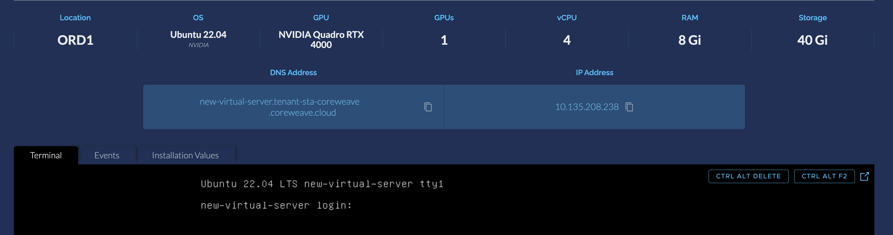
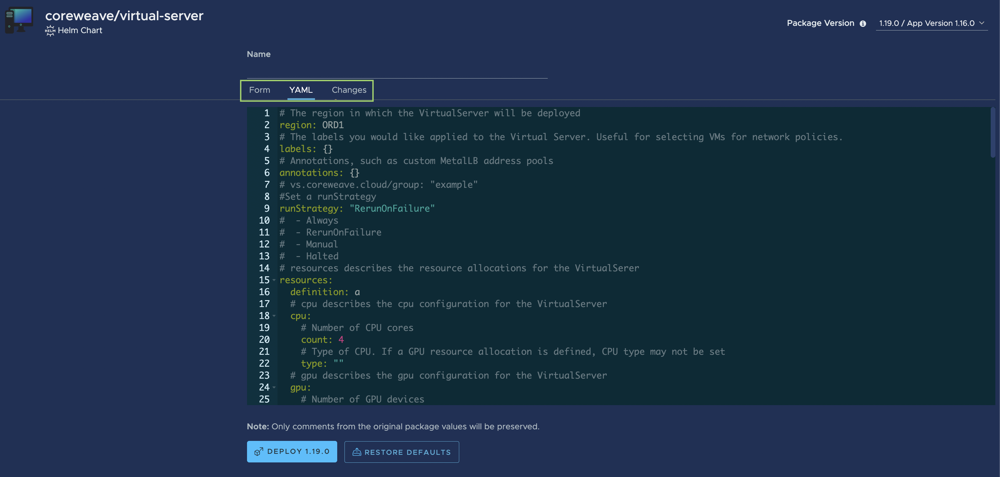

# CoreWeave Cloud UI


**What's a Virtual Server?**

Learn more from ["Getting Started"](../getting-started.md).\
\
_To configure **data-disk storage** for your Virtual Server, see_ [_How to provision CoreWeave Cloud Storage_](https://docs.coreweave.com/coreweave-kubernetes/storage#how-to-provision-coreweave-cloud-storage)_._


## Introduction

The [CoreWeave Cloud UI](https://apps.coreweave.com/) is a responsive, Web-based dashboard enabling users to configure, deploy, and manage Virtual Servers using visual methods to deploy Virtual Servers.

.png>)

From the Virtual Server deployment screen, you can configure the following aspects of your Virtual Server:

* ****:map: **** [**Data center region**](coreweave-apps.md#geographic-location) - Choose from [three geographic regions](https://docs.coreweave.com/data-center-regions?q=data+cen) where to host your Virtual Server.
* ****:gear: **** [**Hardware**](coreweave-apps.md#hardware-selection) **** - Select your CPU or high-performance GPU hardware, and configure cores and memory.
* ****:computer:****[**Operating System and root disk size**](coreweave-apps.md#system-images-and-additions) - Select which distribution of Linux or which version of Windows you'd like the Virtual Server to run. _To configure **data-disk storage** for your Virtual Server, see_ [_How to provision CoreWeave Cloud Storage_](https://docs.coreweave.com/coreweave-kubernetes/storage#how-to-provision-coreweave-cloud-storage)_._
* ****:globe\_with\_meridians: [**Public IP addresses**](coreweave-apps.md#attach-ip) - Configure a public IP for your Virtual Server to make it publicly accessible.

## Getting started

### :cloud: [Request a CoreWeave Cloud account](https://cloud.coreweave.com/request-account)

**Before you can access the CoreWeave Cloud UI, you must first** [**request an account**](https://cloud.coreweave.com/request-account)**.**

The CoreWeave team will respond to your request **within** **24 hours** of account creation request submission to assist you.

### Log in

Once you have an account and account credentials, log in to the dashboard from the sign-in page at [**https://cloud.coreweave.com**](https://cloud.coreweave.com).

.png>)

## Creating a Virtual Server from the Cloud UI

.png>)

Once you've signed in to your CoreWeave Cloud account, the dashboard landing page is the first page you will see. From here, you can **configure, launch, and manage Virtual Servers.**

To launch a new Virtual Server from the Cloud UI dashboard, navigate to the **Virtual Servers** menu option located in the upper left-hand side of the sidebar menu or click the **Deploy Now** button in the card in the top-middle of the dashboard - either option will bring you to the **Virtual Server dashboard**.

.png>)

From the Virtual Servers dashboard, you can configure a Virtual Server (VM) to your desired specifications. The Virtual Server configuration screen provides a graphical interface for setting up a Virtual Server. Virtual Servers can be configured, then easily deployed, right from this screen.


**Note**

Not _every_ Virtual Server configuration option is exposed through the options displayed graphically on the configuration screen. For more fine-tuned control, or to save the Virtual Server configuration file to replicate additional Virtual Servers, you can view the generated YAML chart under the **YAML** tab.


.png>)

### Virtual Server name

First, set the name of the Virtual Server. This name will also serve as the Operating System hostname of the Virtual Server.

.png>)

### Geographic location

[CoreWeave has three data centers across North America.](../../docs/data-center-regions.md) From the **Geographic Location** menu, you can select the one in which you'd like the Virtual Server to be hosted.

.png>)


**Note**

It is highly recommended to select the data center that is geographically closest to your location.


### Hardware selection

CoreWeave offers a broad selection of GPU and CPU options for Virtual Servers. From the **Hardware Selection** section, you can select the desired GPU type and core count **or** the desired CPU type and core count, and the desired RAM for the Virtual Server.

.png>)


**Note**

CPU classes can only be specified when the Virtual Server is designated as CPU-only, and GPU nodes are pre-configured with frequency optimized CPUs.


### System images

From the **Operating System / Root Disk Storage** section, you can select and configure the desired operating system image (CentOS, Ubuntu, or Windows) for the Virtual Server, along with any desired VirtualServer additions, such as NVIDIA drivers or [Teradici](https://www.teradici.com/) for remote desktop access.

You can also configure the size of the **root disk** of the Virtual Server from here.

.png>)


**Notice**

The root disk's size can be _increased_ later, and the operating system will automatically expand to accommodate, however **the root disk size cannot be **_**reduced**_ after initial deployment.


### System additions

At the bottom of the **Operating System / Root Disk Storage** section, you will find sliders for additional system add-ons such as NVIDIA drivers, Teradici, Parsec, and more. These additions are applications that will be installed at the time of deployment automatically, so they can be ready to use as soon as the Virtual Server is available.


**Note**

Additions are installed on-demand on Windows machines. On Linux machines, additions are baked into the image.


#### Linux system additions

.png>)

For **Linux-based systems**, current available automatic add-ons include:

* **NVIDIA GPU drivers** - Toggling this option selects a Linux image with NVIDIA GPU drivers already installed.
* **Teradici** - [Teradici](https://www.teradici.com/) is a remote desktop tool for Linux and Windows - enabling this addition selects a Linux image with Teradici already installed.

__[_Learn more_](https://docs.coreweave.com/virtual-servers/coreweave-system-images/linux-images#flavors) _about CoreWeave Virtual Server system images._

#### Windows system additions

.png>)

For **Windows-based systems**, current available automatic add-ons include:

* **Windows automatic logon (autologon)** - [Windows automatic logon](https://docs.microsoft.com/en-us/troubleshoot/windows-server/user-profiles-and-logon/turn-on-automatic-logon) automates the logon process.
* **Windows Licensing via CoreWeave KMS** - CoreWeave provides a Windows Key Management Server (KMS) with which your Virtual Server's Windows OS can be optionally licensed. _Learn more on_ [_the Windows system images page_](https://docs.coreweave.com/virtual-servers/coreweave-system-images/windows-images#coreweave-kms)_._
* **Parsec Remote Desktop** - CoreWeave strongly recommends using [Parsec](https://parsec.app/) for remote desktop access on Windows. Toggling this option on will automatically install Parsec onto your Windows Virtual Server.
* **Teradici** - Teradici is also supported for remote desktop access on Windows - enabling this addition installs Teradici onto the Virtual Server.
* **Virtual Displays** - Many applications on Windows require a display connected to GPU in order to render. Toggling this option on will attach a virtual 4K monitor to all available outputs.\
  _**Note:** Toggling this option on will disconnect the built-in VNC display, and will disable the_ [_virtual terminal_](coreweave-apps.md#undefined) _provided in the status page._
* **Parsec Team enrollment** - If you are already a [Parsec Teams](https://parsec.app/teams) subscriber, you can automatically enroll the Virtual Machine using your subscriber credentials.
* **Mount Samba compliant shares** - Samba shares (Or any SMB/CIFS compliant share) can be configured prior to booting the Virtual Server. If this option is toggled, an additional configuration menu will be shown to configure the SMB mount.

.png>)

### Attach IP

.png>)

From the **Attach IP** section, you can configure a **public** IP address for your Virtual Server to make it accessible to the Internet. The IP address, as well as a public **DNS name**, will be generated for you, and will be made visible from the status page once the Virtual Server is ready and running.

.png>)


**Tip**

If the Virtual Server will only be accessed from within your namespace, or you're using a remote access tool with NAT-punching abilities like [Parsec](https://parsec.app), you may not need a public-facing IP address.


#### User account

The user account configured in the **Account** section of this screen will be used as the administrative user account on the Virtual Server. User accounts can be configured to use either an SSH public key or a password for authentication.


**Warning**

Users created on Virtual Servers are automatically given **administrative privileges (`sudo` access).**


.png>)

## Deploying the Virtual Server

To deploy your new Virtual Server, click the **Deploy** button. This will instantiate a new Virtual Server instance in your namespace on CoreWeave Cloud.

.png>)

### The status page

Once your Virtual Server has begun deploying, you will be automatically redirected to the **status page**. From here, the Virtual Server can be **restarted**, **upgraded** (or changed), **deleted**, or **stopped**.

.png>)

#### Virtual terminal

Additionally featured on the status page is a virtual terminal, allowing immediate access to the Virtual Server once it is in a ready state.


**Note**

For Virtual Servers running **Windows**, it may take time to install and upgrade the OS. Additionally, the Web-based terminal is not supported by Virtual Servers utilizing **custom EDID.**



**Note**

Clicking the **Upgrade** button will bring you back to the Hardware Selection page shown above. From there, you can change options such as GPU type, CPU core amounts, root disk size, and so on.


## Additional management tools

### The Virtual Server Helm chart

The configuration fields in the Cloud UI generates a [Helm chart](https://helm.sh/docs/topics/charts/) that defines the Virtual Server's attributes. This chart enables you to utilize the same configuration for additional Virtual Server deployments, and exposes additional options for finer-tuned configuration, and allows you to create additional Virtual Servers, deployed via the Web UI or from the command line.

To view the Virtual Server's generated YAML chart, click on the **YAML** tab below the **Name** field.


**Note**

After the server has been deployed, the YAML manifest can be viewed by clicking the **Upgrade** button from the [status page](coreweave-apps.md#the-status-page).


This YAML manifest also exposes additional configurations, which may be adjusted directly.

### Virtual Server events

A basic diagnostic log of all actions involving the Virtual Server will be recorded in a list under the **Events** tab.&#x20;


**Note**

The events listed under the **Events** tab are short-lived, and should mostly be used for diagnostics or simply for tracing the status of the Virtual Server.


.png>)

**Learn more about methods for deploying Virtual Servers:**


[.](./)

