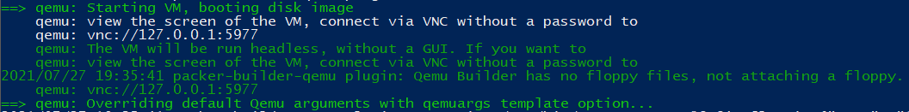

# Configuring a Windows Image sourced from CoreWeave Cloud

**Objective:** Use our Packer Virtual Server to configure a Windows image from CoreWeave Cloud.\
**Overview:** [Packer by Hashicorp](https://www.packer.io/intro) uses KVM to spin up a virtual machine and perform configuration actions that would normally done by human hand. You feed it an image, which it then connects to via SSH, and it executes scripts/commands you describe in the configuration JSON. This process consists of using [the generated Virtual Server](creating-a-packer-worker-virtual-server.md) to configure our cloned image using Packer. Reference Packer’s [QEMU docs](https://www.packer.io/docs/builders/qemu) for more information.


This guide assumes you have created a [Packer Worker VS](creating-a-packer-worker-virtual-server.md)


#### References:









## Configuring the Packer manifest

Using **win.json**, we’ll need to make a few edits before configuring our image:




```javascript
{
    "builders": [
        {
            "type": "qemu",
            "accelerator": "kvm",
            "communicator": "ssh",
            "headless": true,
            "disk_image": false,
            "cpus": "6",
            "memory": "16384",
            "format": "raw",
            "iso_checksum": "none",
            "iso_url": "/dev/vdb",
            "skip_resize_disk": false,
            "skip_compaction": false,
            "disk_size": "80000M",
            "qemuargs": [
                ["-machine","pc-q35-4.2,accel=kvm,usb=off,vmport=off,dump-guest-core=off"],
                ["-cpu", "host"],
                [ "-smp", "cpus=4,sockets=1" ],
                [ "-cdrom", "cidata.iso" ],
                ["-drive", "file=/dev/vdb"]
            ],
            "net_device": "e1000",
            "ssh_username": "user",
            "ssh_password": "packer",
            "ssh_timeout": "6h",
            "shutdown_command": "cmd /c shutdown -s -t 00"
        }
    ],
    "provisioners": [
        {
            "type": "powershell",
            "execute_command": "{{.Path}}; exit $LastExitCode",
            "inline": [
                         "Install-WindowsUpdate -Install -MicrosoftUpdate -IgnoreUserInput -AcceptAll"
            ],
             "start_retry_timeout": "20m"
        }
    ]
}

```



**/dev/vdb** refers to our cloned block device



The credentials in this configuration are created when the VM reads the image output of  **create-ci-data.sh**



In this example, we are using the PowerShell provisioner to install Windows Updates. To learn more and view more provisioners, view [Hashicorp's documentation](https://www.packer.io/docs/provisioners/powershell).




## Generate credentials for the Packer VM

Similar to Cloud images provided by Canonical and RedHat, images from CoreWeave do not have users by default – they are generated by [Cloud-init](https://cloudinit.readthedocs.io/en/latest/) on initial instance launch.

To create a user for packer to communicate with, we need to run **create-ci-data.sh**, which will generate an ISO mounted by the Packer VM with credential information:




```bash
cat <<EOF >user-data
#cloud-config
ssh_pwauth: True
users:
  - name: user
    plain_text_passwd: packer
    sudo: ALL=(ALL) NOPASSWD:ALL
    shell: /bin/bash
    lock_passwd: false
EOF

cat <<EOF >meta-data
{"instance-id":"packer-worker.tenant-local","local-hostname":"packer-worker"}
EOF

genisoimage -output cidata.iso -input-charset utf-8 -volid cidata -joliet -r \
            user-data meta-data
```



This generates an ISO (**cidata.iso**) referenced by our JSON that will be presented to the VM Packer configures



Note the username and password referenced in our JSON is created here




## Execute Packer docker image

With our cidata ISO created, we can kick off the Packer build with `launch-docker.sh win.json`




```bash
CONFIG="$1"
exec docker run --rm --dns 1.1.1.1 --device /dev/kvm --privileged --net=host \
     -v /var/lib/libvirt:/var/lib/libvirt \
     -v /var/run/libvirt:/var/run/libvirt \
     --volume $PWD:/work -it packer:latest \
     packer build -force -on-error=abort \
       $CONFIG
```




Once Packer has kicked started the virtual machine – it is viewable locally with any VNC client:



Since QEMU is referencing the PVC directly, all changes made to the cloned images are written directly to the mounted PVC.

Once Packer has completed, the Virtual Server can be safely deleted (`k delete vs packer-worker`). The modified, now updated PVC will remain in your namespace to serve as a source image for subsequent Virtual Servers.
