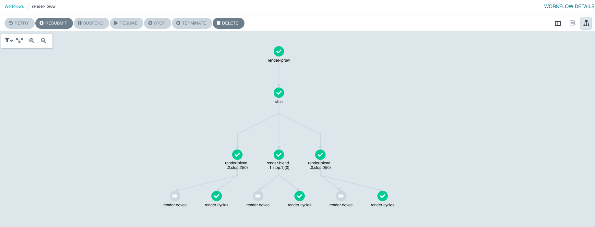

# Getting Started

## Introduction

Workflows on CoreWeave run on [Argo Workflows](https://argoproj.github.io/argo/), which is a great tool to orchestrate parallel execution of GPU and CPU jobs. It manages retries and parallelism for you, and allows you to submit workflows via CLI, [Rest API](https://github.com/argoproj/argo/blob/master/examples/rest-examples.md) and the [Kubernetes API](https://github.com/argoproj/argo/blob/master/docs/rest-api.md).



## Getting Started

* After logging into [CoreWeave Cloud](https://cloud.coreweave.com), go to the CoreWeave Apps `Catalog`

 (2).png>)

* A new window will open to CoreWeave Apps with the list of available applications. Find and select the **argo-workflows** application

.png>)

* In the right upper corner, select the latest version of the helm chart and click `DEPLOY`\\

.png>)

* The deployment form will prompt you to enter an application name. The remaining parameters have our suggested defaults, when ready click `DEPLOY` at the bottom of the page\\

.png>)


`server` authentication mode does not require credentials, we suggest using`client` mode instead for better security, for more information visit [https://argoproj.github.io/argo-workflows/argo-server-auth-mode](https://argoproj.github.io/argo-workflows/argo-server-auth-mode)


*   After a few minutes, the deployment will be ready. If you selected `Expose UI via public Ingress`, Argo Workflows will be accessible outside the cluster. \\

    Click the ingress link to open Argo Workflows UI in a new window

.png>)


On first visit, you may encounter get a TLS certificate error. It can take up to five minutes for the certificate to be issued, once issued the error should disappear.


* To run a sample workflow, click `+SUBMIT NEW WORKFLOW` and then `Edit using workflow options`\
  This shows 'Argo says' workflow, click `+CREATE`, after a few minutes, on success, the workflow will change to green.

## Argo CLI

After installing `kubectl` and adding your CoreWeave Cloud access credentials, install Argo CLI from [https://github.com/argoproj/argo-workflows/releases](https://github.com/argoproj/argo-workflows/releases)

1. Save an example workflow into the file `gpu-say-workflow.yaml`

```yaml
apiVersion: argoproj.io/v1alpha1
kind: Workflow
metadata:
  generateName: gpu-say
spec:
  entrypoint: main
  activeDeadlineSeconds: 300 # Cancel operation if not finished in 5 minutes
  ttlSecondsAfterFinished: 86400 # Clean out old workflows after a day
  # Parameters can be passed/overridden via the argo CLI.
  # To override the printed message, run `argo submit` with the -p option:
  # $ argo submit examples/arguments-parameters.yaml -p messages='["CoreWeave", "Is", "Fun"]'
  arguments:
    parameters:
    - name: messages
      value: '["Argo", "Is", "Awesome"]'

  templates:
  - name: main
    steps:
    - - name: echo
        template: gpu-echo
        arguments:
          parameters:
          - name: message
            value: "{{item}}"
        withParam: "{{workflow.parameters.messages}}"

  - name: gpu-echo
    inputs:
      parameters:
      - name: message
    retryStrategy:
      limit: 1
    script:
      image: nvidia/cuda:11.4.1-runtime-ubuntu20.04
      command: [bash]
      source: |
        nvidia-smi
        echo "Input was: {{inputs.parameters.message}}"

      resources:
        requests:
          memory: 128Mi
          cpu: 500m # Half a core
        limits:
          nvidia.com/gpu: 1 # Allocate one GPU
    affinity:
      nodeAffinity:
        requiredDuringSchedulingIgnoredDuringExecution:
            # This will REQUIRE the Pod to be run on a system with a GPU with 8 or 16GB VRAM
              nodeSelectorTerms:
              - matchExpressions:
                - key: gpu.nvidia.com/vram
                  operator: In
                  values:
                    - "8"
                    - "16"
```

1.  Submit the workflow, `gpu-say-workflow.yaml` . The workflow takes a JSON Array and spins up one Pod with one GPU allocated for each, in parallel. `nvidia-smi` output, as well as the parameter entry assigned for that Pod, is printed to the log.

    ```
    $ argo submit --watch gpu-say-workflow.yaml -p messages='["Argo", "Is", "Awesome"]'
      Name:                gpu-sayzfwxc
      Namespace:           tenant-test
      ServiceAccount:      default
      Status:              Running
      Created:             Mon Feb 10 19:31:17 -0500 (15 seconds ago)
      Started:             Mon Feb 10 19:31:17 -0500 (15 seconds ago)
      Duration:            15 seconds
      Parameters:
        messages:          ["Argo", "Is", "Awesome"]

      STEP                                  PODNAME                  DURATION  MESSAGE
       ● gpu-sayzfwxc (main)
       └-·-✔ echo(0:Argo)(0) (gpu-echo)     gpu-sayzfwxc-391007373   10s
         ├-● echo(1:Is)(0) (gpu-echo)       gpu-sayzfwxc-3501791705  15s
         └-✔ echo(2:Awesome)(0) (gpu-echo)  gpu-sayzfwxc-3986963301  12s
    ```
2.  Get the log output from all parallel containers

    ```
    $ argo logs -w gpu-sayrbr6z
    echo(0:Argo)(0):    Tue Feb 11 00:25:30 2020
    echo(0:Argo)(0):    +-----------------------------------------------------------------------------+
    echo(0:Argo)(0):    | NVIDIA-SMI 440.44       Driver Version: 440.44       CUDA Version: 10.2     |
    echo(0:Argo)(0):    |-------------------------------+----------------------+----------------------+
    echo(0:Argo)(0):    | GPU  Name        Persistence-M| Bus-Id        Disp.A | Volatile Uncorr. ECC |
    echo(0:Argo)(0):    | Fan  Temp  Perf  Pwr:Usage/Cap|         Memory-Usage | GPU-Util  Compute M. |
    echo(0:Argo)(0):    |===============================+======================+======================|
    echo(0:Argo)(0):    |   0  NVIDIA Graphics...  Off  | 00000000:08:00.0 Off |                  N/A |
    echo(0:Argo)(0):    | 28%   51C    P5    16W / 180W |     18MiB /  8119MiB |      0%      Default |
    echo(0:Argo)(0):    +-------------------------------+----------------------+----------------------+
    echo(0:Argo)(0):
    echo(0:Argo)(0):    +-----------------------------------------------------------------------------+
    echo(0:Argo)(0):    | Processes:                                                       GPU Memory |
    echo(0:Argo)(0):    |  GPU       PID   Type   Process name                             Usage      |
    echo(0:Argo)(0):    |=============================================================================|
    echo(0:Argo)(0):    +-----------------------------------------------------------------------------+
    echo(0:Argo)(0):    Input was: Argo
    echo(1:Is)(0):    Tue Feb 11 00:25:30 2020
    echo(1:Is)(0):    +-----------------------------------------------------------------------------+
    echo(1:Is)(0):    | NVIDIA-SMI 440.44       Driver Version: 440.44       CUDA Version: 10.2     |
    echo(1:Is)(0):    |-------------------------------+----------------------+----------------------+
    ...
    ```

## Recommendations

We recommend the following retry strategy on your workflow / steps.

```yaml
 retryStrategy:
   limit: 2
   retryPolicy: Always
   backoff:
     duration: "15s"
     factor: 2
   affinity:
     nodeAntiAffinity: {}
```

We also recommend setting an `activeDeadlineSeconds` on each `step`, but not on the entire workflow. This allows a step to retry but prevents it from taking unreasonably long time to finish.
